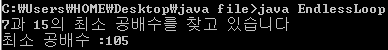

안녕하세요. ㅎ

중3이 되는 바람에 제대로 포스팅을 하지 못했습니다.. ;

그래도 제 java공부는 계속 이어갑니다!

아무튼 이번에는 무한 루프와 그 유용성에 대해 알아보겠습니다.

제목에 있는 한자와 영어 無限Loop, 다들 아시죠?

'무한'이란건 말 그대로 한이 없다는 뜻입니다.

java에서는 반복문의 반복 조건이 true로 되어 있을 경우 무한 루프가 되지요.

> while(true)
>
> {
>
> .....
>
> }
>
> 또는
>
> do
>
> {
>
> .....
>
> }while(true)
>
> 또는
>
> for( ; ; )
>
> {
>
> .....
>
> }

이렇게 반복 조건 부분에 true를 집어넣으면 무한 루프가 형성되게 됩니다.

보시면 아시다싶이 for문은 true를 넣지 않고 공백으로 둬도 무한 루프가 되므로 이렇게 하는 것이 일반적이라 합니다.

이런 무한 루프는 존재 자체만으로는 의미를 생각할 수 없지만, break문을 만나서 사용하는 것이 일반적인 무한 루프의 사용법이라 생각됩니다.

아래 최소 공배수를 구하는 예제를 보겠습니다.

```java
class EndlessLoop
{
  public static void main(String[] args)
  {
    System.out.println("7과 15의 최소 공배수를 찾고 있습니다");

    int M=1;
    do
    {
      if(M%7==0 && M%15==0)
        break;
      M++;
    }while(true);

    System.out.println("최소 공배수 :"+M);
  }
}
```

7과 15의 최소 공배수를 구하는 예제입니다. *(제가 응용해서 만들어 봤어요)*

int M=1;으로 변수를 선언하고 있습니다.

그리고 do~while문으로 최소 공배수를 찾고 있는데요.

if(M%7==0 && M%15==0)

즉 7로 나누고 15로 나눠도 나머지가 0인 값, 즉 최소 공배수일때 break를 통해 무한 루프를 빠져나오게 되는 겁니다.



실행 결과를 보시면 if(M%7==0 && M%15==0)가 만족하는 순간 break로 빠져나온다음 최소공배수를 표시하게 됩니다.

만약 무한루프로 구현하지 않았다면 어떻게 해야 할까요?

반복 조건에 들어가는 true대신 조건을 넣어야 하는데요.

이경우 최소 공배수의 크기를 예측해야하는 필요성이 있습니다.

만약 200미만 숫자중 최소공배수가 있는가? 라는 프로그램을 만들고 싶다면 무한루프로 구현하시면 안되고 반복 조건에 M<200등의 기호를 넣어 줘야 한다는 것이 됩니다.

무한 루프는 유용하게 사용 할 수 있습니다.

하지만 명령문을 잘못 구성할 경우 계속 무한 루프가 돌아가게 되어 프로그램이 종료되지 못하는 경우가 발생할 수 있으니 주의하셔야 합니다.

예를 들면 위 예제에서 break가 없었다면 계속 do~while이 돌아가게 되겠죠?

그럴 때는 프로그램이 먹통이 될 겁니다.