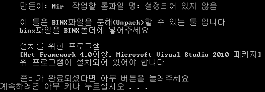
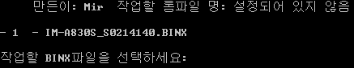
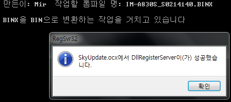

혹시 http://cafe.naver.com/skydevelopers 카페(이하 SDA, 스다)를 아시나요?  
설립이후부터 쭉 고민해왔던 BINX 분해에 대한 부분이 지금 풀렸다 합니다

BINX란? 스카이(팬택)의 업그레이드를 위한 파일입니다

예를 들자만 삼성의 오딘(정확히는 tar파일)과 같은 역활을 하지요

처음 스다 카페 설립시 부터 지금까지 많은 시도끝에 BINX파일이 풀려지게 되었습니다

BINX를 먼저 BIN파일으로 추출한다음 BIN파이을 다시 분해하는 과정을 거치게 됩니다

원 개발자는 해외 포럼의 개발자 이신걸로 알고있습니다 *(좀더 찾아본후 보충할 예정입니다)*

su_ky님과 베트남 분(자세히는 모르겠습니다)께서 만드셨다고 합니다

이 툴을 실행하기 위해서는 Net Framework 4.0.30319이상과 Microsoft Visual Studio 2010이 필요합니다

필요 파일 다운로드

혹시 몰라 필요한 파일을 업로드해 두겠습니다

필요 파일을 설치하신다음 아래 툴을 받아 압축풀어 주세요

압축풀으신다음 폴더에 진입하셔서 BINX폴더에 분해를 원하는 .binx파일을 넣어주신다음 Unpacker.bat를 실행해주시면 됩니다

이렇게 초기화면이 나타납니다

아무 키나 눌러주시면 다음화면으로 넘어갑니다

자동으로 BINX폴더에 있는 파일을 읽어 표시합니다 APK매니저 처럼요

옆에 있는 숫자를 입력하시면 됩니다

입력한 BINX를 BIN으로 변환합니다

스샷은 없지만 BIN으로 변환이 완료된후 BIN파일을 자동으로 압축풀어 줍니다

모두 분해가 완료되면 위와 같은 화면이 나타납니다

그리고 툴이 종료되지요

이렇게 해서 오랜 숙제였던 BINX분해에 관한 설명을 모두 마치겠습니다 ㅎㅎ

팬택은 이런거에만 너무 발달되어 있단말이예요;

참고로 이 툴은 ColorMeat의 툴을 사용했으며 Unpacker의 내용을 스스로 만들었습니다

툴을 만들어 주신 모든 분들과 파일을 만들어주신 모든 분들께 다시한번 감사의 말씀을 전합니다!

+업데이트

경로를 찾을수 없다는 오류를 해결했습니다
