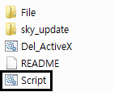
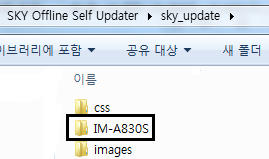
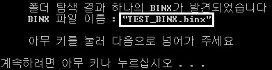
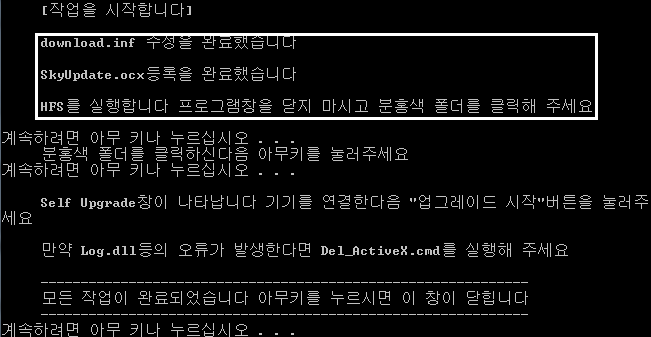
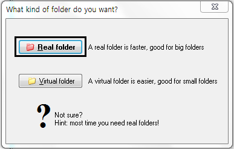
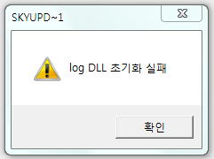
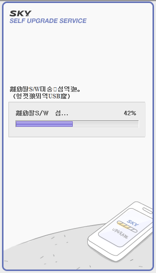

안녕하세요

이번에는 BINX를 이용하여 오프라인에서도 업데이트를 할 수 있게 해주는 SKY Offline Self Updater Tool입니다 ㅎㅎ

기존 Self Update의 방식은 아래와 같습니다

Active X 설치 - 인터넷 연결 (필수) - BINX파일 다운로드 - BINX 압축 해제 - 업데이트

여기서 인터넷 연결이 필수 항목 입니다

인터넷이 되어야지만 업데이트가 가능한 것이며 또한 스카이 서버가 느릴경우, 또는 인터넷이 느릴경우 개속 기다려야 하지요..;

다운받는중간에 끊길경우 처음부터 해야하는 불편함도 있지요

이런 불편함을 없애기 위해 태어난 것이 바로 SKY Offline Self Updater Tool 입니다

이름부터 알 수 있드시 오프라인에서 업그레이드를 할 수 있도록 도와주는 툴입니다

**기반**

중국의 su\_ky님께서 기반을 만드셨으며, 좀더 다듬어서 만들어 졌습니다

**특징**

이 툴의 특징은 다른 툴의 경우 BINX파일의 이름을 통일시켜야 하고 한번에 하나의 BINX만 가능했다면

유동적으로 기기를 바꿔 사용할 수 있도록 만들었습니다

**사용방법 및 스크린샷**

1. 먼저 압축을 풀으신다음 Script.cmd를 실행시키시면 됩니다

2. 실행 시킨다음 기기명을 입력해 주세요

3. 기기명을 입력받은다음 엔터를 누르면 압축푼 폴더의 sky\_update폴더안에 '기기명' 폴더가 생깁니다

기기명 폴더가 생긴 모습

입력한 기기명이 맞는지 확인하고 있습니다

4 sky\_update안에 생긴 기기명 폴더안에 BINX를 넣어주세요 이름은 상관 없습니다

5. 만약 폴더안에 들어있는 BINX가 하나일경우 자동으로 선택되어 진행하게 되며 선택된 BINX의 이름이 나타납니다

만약 폴더안에 있는 BINX가 두개 이상일경우 파일을 선택할 수 있는 화면이 나타납니다. 원하는 파일의 숫자를 입력해 주시면 됩니다

6. 자동으로 입력한 기기명과 BINX의 이름을 download.inf에 기입합니다 이부분은 스크립트가 자동으로 하게 됩니다

7. 자동으로 작업이 진행되며 HTS프로그램이 실행되는대요 이때 분홍색 폴더 아이콘을 클릭해 주시면 됩니다

8. 마지막으로 셀프 업그레이드 창이 나타나며 기기를 연결하신다음 업그레이드를 진행 하시면 됩니다

**주의사항**

위 사진처럼 log Dll 초기화 실패 오류가 나타날경우 압축파일안에 들어있는 Del\_ActiveX.cmd를 실행해 주세요

등록한 액티브X와 설치된 SKYUpdate를 제거해 주는 역할을 합니다

**다운로드**

[ SKY Offline Self Updater.zip](/attachment/cfile23.uf@24106D50513D957F31CD8C.zip)

네이버의 경우 첨부파일 참고

**스샷**

이렇게 오프라인에서 BINX로 업(다운)그레이드를 성공했습니다 ㅋㅋ

ㅎㅎ SKY Offline Self Updater Tool에 대한 설명이 끝났군요 ㅎㅎ

결국 BINX를 이용해서 오프라인으로 업데이트를 하는 시절이 왔군요 ㅋㅋㅋㅋ

기기의 BINX를 모조리 모와서 폴더별로 정리해 둔다음 Script.cmd에 기기명만 다르게 입력하면 전기종 업데이트를 한컴퓨터에서 흐흐ㅎㅎ

다른 궁금한거 있으시면 덧글로 알려주세요~
