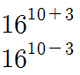
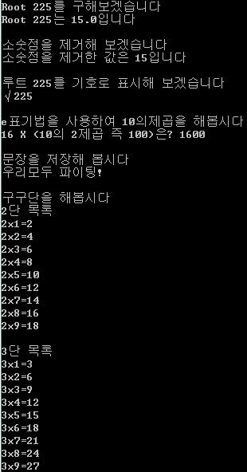

지금까지 배운것 다 안까먹으셨기를 바라며.. 총정리를 해보도록 하겠습니다.

아마 지금까지 배운 내용은 하나씩 들어 있을거라 생각되네요.

새로 배우시는 것도 있으니 파일 다운로드 하신 다음에 집중해 주세요.


자 오늘은 예제의 길이가 아주 긴 관계로 하나씩 끊어서 살펴봐야 합니다.

그러므로 전체 소스를 올리지는 않도록 하겠습니다.

또한 이해가 안되는 부분이 있을까봐 저 파일에는 주석을 사용해서 부가 설명을 하고 있습니다. 이 글에서는 주석을 제거하였습니다.

그럼 시작해 보겠습니다.

먼저 처음 부분입니다.

> import java.lang.Math;

맨날 지겹게 보는 public static void String([] args)는 지금은 이해하기 힘든 부부도 있으므로 생략하겠습니다.

improt는 처음보는 명령어 입니다.

이번 강좌에서 루트를 사용하는 일이 있는데, 이때 명시해 줘야 하는 부분입니다.

'난 정말 JAVA'책에는 아직까지 나오지 않았습니다만 미리 알아두셔도 좋겠죠?

라이브러리를 호출하는 명령어라 생각하시면 될 듯 합니다.

저도 아직 이 부분을 배우지 않았기에 명쾌한 설명을 드리기는 어려울듯하고, 그냥 루트를 사용할 때 필요한 것이다라고 생각해 주세요.

참고: package 개념을 배우시면 import에 대해 이해하실 수 있습니다!

이제 다음을 봅시다.

> System.out.println("Root 225를 구해보겠습니다");
>
> double Root225=Math.sqrt(225);
>
> System.out.println("Root 225는 "+Root225+"입니다");

보시면 루트를 사용하고 있습니다.

수학적 기호 √, 중3이면 아실겁니다. 이 루트를 java에서는 Math.sqrt(값); 으로 표시하고 있습니다.

즉 Math.sqrt(225); 는 루트 225, √225가 됩니다.

여기서 double변수를 사용하고 있는데, 루트를 넣기 위해서는 double을 사용합니다.

전에 모든 실수는 이 변수를 사용한다 라고 했지요?

만약 float에 넣고 싶다면 명시적 형변환 표시를 해줘야 합니다.

> System.out.println("소숫점을 제거해 보겠습니다");
>
> int Root=(int)Root225;
>
> System.out.println("소숫점을 제거한 값은 "+Root+"입니다");

여기서 명시적 형 변환을 해주고 있습니다.

루트 225는 15입니다 그런대 double을 사용하고 있으므로 15.0으로 표시됩니다.

소숫점을 날리기 위해 int형으로 형 변환을 해주면 15만 나타나게 되지요.

이렇게 명시적 형 변환은 '(변수)' 이렇게 표시하므로 가능합니다.

이번에는 char을 사용해 보겠습니다.

> System.out.println("루트 225를 기호로 표시해 보겠습니다");
>
> char root='√';
>
> System.out.println(root+"225");

설마 루트기호 √가 들어갈줄은 몰랐는데요. 들어갑니다. ㅋㅋㅋ

실행해보면 √225가 표시됩니다.

문자를 작은따음표 '로 묶어 표시하면 됩니다.

이번엔 e표기법을 사용한 예를 보겠습니다.

> System.out.println("e표기법을 사용하여 10의제곱을 해봅시다");
>
> int square=(int)16e2;
>
> System.out.println("16 X (10의 2제곱 즉 100)은? "+square);

까먹으셨을수도 있는데, e표기법은 10의 제곱을 나타냅니다.

음...설마 언급을 안한 내용인가요?..ㅠ



이렇게 나타내는 것을 e표기법을 이용해 사용하는 것이지요.

e+3은 10+3제곱을, e-3은 10-3제곱을 뜻합니다.

예제를 보시면 +가 생략된 걸 볼 수 있는데요 이렇게 생략할 수도 있습니다.

이번에는 char변수 말고 문장을 저장해 봅시다.

> System.out.println("문장을 저장해 봅시다");
>
> String fighting="파이팅!";
>
> System.out.println("우리모두 "+fighting);

char는 작은따음표 '로 한 글자만 저장했다면,

String는 큰따음표 "로 문장을 저장할 수 있습니다.

이 역시 아직 나오지 않은 부분으로 언제 한 번 본격적으로 탐구할 시간이 있을겁니다.

마지막으로 반복문을 이용해 구구단을 해보겠습니다.

```java
Sysem.out.println("구구단을 해봅시다");
for(int N=2 ; N<4 ; N++)
{
System.out.println(N+"단 목록");
for(int M=1 ; M<10 ; M++)
System.out.println(N+"x"+M+"="+N*M);
System.out.println("");
}
```

오랜만에 보시나요?ㅋㅋ

두 개의 for반복문을 이용해 구구단을 표시하고 있습니다.

N이 곱할수, M이 곱해지는 수 입니다.

즉 N\*M이 되지요.

for반복문은 자주 쓰입니다. 꼭 익숙해 져야 합니다.

for문의 구조를 보면,

for ( [변수선언] ; [반복 조건] ; [값의 변화] )

라는 구조를 가지고 있습니다.

1. 변수선언 - 반복조건확인 - 반복영역 실행 - 값 변화

2. 반복조건확인 - 반복영역 실행 - 값 변화

3. ...

\*. 반복조건확인 - false이므로 for문 탈출

이렇게 실행이 된다는 점도 아시겠죠?

이 예제를 실행시키면 아래와 같은 결과가 나타납니다.



예제도 긴 만큼 결과도 깁니다.

이렇게 해서 총정리를 해봤습니다.

혹시 까먹으신건 아니시겠죠? ㅋㅋ

많은 진도보다 한번씩 쉬어가는게 좋다 생각해서 정리를 해봤습니다.

허허 생각보다 많은걸 배웠군요ㅡ;;

다시한 번 스스로 복습해 보시고 다음편에서 만나요~