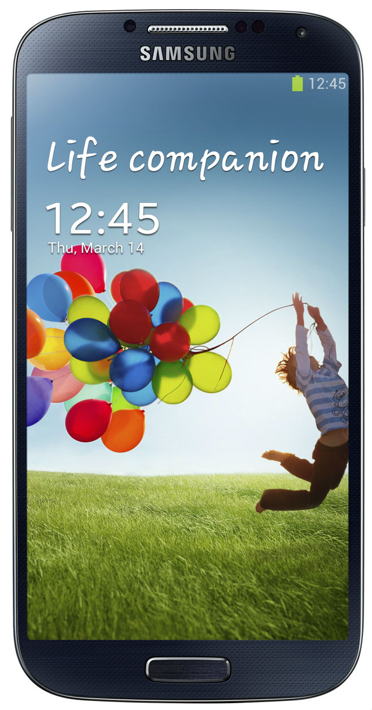
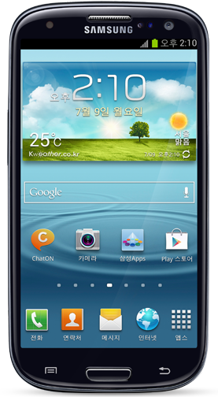
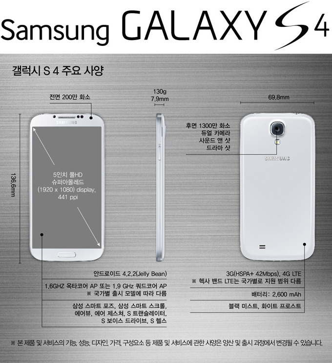
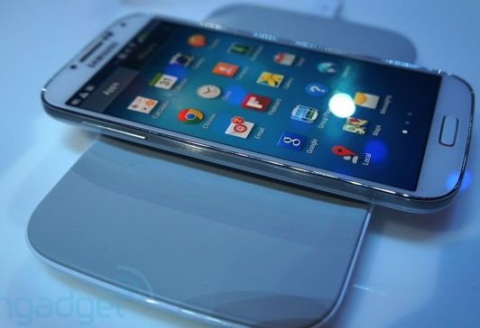

갤럭시 S4가 출시되었습니다!

디자인을 보면 뭔가 닮았군요 ㅋ

왼쪽이 S4의 사진이고 오른쪽이 S3의 사진입니다

현존 최대 스펙이라 생각되는 갤럭시 S4

주요 사양을 한번 살펴보도록 하겠습니다

안드로이드 4.2.2 (Jelly Bean)

1.6Ghz 옥타코어 AP or 1.9Ghz 쿼드코어 AP

배터리 2,600 mAh

색상 : 블랙 미스트(Black Mist) or 화이트 프로스트(White Frost)

etc...

갤럭시 S4는 5인치의 화면을 가지고 있으며 441ppi의 풀HD 슈퍼아몰레드 디스플레이를 탑재한 폰입니다

그러므로 자연 그대로의 색을 좀더 선명하게 볼 수 있을거라 생각되네요

번..인은 잘 생기지 않을거라 믿습니다 ㅋ

갤럭시 S4의 두께는 7.9mm, 무게는 130g으로 저번 갤럭시(?)인 갤3보다 얇고 가벼워 졌습니다

그리고 베젤 (각주: 디스플레이(액정)의 양옆부분을 생각하시면 편합니다)도 정말 심하게(?)줄여 현존 최대 스펙을 자랑하는 갤럭시 S4가 만들어 졌습니다

또한 디파이등에 사용된 고릴라 글래스의 최신작 고릴라 글래스 3을 처음 사용하여 내구성이 더욱 좋아졌습니다

항상 그래왔듯이 갤럭시S3 출시때에도 신기술이 대량 탑제되었습니다

이번에도 엄청나게 많은 기술이 탑재되었는대요 한번 살펴보도록 하겠습니다

1. 삼성 스마트 포즈(Samsung Smart Pause)

사용자가 동영상 시청중일때 시선을 자동으로 포착하여 시선이 다른곳으로 옮겨지면 동영상이 일시 정지되고 다시 화면을 보면 자동으로 동영상이 실행되는 기능 입니다

2. 삼성 스마트 스크롤(Samsung Smart Scroll)

갤럭시 S4로 인터넷등을 볼때 시선을 인식한 다음 스마트폰의 기울기를 파악하여 화면을 위 아래로 움직여 주는 기능이며 화면 터치없이 긴글을 읽을 때 유용한 기능입니다

3. 에어뷰(Air View)

갤럭시 노트에서 보여준 에어뷰가 탑제되었습니다

노트의 에어뷰와 다른점은 노트는 S펜을 사용했지만 갤4는 손가락으로도 가능한 점입니다

에어뷰란 손가락을 화면 위로 갖다대면 내용을 미리 확인할수 있는 기능입니다

갤러리, 동영상 시간 게이지 등에 손가락을 대면 미리 보기가 가능하며 전화걸기전 단축 번호 확인, 인터넷의 원하는 부분만 확대도 가능합니다

4. 터치 최적화

상황별로 터치 인식을 자동 최적화 하고 감도를 개선하여 겨울에 장갑을 낀상태 에서도 터치를 인식 할 수 있는 기능입니다

5. 에어 제스쳐(Air Gesture)

적외선 센서를 사용하여 손의 제스처를 인식해 다음곡 선택, 아래로 페이지 이동, 전화 받기 등을 할 수 있습니다

6. S 보이스 드라이브(S Voice Drive)

자동차 안에서 블루투스를 사용해 갤럭시 S4에 연결할 경우 운전모드가 활성화 되고 통화, 메세지 전송, 음악등을 음성으로 조작할 수 있습니다

7. S 트랜슬레이터(S Translator)

LG의 어떤 기능과 완전 비슷한 기능입니다

이 역시도 마찬가지로 번역 기능을 제공하며 문자나 삼성 메신저 쳇온의 메세지를 바로 번역하여 TXT로 보고 음성으로 들을수 있습니다

언어는 한국어, 중국어, 일본어, 영어에 한해 상호간 교차 번역을 지원하며, 독어, 불어, 이태리어, 포르투갈어, 스페인어는 영어로 번역이 가능합니다.

8. 삼성 워치온(Samsung WatchON)

갤럭시 S4로 TV, 셋톱박스의 실시간 채널 정보를 보고 선택할 수 있으며 VOD등의 프로그램을 추천해 주고 DVD나 에어컨을 제어할 수 있는 리모컨 역활을 합니다

9. 삼성 옵티컬 리더(Samsung Optical Reader)

이메일, 주소(https://~), 전화번호, QR코드등을 카메라를 통해 인식해 번역, 검색, 문자발송, 전화, 이메일등을 바로 할 수 있습니다

10.듀얼 카메라(Dual Camera)

1300만 화소의 후면 카메라와 200만 화소의 전면 카메라를 동시에 이용해서 동영상과 사진을 찍을수 있습니다

이 기능을 사용해 사진을 찍는사람/찍히는 사람을 한 화면에 담을 수 있습니다

기능 더보기

11.듀얼 비디오 콜(Dual Video Call)

전/후면 카메라를 동시에 활용하여 화상 통화 시에도 나의 모습과 내가 촬영하는 대상을 한 화면으로 상대방에게 보여 줍니다.

12. 사운드 앤 샷(Sound & Shot)

사진 촬영시 소리 또는 음성을 사진과 함께 저장할 수 있는 기능입니다

이 기능으로 이미지와 소리까지 한번에 저장할 수 있습니다

13. 드라마 샷(Drama Shot)

빠르게 움직이는 물체의 연속 모션을 한장의 사진으로 합성하는 기능입니다

예를 들면 날아가는 야구공을 한장에 담을수 있고 빠르게 움직이는 자동차를 한 장의 사진에 담을 수 있습니다

14. 스토리 앨범(Story Album)

촬영한 사진을 메모, 위치정보, 날씨 등 다양한 내용과 함께 담아 마음에 드는 디지털 앨범으로 만들 수 있으며, 이렇게 꾸민 디지털 앨범을 온라인으로 주문하여 실물 앨범으로 배송 받을 수 있습니다.

15. 그룹 플레이(Group Play)

갤럭시 S4끼리 무선 핫스팟으로 연결하여 같은 음악을 동시에 듣거나 게임도 함께 즐기고 여러 명이 찍은 사진을 공동으로 합성할 수 있습니다

16. S 헬스(S Health)

여러 센서를 사용해서 건강상태, 주변 상황을 인지하고 추가 정보를 입력해 칼로리와 운동 관련 부분도 추천해 줍니다

17. 삼성 어댑트 디스플레이(Samsung Adapt Display)

화면 밝기, 선명도 등을 최적화해서 e북을 읽을 때는 눈이 편안하도록 최적의 화면 모드로 자동 전환합니다

18. 삼성 어댑트 사운드(Samsung Adapt Sound)

최상의 청취 경험을 제공하는 삼성 어댑트 사운드 기능으로 개인에게 최적화된 통화/음악을 감상 할 수 있습니다

기능이 너무 많아 긴 글이 될까봐 조금 짤랐습니다

또한 Oi에 기반한 무선충전을 지원한다 합니다 ㅎㅎ

국가와 통신사에 따라 지원 여부는 다르다고 말했습니다

이렇게 갤럭시 S4가 공개되었는대요

역시 이번에도 반응은 두가지로 나눠지고 있습니다

먼저 "와 정말 좋은 기기다" 쪽과 "S3와 달라진게 뭔대" 라는 두가지 분류로 나눌수 있는듯 한대요

어찌됬던 S4의 공개는 누구나 바라던 바이며 꼭 갖고싶은 폰이 아닐까 생각되네요 ㅎㅎ

ps. 저는 삼성과 무관한 학생이며 아무 편도 들지 않는 중립적 입장으로 이 글을 작성하였고 삼성빠가 아닙니다 또한 광고도 아니고요

잘못된 정보가 있을경우 알려주시면 감사드리겠습니다 ㅎㅎ

출처 : 일부 글과 사진 http://www.samsungtomorrow.com/4139
