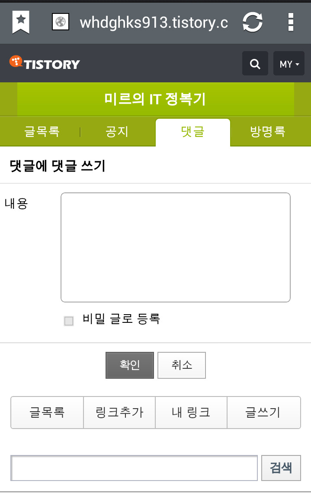
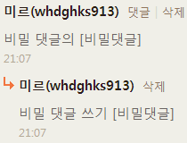
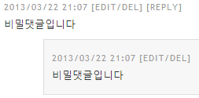

티스토리에는 네이버 블로그와 달리 덧글의 답글 쓰기가 없는것 같습니다

저역시도 없다고 확신했지요 ㅎ..

그런대 모바일로 덧글의 답글 쓰기를 하다 보니 비밀글로 쓰기를 발견했습니다..!

위 스샷을 보시면 비밀 글로 등록 이라는 버튼이 있는것을 볼 수 있습니다

댓글의 댓글 쓰기인 상태인 것을 확인 할 수도 있지요 ㅎㅎ

테스트 해봤습니다

이렇게 보시면 비밀 댓글의 라는 첫번째 댓글과 비밀 댓글 쓰기 라는 두번째 댓글을 볼 수 있습니다 ㅎㅎ

로그인을 하지 않은 분들에게는 아래와 같이 나타납니다

비밀댓글의 비밀댓글이 되는것 이죠 ㅎㅎ

자 이 팁이 유용하다면 아래 손가락을 눌러주세요 ㅎㅎ..

로그인은 필요 없으며 다음 View라는 것인대 유용한 글이 널리 퍼질 수 있도록 도와줍니다!
