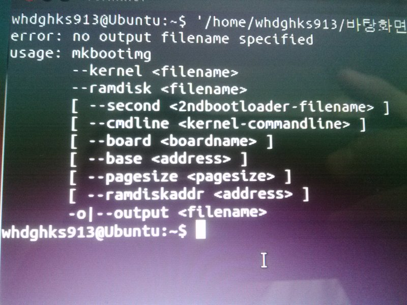

부트 이미지를 만들기 위해 mkbootimg를 사용합니다

그런대 만약 mkbootimg의 버전이 낮다면 최근 나온 폰들에서 필요로 하는 ramdiskaddr을 넣을수 없지요

그래서 구글링을 하다보니 좋은 자료를 찾았습니다

[mkbootimg](./file/mkbootimg)

만약 확장자 bin이 붙는다면 제거해 주세요 ㅎㅎ

터미널로 확인해본결과 ramdiskaddr을 사용할 수 있는 mkbootimg임을 확인했습니다

출처 : <http://code.google.com/p/cyanogen-presto/downloads/detail?name=mkbootimg&can=2&q>=

---

## 첨부파일

- [mkbootimg](https://github.com/itmir913/archive/releases/download/itmir-attachments/181-mkbootimg) `32 KB`
