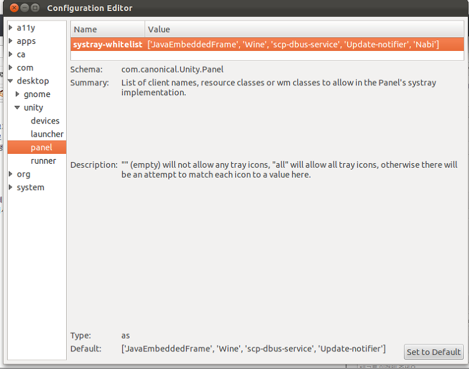

우분투의 기본 키 입력 프로그램 ibus는 여러가지 한글 입력의 버그가 발생합니다.

예를들어, "안녕하세요 우분투 입력기 입니다"라는 입력을 ibus로 입력하면,

"안녕하세 요우분 투입력기 입니다" 이런 식의 띄어쓰기 문제가 발생합니다.

그러므로 우리는 Nabi라는 한글 입력기를 사용하는데요.

이 입력기는 ibus와 같은 버그가 존재하지 않습니다.

그러나 Nabi의 최대 단점(?)으로 생각할수 있는건 바로 화면 위쪽에 나비 시스탬 트레이가 발생한다는 것이지요.

11.10등에서는 숨기기 버튼이 살아있지만 제 경험으로는 12.04에서는 이 버튼이 비활성화 되어 있더군요.

이번에는 이 Nabi를 시스탬 트레이에 넣어보겠습니다.

먼저 dconf-editor을 설치해야 합니다.

우분투 소프트웨어 센터에서 "dconf-editor"을 검색해 설치하거나,

터미널에 아래 명령어를 입력해 설치해 주세요.

> sudo apt-get install dconf-tools

설치를 완료하셨다면 실행해 주시면 됩니다.

그 다음 왼쪽 메뉴를 확인해 주세요.

아래 순서대로 들어가시면 됩니다.

> desktop - unity - panel

로 들어가시면 [systray-whitelist]가 있는데요.

설정되어 있는 값의 맨 마지막에 Nabi를 입력해 주시면 됩니다.

예를 들어 설명하자면

['JavaEmbeddedFrame', 'Wine', 'scp-dbus-service', 'Update-notifier']

이렇게 기본설정이 되어있을경우 맨 마지막에 Nabi를 추가해서

['JavaEmbeddedFrame', 'Wine', 'scp-dbus-service', 'Update-notifier'**, 'Nabi'**]

를 입력하신다음 엔터를 눌러 저장해 주시고 로그아웃 또는 재부팅을 해주시면 시스탬 트레이에 있는 nab의 모습을 보실수 있으실겁니다. ㅎㅎ

(가장 왼쪽 아이콘 - Nabi)

이렇게 시스탬 트레이에 나비를 넣어봤습니다~

PS. 저 유틸을 이용하지 않고 터미널로도 가능합니다.

먼저 아래와 같이 입력해 주세요.

> gsettings get com.canonical.Unity.Panel systray-whitelist

['JavaEmbeddedFrame','Wine','scp-dbus-service','Update-notifier']

이렇게 출력 결과가 나타날겁니다. (사용자 마다 출력 결과가 다릅니다)

출력 결과의 마지막에 Nabi를 넣은다음 터미널에 입력하시면 됩니다.

> gsettings set com.canonical.Unity.Panel systray-whitelist "['JavaEmbeddedFrame','Wine','Update-notifier','Nabi']"

마찬가지로 로그아웃 하시고 들어와 보시면 됩니다.
