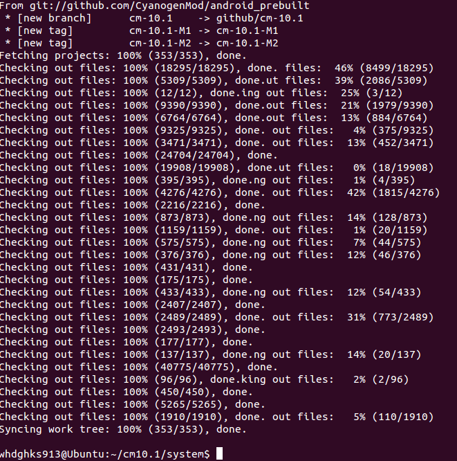
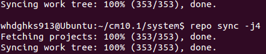

안녕하세요

이번에는 CyanogenMod의 소스를 버전별로 받아보는 방법에 대해 알아보도록 하겠습니다

CyanogenMod, 다들 아시죠?

[2013/02/02 - [강좌/팁/SmartPhone 강좌] - 커롬의 절대 강자! CM과 MIUI를 비교해 보자!](http://itmir.tistory.com/106)

이 글을 살펴보시면 CyanogenMod(이하 CM, 큼)과 MIUI(이하 미우이, 미유아이)를 살펴 보실수 있으십니다 ㅎ

이 글의 명령어는 txt로 첨부해 뒀습니다

[repo.txt

다운로드](./file/repo.txt)

그럼 기본적인 이해는 하셨다 생각하고 글을 진행해 보도록 하겠습니다

CyanogenMod의 소스를 다운받는 방법이 뭔가요?

우리는 소스를 받을 예정인대 이것조차 모르면 앞으로 힘들어 질것 같습니다 ㅎㅎ;;;

소스는 repo라는 툴로 받습니다

repo란 대충 설명해 보면 git 최상위에 설정하는 툴이라 생각하시면 됩니다

그럼 또 의문점이 발생하죠 git이란 무엇인가?

git은 프로젝트의 소스 수정 내역을 기록하고, 팀원과 효율적인 협업을 할 수 있도록 도와주는 프로그램이라 생각하시면 됩니다.

그리고 github는 git을 서비스 해주는 사이트중 하나고요

아무튼 이쯤해서 repo와 git에대한 설명을 끝내고 본격적으로 설명에 들어가 볼까 합니다

**1. repo를 받자**

처음에는 repo을 받아둬야 합니다

repo는 (사용자 계정)/bin에 받는것이 일반적입니다

> mkdir ~/bin
>
> curl https://dl-ssl.google.com/dl/googlesource/git-repo/repo > ~/bin/repo
>
> chmod a+x ~/bin/repo

위 명령어로 사용자 계정(~/)의 bin폴더에 repo를 받았습니다

참고로 curl이라는 것은 하나의 프로그램이므로 sudo apt-get install curl으로 설치를 하셔야 하는 프로그램 입니다

[2013/01/27 - [강좌/팁/커널/빌드 강좌] - 커널 컴파일을 위한 기본 설정 구축하기](http://itmir.tistory.com/51)

이 글을 끝내셨다면 curl은 깔려있습니다 ㅎㅎ

**2. repo에 다운받을 소스를 입력하자**

우리는 ~/bin에 repo를 설치했습니다

그러나 설치만 했다고 어떠한 소스를 받을지 repo가 자동으로 안다면 얼마나 똑똑할까요?

하지만 아직 이런 수준의 프로그램이 발달하지 못했으므로 직접 설정해 주어야 합니다

repo에 소스 받을 경로를 설정해 주는것은 아래 명령어를 사용합니다

> repo init (주소)

이런 구조로 설정해 줍니다 (자세한건 repo --help명령어로 확인해 주세요)

우리는 지금 CyanogenMod의 소스를 받으려 하므로 아래 명령어중 하나를 입력하시면 됩니다

> repo init -u git://github.com/CyanogenMod/android.git -b (버전명)

이렇게 입력하시면 되는대 여기서 자신이 원하는 버전의 CM소스를 받기 위해 (버전명)에 원하는 버전을 기입해 주시면 됩니다

<https://github.com/CyanogenMod/android.git>에 있는 버전명을 모아봤습니다

> @GingerBread이하
>
> eclair
>
> froyo
>
> froyo-stable
>
> @GingerBread
>
> cm-7.0.0
>
> cm-7.0.1
>
> cm-7.0.2.1
>
> cm-7.0.3
>
> gb-release-7.2
>
> gingerbread
>
> gingerbread-release
>
> @ICS
>
> ics
>
> ics-release
>
> cm-9.0.0
>
> cm-9.1.0
>
> @JellyBean
>
> cm-10.1
>
> jellybean
>
> jellybean-release
>
> jellybean-stable

만약 cm10.1의 소스를 받고 싶다면 아래 명령어를 입력해 주시면 됩니다

repo init -u git://github.com/CyanogenMod/android.git -b **cm-10.1**

이런식으로 작성해 주시면 됩니다 ㅎㅎ

**3. 소스를 다운받자**

이제 얼마 안남았습니다 (터미널로 작성하는것만요..;;)

> repo sync

이 명령어로 다운이 가능합니다!

사양이 좋으시다면 뒤에 -j(숫자)를 붙혀 더 빨리 받으실수 있습니다

보통은 -j8을 자주 사용하시는것 같더라고요 ㅋㅋ

> repo sync -j8

이렇게 입력하시고 기다리시면 됩니다 ㅎㅎ

서버의 사정에 따라 아주 빠를수도, 아주 느릴수도 있습니다

저는 cm10.1소스를 약 40분만에 유선으로 다운받았습니다 ㅎㅎ..

**유선을 강력 추천드립니다!!!**

done이라 뜨면 완료된것입니다 ㅎㅎ

업데이트가 된것이 있는지 확인겸 다시한번 repo sync를 입력해 주시면 됩니다

이렇게 해서 CyanogenMod의 소스를 다운받는 방법에 대해 살펴봤습니다!~

---

## 첨부파일

- [repo.txt](./files/repo.txt)
