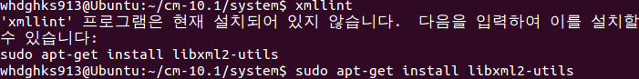

관련된 스샷이 없어 준비를 못했습니다.. 양해를 구합니다..

가끔 빌드를 하다보면 /bin/bash : \* 를 찾을수 없습니다

라는 오류를 볼 수 있는대요 이런 오류는 간단하게 해결 할 수 있습니다

먼저 찾을수 없는 값을 터미널에 입력해 주세요

제 경우 'xmllint' 이놈을 찾을 수 없다고 나왔습니다

그럼 터미널에 xmllint을 입력해 주세요

> xmllint

이런식으로 찾을 수 없는 명령어를 입력해 주시면 됩니다

그럼 이런식으로 이 프로그램이 현재 설치되어 있지 않다고 나타나면서 설치 할 수 있는 방법을 알려줍니다

그럼 터미널에 나타난 명령어를 입력해 설치해 주시면 되는 것 이지요!

> sudo apt-get install libxml2-utils

제경우는 xmllint이 문제였으니 libxml2-utils을 설치해 주면 해결되는 오류였습니다

이런식으로 해서 빠진 프로그램을 설치해 주시면 됩니다 ㅎㅎ

만약 이래도 오류가 뜬다면 아래 자료를 참고해 보세요 빌드시 나타나는 제가 격은 오류를 정리해 뒀습니다 ㅎ

[2013/01/27 - [강좌/팁/커널/빌드 강좌] - CM 빌드/ Apk 컴파일 등에서 나타나는 오류 해결법 [정리]](/archive/itmir/2013/41)