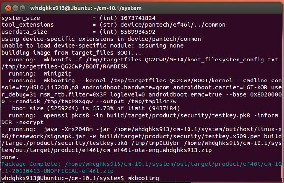
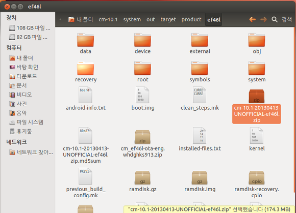

장장 약 24시간의 빌드를 끝내고 zip이 나왔습니다

소스는 cm10, hpa님의 디바이스 트리를 이용하고 제가 심하게 다듬어서 빌드가 이루어 졌습니다

일단 빌드까진 완료되었는대.. 중요한건 부팅이 안되는 군요

백업했던걸로 돌아가고 있습니다

예상했던대로 adb와 fastboot모두 작동하지 않았고요

아무것도 잡히지 않는군요..

다행히도 부트로더의 손상은 없기에 리커버리에는 들어가 집니다

전에 미라크a cm7때도 이와 비슷한 경험이 있긴 한대..

이번에는 뭐때문인지 부팅이 안되는지 모르겠습니다..

아무튼 오늘은 이쯤해서 끝내고 이제 시험 기간이니 공부에 더 집중하려고요 ㅎ

시험 끝나고 cm10.1이 포팅될 수 있도록 노력해 보겠습니다~

(그런대 이 11시 밤에 보시는 분이 계실지 몰ㄹ...)

혹시 디바이스 소스가 필요하신분(께서 계실리는 없지만요..;)께서는 제 깃허브에 올려두었습니다~

할 작업이 없으신 분들은 제가 뭘 수정했는지 확인해 보시는ㄱ...ㅋㅋㅋ

github.com/itmir913/android\_device\_ef46l
