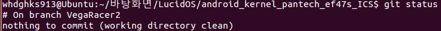
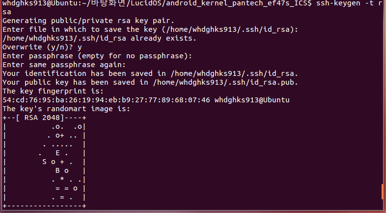
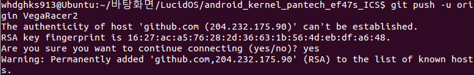
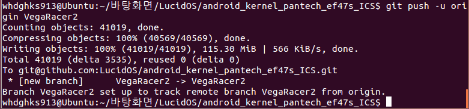

프로젝트를 만들다 보면 branch를 만들어 업로드 해야 하는 경우가 생깁니다.

한번 그 방법을 확인해 보도록 할까요?

> sudo apt-get install git-core

먼저 이렇게 해서 git을 깔아 줍시다.

그다음 설정을 해야 겠지요?

> git config --global user.name "로그인 아이디"
>
> git config --global user.email [가입한 이메일 주소]

이렇게 자신의 이름과 이메일을 입력해 주세요.

> git init

이제 init 명령어로 이 폴더를 git 작업폴더로 사용할 것임을 선언해 주세요.

그럼 새로운 branch를 만들어야겠죠?

참고로 기본 branch는 master입니다. 그리고 master 브런치만 필요하다면 브런치를 새로 만들 필요는 없습니다.

> git checkout -b [만들 branch 이름]

이렇게 브런치를 새로 만들고 그 브런치로 이동해 줍니다.

git status로 상태를 확인해 봤을 때,

# On branch [만든 branch 이름]

이렇게 나타나야 합니다.

이렇게 말이죠.

이제 파일을 추가 시켜 봅시다.

업로드할 파일을 폴더에 집어넣은다음,

> git add --all 또는 git add .

이렇게 파일을 add 시켜 줍시다.

add를 했으면 commit를 등록해야 하는데요.

git commit -m "[설명]"

이 명령어를 입력해 commit를 해줍시다.

그럼 기본적인 것은 완료 했습니다.

이제 SSH를 등록해야 한다고 합니다 (각주: 참고 : http://uiandwe.tistory.com/m/803)

SSH를 등록하는 이유는 git@git~을 사용하기 위함인데요. HTTP방식으로 업로드 하려면 생략하셔도 됩니다.

> ssh-keygen -t rsa

입력하면 뭐라 뭐라 나오는데요. 경로와 이름 부분이 있는데, 엔터로 넘어가시면 됩니다.

이렇게 ssh키 생성이 완료된 것을 보실 수 있습니다.

그럼 ~/ssh/id\_rsa.pub을 열어보시면 무슨 내용이 있습니다.

이것을 github에 등록시켜 줍시다.

<https://github.com/settings/ssh>

또는 계정 설정 페이지에서 SSH Keys을 찾아 들어가 주세요.

Title은 알아서 마음대로 하셔도 되고, 내용에다가 id\_rsa.pub에 있는 내용을 넣어주신다음 저장해 주시면 됩니다.

이제 어디에 push할지 위치를 정해 줍시다.

> git remote add origin [자신의 repo 위치]

origin이라는 객체에 자신의 repo위치를 등록하라 라는 뜻으로 해석하시면 됩니다.

만약 두개 이상을 등록하시려면,

git remote add [만들 이름] [자신의 repo 위치]

이렇게 등록해 주시면 됩니다.

EX) git remote add origin git@github.com:itmir913/Mir-Kernel.git

아까 SSH를 등록했기 때문에 SSH 주소를 입력하시면 되죠 ㅎㅎ

자! 이제 업로드만 남았습니다.

> git push -u origin [branch 이름]

이 명령어로 업로드 하시면 됩니다!

이렇게 연결하시겠습니까? 라고 뜨면 yes를 입력해 줍시다.

그럼 소스 업로드가 완료되고 github사이트에 가시면 업로드된 소스가 있을겁니다!
