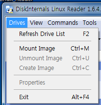
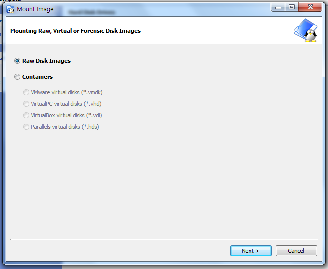
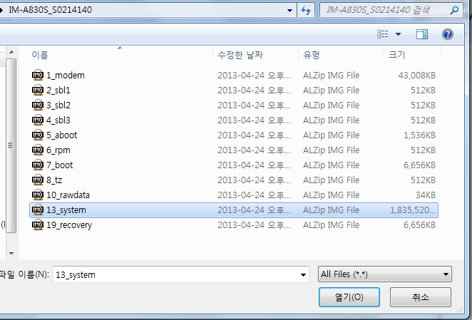
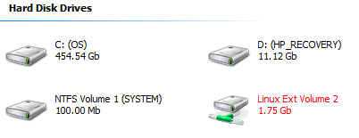
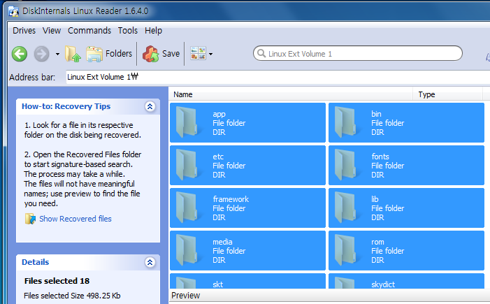
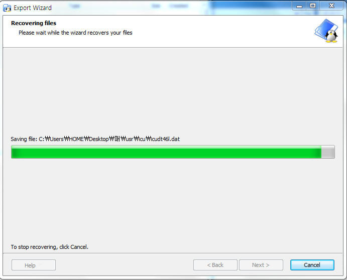
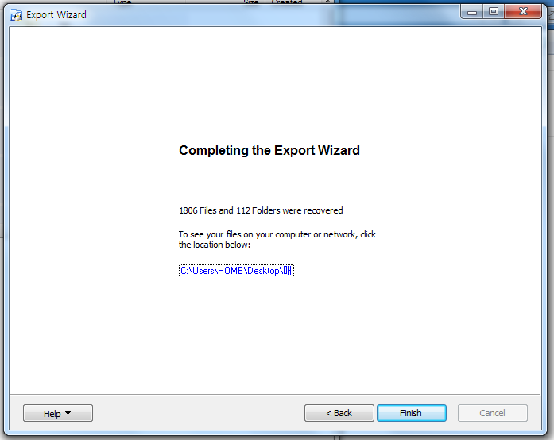

BINX를 분해하면 나오는 img 또는 cwm에서 백업하면 생기는 img파일은 아래와 같은 방법으로 분해가 가능합니다

[Linux Reader.exe](./file/Linux Reader.exe)

<http://www.diskinternals.com/linux-reader/>

Linux Reader라는 프로그램을 이용하여 분해가 가능한대요

말만 분해이지 안에 있는 파일을 복사 하는 정도 입니다

일단 Linux Reader을 깔아주세요

설치후 왼족 상단 메뉴를 보시면 Drivers가 있는데요

Mount Image를 선택해 주시면 됩니다

기본 설정 그대로 둔다음 Next >를!

열려고 하는 img를 선택해주세요

그럼 주황색 글씨로 새로운 파티션 같은게 생깁니다

더블클릭으로 들어가 주세요

자! Ctrl키와 A키를 눌러 모두 선택을 해주신 다음 위에 있는 Save를 눌러줍시다

어디에 저장할건지 지정한다음 확인하시면 이렇게 저장되서 나옵니다

이 화면이 뜬다면 완료된 것입니다

이렇게 해서 img파일을 분해하는 방법에 대해 알아봤습니다

연관된 글 :

[2013/03/09 - [강좌/팁/SmartPhone 강좌] - BINX를 분해해 보자!](http://itmir.tistory.com/174)