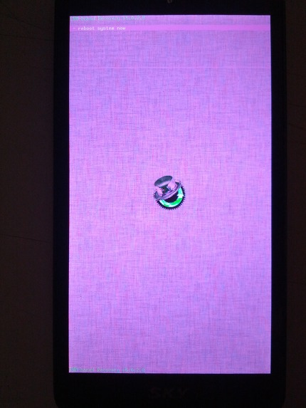
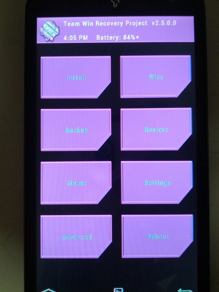

심심해서 빌드해봤습니다 ㅇㅅㅇ

이제 내일이면 시험이 끝나는 관계로 간단하게 만들었습니다 ㅋ

어제 빌드했던 리커버리의 오류를 수정해서 정상적으로 뜨는 리커버리를 만들었는대요

반응이 너무 좋더라고요?!?!?!?!ㅋㅋㅋㅋ

그래서 핑크색(?) 리커버리도 올려드립니다~

\_pink가 있는 파일이 어제 빌드한 안 따끈따끈한 리커버리고요

없는것이 정상적으로 설치/표시되는 리커버리 입니다

오늘도, 내일도 시험인지라 오류가 뜨는지 여부는 확인하지 못했지만 아마도 잘 작동할겁니다 ㅇㅅㅇ

그나저나 serenity님께서 소스 올려주신다고 하셨는대 지금쯤 올려져 있을까요?ㅎㅎ

아무튼 오늘은 내일 시험 준비로 이만 사라지렵니다~

그럼 오늘 하루도 파이팅!!

[cwm.img](https://github.com/itmir913/archive/releases/download/itmir-attachments/cwm.img)

[cwm\_pink.img](https://github.com/itmir913/archive/releases/download/itmir-attachments/cwm_pink.img)

[twrp.img](https://github.com/itmir913/archive/releases/download/itmir-attachments/twrp.img)

[twrp\_pink.img](https://github.com/itmir913/archive/releases/download/itmir-attachments/twrp_pink.img)

참고로 pink 리커버리는 아래와 같이 생겼습니다

CWM은 사용할 수 없을거 같지만 TWRP는 사용 가능할 정도로 좋군요 ㅋㅋㅋㅋㅋ

아무튼 이렇게 해서 간단하게 빌드한 리커버리들 입니다~

PS. 어딜봐서 7ㅔe 리커버리 인가요 ㅋㅋㅋㅋㅋㅋㅋㅋㅋㅋㅋㅋㅋㅋㅋㅋㅋㅋㅋ

---

## 첨부파일

- [cwm.img](https://github.com/itmir913/archive/releases/download/itmir-attachments/cwm.img) `6.6 MB`
- [cwm_pink.img](https://github.com/itmir913/archive/releases/download/itmir-attachments/cwm_pink.img) `6.6 MB`
- [twrp.img](https://github.com/itmir913/archive/releases/download/itmir-attachments/twrp.img) `7.1 MB`
- [twrp_pink.img](https://github.com/itmir913/archive/releases/download/itmir-attachments/twrp_pink.img) `7.1 MB`
