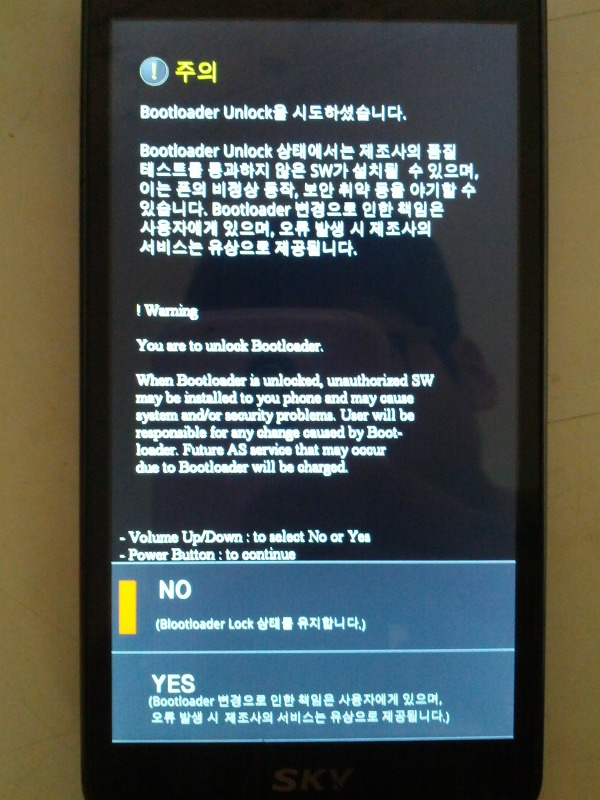
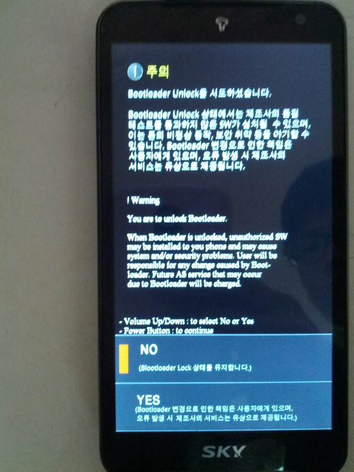
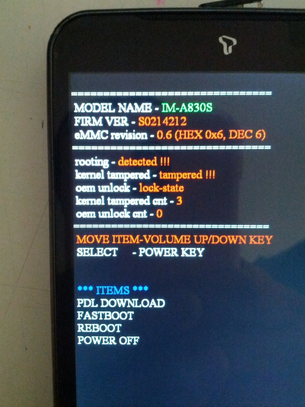

제목 그대로입니다..

fastboot boot recovery.img가 먹히지 않아 원인을 찾던도중

fastboot oem unlock를 하니 아래와 같은 화면이 나타납니다

즉 부트로더가 락되어 있다는 것이죠

부트로더를 보면 이미 제 커널 카운터가 몇개 올라가 있습니다..

아마도 이번 젤리빈 부터는 루팅 여부만 검사하는것이 아니라 몇번 했는지도 검사하는게 아닌지 의심스러워 졌습니다

이로써 우리는 더욱더 할일이 많아졌습니다...;;

아직 젤리빈 적용안하신 분들

루팅 못합니다

언락하지 않는이상

그러니 CWM에서 설치하실때 꼭 슈퍼유저를 설치하신다음 재부팅 하세요

그냥 재부팅 하시면 부트로더가 잠겨서 아무런 짓도 못합니다...

어떻게 루팅을 해야 할까 막막하군요...

다시 락하는 방법이 있지 않는 이상은....말이죠

