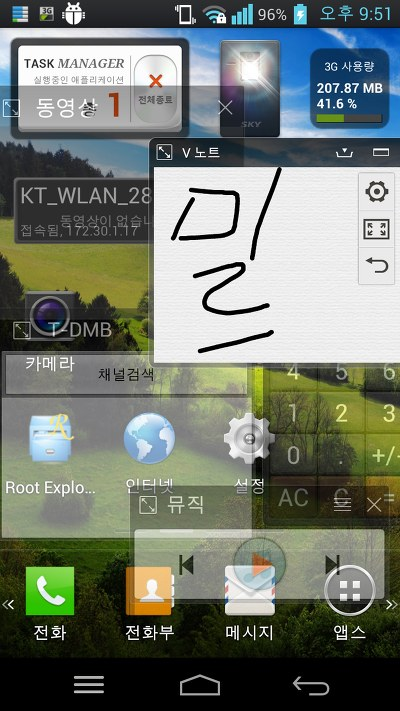
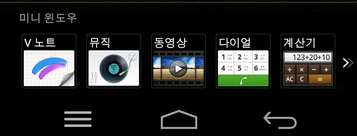
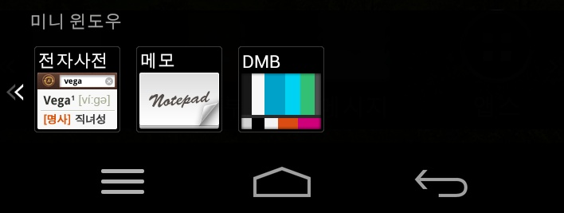

이번시간에는 베가 넘버 6의 미니 윈도우를 적용해 보도록 하겠습니다 ~_~

베가 넘버 식스는 미니 윈도우에서 많은 발전이 있었던 기종입니다

멀티 미니 윈도우가 가능하고 미니 윈도우의 숫자가 기야 급수적으로 늘었습니다

( 자세한 부분은 [2013/02/07 - [전자 기기 포스팅] - 미니 윈도우를 통한 팬택의 기능 업그레이드 살펴보기](http://whdghks913.tistory.com/118) 포스팅을 살펴봐 주세요 )

이렇게 많이 들어가 있는 미니 윈도우, 베넘식에만 쓰기는 아깝죠?

그래서 한번 제 베레2에 넣어보도록 하겠습니다

[배넘식 미니 윈도우.zip](https://github.com/itmir913/archive/releases/download/itmir-attachments/206-mini-window.zip)

[AOTDialer.apk](https://github.com/itmir913/archive/releases/download/itmir-attachments/AOTDialer.apk)

미니 다이얼을 업데이트 하였습니다

배넘식 미니 윈도우.zip에 들어있는 AOTDialer를 사용하지 마시고 새로 올려진 AOTDialer.apk를 사용해 주세요

정상적으로 Deodex하였는대 강제종료가 뜨는군요;

미니다이얼이 아직도 안됩니다

이 두개의 파일을 받아 압축을 풀어주세요

그다음 /system/app에 넣어주시면 됩니다

VEGACamera.apk를 넣지 않으시면 카메라가 활성화 되지 않습니다

또한 지금 제가 테스트 해본 결과로는 미니 다이얼이 작동하지 않는군요..

픽스 되면 바로 업데이트 하도록 하겠습니다

아래는 스크린 샷 입니다 ㅎㅎ

---

## 첨부파일

- [AOTDialer.apk](https://github.com/itmir913/archive/releases/download/itmir-attachments/AOTDialer.apk) `221 KB`

- [배넘식 미니 윈도우.zip](https://github.com/itmir913/archive/releases/download/itmir-attachments/206-mini-window.zip) `3.1 MB`
