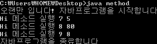
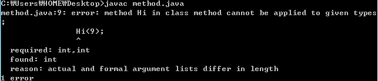

안녕하세요~

거의 한 달만에 뵙지요? 제가 시험기간이라 공부를 하고 있어서 자바의 학습을 중단하는 관계로 잠시 포스팅을 중단했습니다.

그래서 약간 기억도 가물가물 하고요....

아무튼 열씸히 배워봅시다!

이번에는 메소드에 대해 배워보도록 하겠습니다.

우리는 메소드에 대해 아는것은 극히 일부분 입니다..

[2013/02/20 - [미르의 개발 이야기/Java 배움터] - 첫번째 java프로그램을 만들어 보자](http://itmir.tistory.com/148)

우리가 처음에 자바를 배웠을 당시 제가 메소드에 대해 언급을 했습니다.

메소드는 다른 프로그래밍 언어에서는 "함수"라고도 한다 언급을 한 기억이 나는군요. +\_+

우리는 아직 이 "메소드"라는 녀석에 대해 자세히 알고 있지 않습니다.

한번 배워보기전 지금까지 배운 상식으로 우리가 알고 있는것을 정리해 보도록 하겠습니다.

자바 프로그램의 시작 : 자바 프로그램은 main이라는 메소드의 호출으로 시작된다

메소드의 위치 : 우리는 메소드는 class(클래스)라는 것의 내부에 존재해야 함을 알고 있다

메소드의 이름의 위치 : public static void **main**(String[] args)에서 main이 메소드의 이름인것을 알고 있다

중괄호 : 메소드의 중괄호 {, }안에 존재하는 문장들이 위에서 아래로 차례대로 실행된다

그럼 우리가 모르는 것은 무었일까요? (다 알고 있다고 말씀하시는 분께서는 "뒤로가기"를 클릭해 주세요)

public, static, void은 무엇인가?

String[], args는 왜 필요한가?

이름은 왜 main으로만 했나?

이렇게 나눠볼수 있습니다.

아쉽게도(?) 당분간은 public, static, String[], args에 대해서는 언급이 없습니다. (책에서도 없어요;;)

그러므로 시기가 될때까지는 기다려 주시면 감사드리겠습니다..

왜 이름은 mian인가?

"자바 프로그램은 항상 main이라는 이름을 가진 메소드를 실행하며 시작된다"

한번 main이 없는 자바 파일을 만들어 보세요.

아마 main이 없다고 오류가 날겁니다.

그렇다면 자바 프로그램의 시작을 목적으로 만들지 않는다면, 다른 파일에 호출당하는 파일이라면,

이름을 main으로 하지 않아도 되겠지요?

예제를 가지고 메소드와 메소드의 호출 방법에 대해 알아보겠습니다.

```java
class method
{
  public static void main(String[] args)
  {
    System.out.println("오랜만 입니다! 자바프로그램을 시작합니다");
    int Mir=80;
    Hi(7, 5);
    Hi(8, Mir);
    Hi(9,8);
    System.out.println("자바프로그램을 종료합니다");
  }

  public static void Hi(int H1, int H2)
  {
    System.out.println("Hi 메소드 실행 "+H1+" "+H2);
  }
}
```

[method.java](./file/method.java)

자! 소스를 분석해 봅시다.

평소의 예제와는 뭔가 다른 느낌이 있지요? 메소드가 하나 더 생겼습니다.

우리가 주목해야 하는건 Hi(7, 5);아래 부분입니다. 굵은 글씨를 주목하세요!

메소드 호출 방법이 나와있는데요.

Hi(7, 5);를 보시면 Hi라는 메소드를 실행하라고 명령해 주고 있습니다.

Hi라는 메소드에 7과 5를 넘겨주고 있는것이죠.

이 넘겨주는 값은 메소드의 이름 옆에 있는 ()에 저장됩니다.

(int H1, int H2)는 변수를 할당해 주는 것이죠.

값을 전달받은 메소드는 순차적으로 명령을 실행하는 겁니다.

메소드의 호출이 끝난후 호출했던 문장, 즉 Hi(7, 5);로 되돌아와서 그 아래 부분의 명령이 실행됩니다.

이해가 안되시다면 아래 설명을 잘 읽어 주세요~

Hi(7, 5);를 통해 Hi라는 메소드가 시작된후 종료된다.

그다음 Hi(7, 5);아래에 있는 Hi(8, Mir);가 실행되어 Hi메소드가 시작된 후 종료된다.

그다음 Hi(8, Mir);아래에 있는 Hi(9,8);이 실행되어 Hi메소드가 시작된 후 종료된다.

이런 구조로 실행되는 것이지요.

실행 결과를 확인해 볼까요?



역시 같은 결과가 나타납니다.

여기서 잠깐, Hi메소드는 public static void Hi(int H1, int H2)라고 선언되어 있습니다.

즉 (int H1, int H2)을 보아 저장공간(변수)이 2개가 있죠.

그런데 메소드 호출문으로 Hi(9);라고 만든다면 어떻게 될까요?

오류가 발생합니다.



이렇게 int는 2개가 있는대 1개만 값을 준다고 오류가 나타나는 것입니다.

이것으로 오늘 우리는 메소드와 그 호출문에 대해 알아봤습니다~

다음에는 좀 더 복잡한 예제를 가지고 메소드에 대해 알아보도록 하겠습니다~

---

## 첨부파일

- [method.java](./files/method.java)
