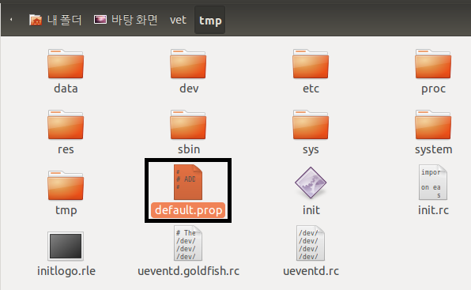
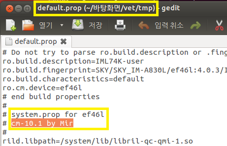
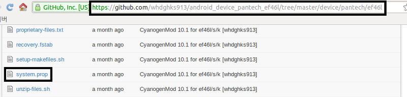
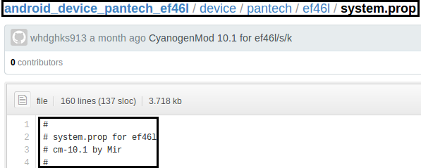

난 천재니까님께서 발견하신 베가레이서2 젤리빈용 CWM ( <http://cafe.naver.com/skydevelopers/246150> )을 터치 리커버리로 만들겸 분해해 봤습니다

원본 베트남 포럼의 글은 <http://vegaviet.com/forum/threads/10522/> 입니다

분해를 해본 결과 빌드하실때 제 github의 cm-10.1소스를 사용하신거 같군요!

리커버리를 분해한다음 또다시 램디스크를 분해했습니다

default.prop를 확인해 보겠습니다

절대로 다른 파일로 장난을 치지 않습니다 ㅋ

경로 확인해 주시고 cm-10.1 by Mir라는 문구를 확인해 주세요

이것은 베트남 포럼의 리커버리의 램디스크안 default.prop에 있던 내용입니다

제 깃허브에 가보겠습니다 ( <https://github.com/itmir913/android_device_pantech_ef46l/> )

경로 확인해 주시고 system.prop를 열어보겠습니다

제 깃허브의 system.prop를 보시면 같은 문구인 cm-10.1 by Mir라는 문구가 있습니다

업로드 날짜는 약 한달전, 젤리빈이 나오기 전에 업로드된 파일들 입니다 ㅎㅎ..

이렇게 해서 베트남 포럼의 베레2 CWM JB버전은 제 cm-10.1소스로 만들어 진거라는 결론이 나왔습니다

은근 기분이 좋군요 ㅎㅎ

역시 만들어 두길 잘했습니다~

빌드할때 오류가 대부분 패치되어 있으니 작업하시기도 편하셨을거예요 아마 ㅎㅎ

git소스 말고도 cm-10.1 소스 위치/bootable/recovery폴더의

Android.mk를 수정하신거 같고 (위에 뜨는 로고, 참고 : [2013/04/26 - [강좌/팁/커널/빌드 강좌] - [Dev] ClockWorkMod Recovery 키값과 표시 로고 바꿔보기 [개발자글]](/archive/itmir/2013/197) )

또한 nandroid.h파일을 수정하신거 같습니다 (기본 백업 확장자가 tar인것으로 보아)

아무튼 기분은 좋네요 ~~