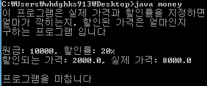

안녕하세요.

이번에는 우리가 지금까지 배운 메소드와 연산자를 이용하여 할인된 가격과 실제 가격을 구해보는 프로그램을 작성해 보도록 하겠습니다.

뭔말이냐? 원금과 할인률 %를 지정해 주면 얼마가 할인되는지, 최종 할인 금액은 얼마인지를 구하는 프로그램입니다.

예를 들면 원금이 20000원이고 할인률이 20%라면 할인 금액은 4000원이고 최종 할인 금액은 16000원이 됩니다. 이를 프로그래밍으로 구해봅시다.

한 main 메소드에 작성할 수 있지만, 우리는 저번 시간에 메소드를 나누는 방법을 배웠습니다.

복습의 의미를 담아서 두 메소드를 이용해 구해보도록 하겠습니다.

```java
class money
{
  public static void main(String[] args)
  {
    int money=10000; // 할인의 대상이 되는 원금  [수정 필요]
    int percent=20; // 20%의 할인                        [수정 필요]

    System.out.println("이 프로그램은 실제 가격과 할인률을 지정하면");
    System.out.println("얼마가 깍히는지, 할인된 가격은 얼마인지");
    System.out.println("구하는 프로그램 입니다");
    System.out.println("");
    System.out.println("원금: "+money+", 할인률: "+percent+"%");
    sale(money, percent);
    System.out.println("");
    System.out.println("프로그램을 마칩니다");
  }

  public static void sale(int money, double percent) // money은 원금이며 percent는 할인률이다
  {
    double M3=percent*0.01; // M3는 %를 소수점으로 변환한 값이다 즉 20%를 0.2로 변환한다
    double yourmoney=money*M3; // 할인되는 가격
    double actually=money-yourmoney; // 실제 가격
    System.out.println("할인되는 가격: "+yourmoney+", 실제 가격: "+actually);
  }
}
```

[money.java](./files/money.java)

자 이게 우리 예제의 소스입니다.

처음에 int형 변수를 2개 선언합니다.

원금과 할인률을 지정해 주고 있지요.

복습을 철저하게 하신 분은 이 두 개의 구문을 하나의 구문으로 바꿀수도 있습니다.

int money=10000, percent=20;

으로 말이죠.

그 아래 부분은 그다지 중요하지 않습니다.

sale메소드를 호출하는 부분부터 중요해 지고 있지요. ㅎ

sale(money, percent);에서 두 개의 변수를 sale메소드로 전달해 주고 있습니다.

여기에는 변수도 들어갈 수 있고 숫자도 들어갈 수 있다는 점!

이제 sale메소드를 봅시다.

double M3=percent\*0.01; // M3는 %를 소수점으로 변환한 값이다 즉 20%를 0.2로 변환한다

주석과 그대로입니다.

M3이라는 변수에 percent에 저장된 값과 0.01을 곱하고 있습니다.

왜 곱해야 하냐면 20%를 소수로 바꾸려면 1/100, 즉 0.01을 곱해야 하기 때문입니다.

소수점이 들어가 있기에 int형이 아닌 double을 사용했습니다.

double yourmoney=money\*M3; // 할인되는 가격

힐인되는 가격을 구하기 위해서는 원금에 할인률(소수)을 곱하면 됩니다.

예를들자면 10000에 20%의 할인률(즉 0.2)을 곱하면 2000원이 나오는데, 이것이 할인되는 가격입니다.

double actually=money-yourmoney; // 실제 가격

자! 이제 할인된 실제 가격을 구해봐야겠지요?

실제 가격은 원금에서 할인된 가격을 빼면 됩니다.

예를 들면 10000원의 20%의 할인률을 적용하면, 10000-2000원이 되므로 8000이 되겠지요.

이렇게 해서 예제 분석이 끝났습니다.

한번 실행 결과를 확인해 볼까요?



할인률과 할인된 가격, 실제 가격을 정상적으로 표시하는것을 볼 수 있습니다.

아직 우리는 java에서 정수를 입력받는 방법을 배우지 않았기에 미리 입력한 정수로 계산하였지만,

정수 입력 방법(Scanner)을 배우면 이 프로그램을 업그레이드 해서 2.0 버전으로 만들어 보도록 하겠습니다.

미리 배우고 싶으신 분들께서는 네이버를 이용해 주세요~

그럼 이번 java강좌를 마치도록 하겠습니다~

---

## 첨부파일

- [money.java](./files/money.java)
