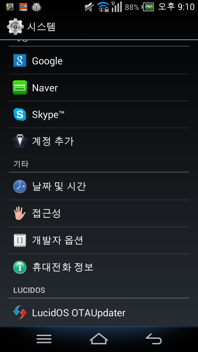
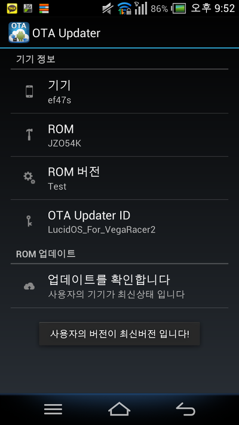
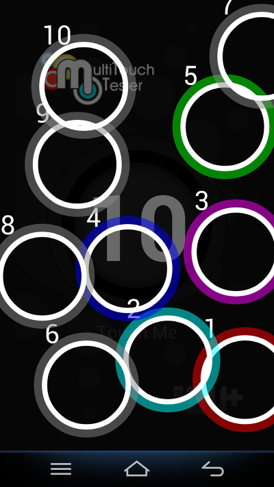
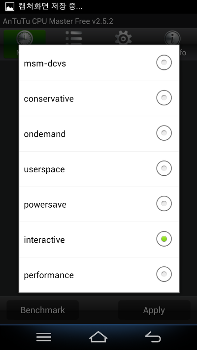
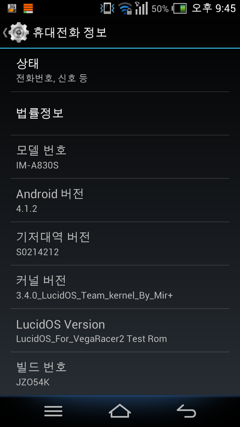
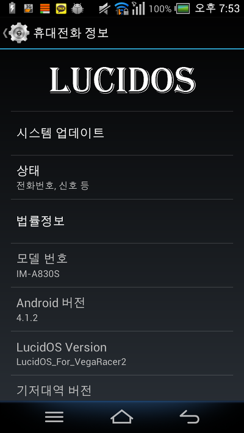
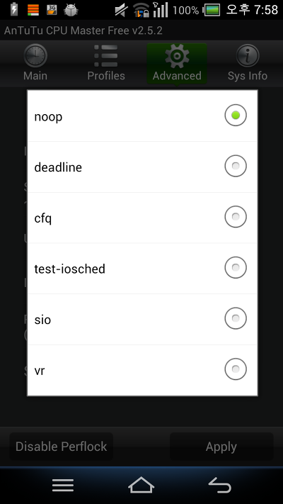
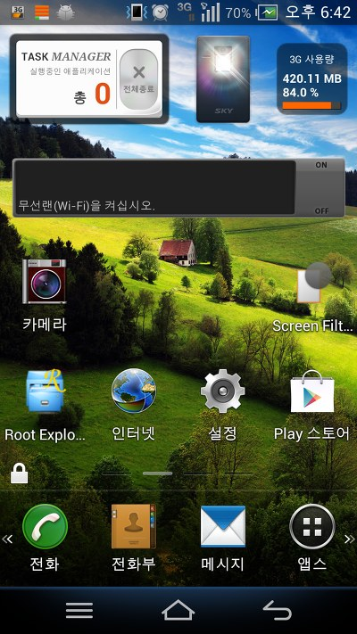
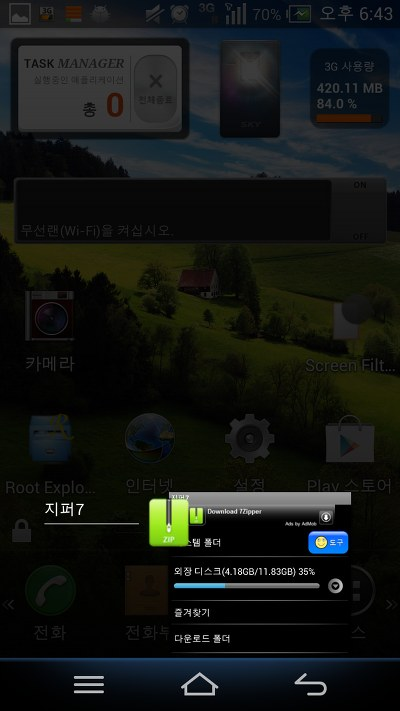

드롭박스에 처음으로 올려 배포했던 Mir-Rom-Beta의 생성날짜를 보니 딱 작년 05-15일 이군요 ㅎㅎ

오늘은 제가 처음으로 만든!, 개발을 시작했던! 날입니다 ㅎㅎ

05월 15일! 딱 스승의 날이군요ㅋ

지금으로 부터 1년전의 저는 아무것도 모르던 쌩 초보였습니다

그러나 조금씩 학습을 통해 여러 경험을 하게 되었고

지금의 저가 탄생하게 된것이겠지요?ㅎ

항상 저를 응원해 주셔서 감사드립니다~

1년이 되는 날이라니....ㅎㅎ

그러므로 VegaRacer2 LucidOS의 떡밥을 던질까 생각중입니다 ㅎ

흙 1주년 맞춰서 배포하려 했는대...

20일쯤에는 나오지 않을까 생각됩니다 ㅎ
