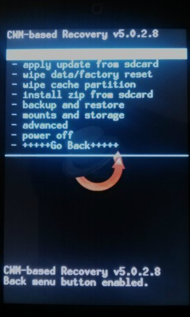

다음 사진처럼 CWM 화면이 나타납니다.

중국 포럼에서 받은 리커버리대신 제가 빌드한 리커버리를 사용해 주세요(?)

이 리커버리의 기기명이 ef32k로 빌드되어 제가 만든 CM7이 정상적으로 설치됩니다.

(중국포럼에서 받은 리커버리는 설치 오류가 납니다.)

다음은 패치에 도움된 삽질님의 덧글 내용(수정)입니다.

1. 디바이스 소스-삼성 폴더에 들어가시면 cooper이라는 폴더가 있는데요.

(이것은 갤럭시 Ace의 코드네임 입니다.)

이 다바이스 소스안 recovery폴더에 있는 graphics.c를 가져와 자신의 디바이스 폴더에 넣습니다.

2. 자신이 만든 logo.rle를 포팅하려는 기기의 소스폴더안에 넣습니다

3. device_기기명.mk에 다음과 같은 내용을 추가합니다.

```
Logo.rle

PRODUCT_COPY_FILES += \

device/제조사/기기명/logo.rle:root/logo.rle \

device/제조사/기기명/logo.rle:root/initlogo.rle

# Custom Graphics

BOARD_CUSTOM_GRAPHICS := ../../../device/제조사/기기명/graphics.c
```

4. `make clobber`을 해줍니다.

(보드컨픽이 수정되었기 때문에 꼭 해주셔야 합니다)

5. 빌드를 합니다 (`make -j4 recoveryimage`)

## 첨부파일

- [22-recovery.img](https://github.com/itmir913/archive/releases/download/itmir-attachments/22-recovery.img) — CWM Recovery (ef32k / KT 미라크A)
