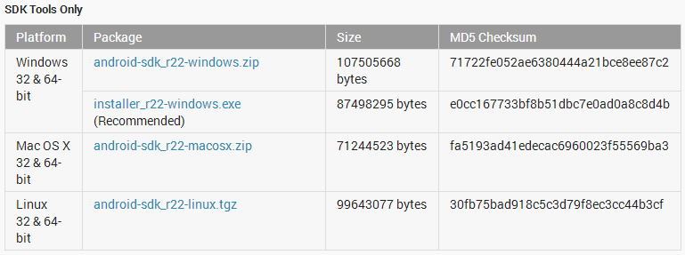

**안드로이드를 빌드하기 전에 빌드 환경을 구축하자**

오랜만에 쓰는 커널/빌드 강좌 이군요 ㅇㅅㅇ

이제 몇일에서 몇달간에 걸쳐 제가 알게된 모든 방법을 이 게시판에 강좌로 올려볼려고 합니다~

이 글을 보실 분이 계실지 모르겠습니다만 쉽고 재미있게 써보도록 하겠습니다~

오래된 정보 안내

이글은 2013년도에 작성된 글입니다.

글 작성시에는 최신 정보라고 해도 2년동안 많은것이 달라졌으므로 (예를들어 우분투 버전등)

어떤 순서로 이루어지는지만 알아두시고 자세한 지침은

구글에서 "android build ubuntu 14.04"와 같은 검색어로 찾아보신다음 진행해주시면 감사드리겠습니다

**0. 빌드를 위한 준비물**

이 부분은 앞으로 진행될 모든 강좌에서 공통으로 필요한 부분입니다

꼭 진행해 주세요~

먼저 빌드를 할 우분투 OS가 필요합니다

Ubuntu의 용량은 넉넉하게 50GB이상으로 잡아주세요 빌드시 용량이 많이 필요합니다

권장하는 버전은 10.04와 12.04 LTS 64Bit 입니다 꼭 64Bit로 설치해 주셔야 합니다!

+ 2015-11-14 추가

이 글은 13년도에 작성된 글로, 당시 12.04가 최신버전이었습니다.

지금 최신은 15버전이거나 그 이상이고, 12버전은 지원이 끊겼으므로 사용하지 마시고 최신버전으로 설치하세요

저는 12.04 LTS 64Bit를 사용중에 있습니다 이 강좌는 12.04를 기준으로 작성되어 집니다~

우분투를 멀티부팅이든 가상머신이든 설치해 주세요 Wubi는 저는 권장하지 않습니다 ㅎ

이 방법은 네이버에 엄청나게 널려있으니 생략하겠습니다~

설치가 완료되었으면 터미널을 켜 주세요

**1. 빌드에 필요한 파일 설치**

**(1) JAVA 설치**

먼저 안드로이드는 달빅캐쉬라는 자바를 이용해 돌아가므로 풀 소스도 .java라는 확장자를 가진 파일들이 많이 있습니다

그러므로 이를 위해 java를 설치해야 하는대요

구글 소스 다운로드 가이드에서 제공하고 있는 방법을 택할경우

$ sudo add-apt-repository "deb http://archive.canonical.com/ lucid partner"

$ sudo apt-get update

$ sudo apt-get install sun-java6-jdk

하지만 이 방법은 국내에서는 잘 되지 않는다고 합니다

그래서 Bridge(htchoi2839)님께서 알려주신 방법을 택하실경우 (<http://cafe.naver.com/develoid/67579>)

$ sudo add-apt-repository "deb http://archive.ubuntu.com/ubuntu hardy main multiverse"

$ sudo add-apt-repository "deb http://archive.ubuntu.com/ubuntu hardy-updates main multiverse"

$ sudo apt-get update

$ sudo apt-get install sun-java6-jdk

이 명령어를 입력하시면 됩니다

하지만 제 경우 전에 java오류에서 엄청난 fail을 격은적이 있습니다..

그래서 아래 방법으로 java를 설치하였습니다

$ sudo add-apt-repository ppa:webupd8team/java

$ sudo apt-get update

$ sudo apt-get install oracle-java6-installer

위 박스안 명령어를 입력하시면 자동으로 파일을 받아 java가 설치됩니다

(출처 : http://thedaneshproject.com/posts/how-to-install-java-7-on-ubuntu-12-04-lts/, thanks for hPa)

설치가 완료된 다음 터미널에 java -version이라 입력할경우 java 버전이 나오면 정상입니다

**(2) Android SDK 설치**

adb와 fastboot를 설치하면 우분투에서 바로 스마트폰의 상태를 확인할 수도 있고 adb명령어가 쓸만한게 많습니다

필요 없으시면 건너뛰셔도 무관합니다.

<http://developer.android.com/sdk/index.html>

위 사이트에 방문 하셔서 SDK를 받으신후 압축 해제해 주시면 됩니다

이 버튼을 눌르신 다음

SDK Tools Only박스에서 Linux 32 & 64-bit를 받아주시면 됩니다

다운이 완료되면 자신의 홈 폴더, 즉 ~/에 압축해제 해주세요

바탕화면, 다운로드폴더의 전 폴더 입니다

이제 터미널에 아래와 같이 입력해 주세요

$ export PATH=${PATH}:~/(폴더명)/tools

$ export PATH=${PATH}:~/(폴더명)/platform-tools

$ export PATH=${PATH}:~/bin

$ PATH="$HOME/(폴더명)/tools:$HOME/(폴더명)/platform-tools:$PATH"

$ android

android를 입력한다음에는 SDK manager메뉴가 나타나야 합니다

만약 나타나지 않을경우 (폴더명)/tools에 있는 android를 실행해 주시면 됩니다

실행후 가장 위에 있는 Android Tools관련만 설치해 주세요

전부 설치하시면 시간도 오래걸리고 용량도 많이 잡아먹습니다 (빌드하면 용량이 부족할수도 있으므로)

설치가 다 되면 platform-tools안에 adb와 fastboot등의 파일이 있을겁니다

위 초록 박스의 명령어를 입력한후 터미널을 닫지 않으면 adb가 될겁니다

하지만 새로 터미널을 닫을경우 adb가 안되는대 이때는 ~/.bashrc등에 SDK를 PATH에 추가해 주시면 됩니다

**(3) 빌드에 필요한 패키지 설치**

이제는 터미널을 사용하여 패키지를 설치해 봅시다

$ sudo apt-get install python

$ sudo apt-get install git-core

위 두줄을 입력해 주신다음

**10.04는 아래 구문을 입력해 주세요**

$ sudo apt-get install git-core gnupg flex bison gperf build-essential \

  zip curl zlib1g-dev libc6-dev lib32ncurses5-dev ia32-libs \

  x11proto-core-dev libx11-dev lib32readline5-dev lib32z-dev \

  libgl1-mesa-dev g++-multilib mingw32 tofrodos python-markdown \

  libxml2-utils

**11.10은 10.04구문 입력후 아래 구문을 또 입력해 주세요**

$ sudo ln -s /usr/lib/i386-linux-gnu/libX11.so.6 /usr/lib/i386-linux-gnu/libX11.so

**12.04는 아래 구문을 입력해 주세요**

$ sudo apt-get install git-core gnupg flex bison gperf build-essential \

  zip curl libc6-dev libncurses5-dev:i386 x11proto-core-dev \

  libx11-dev:i386 libreadline6-dev:i386 libgl1-mesa-glx:i386 \

  libgl1-mesa-dev g++-multilib mingw32 openjdk-6-jdk tofrodos \

  python-markdown libxml2-utils xsltproc zlib1g-dev:i386

$ sudo ln -s /usr/lib/i386-linux-gnu/mesa/libGL.so.1 /usr/lib/i386-linux-gnu/libGL.so

**(3) USB 드라이버 설치**

gksudo gedit /etc/udev/rules.d/51-android.rules

이 명령어를 입력하시면 아무것도 입력되지 않은 빈 파일이 gedit 편집기에 뜰겁니다

아래 회색 박스를 모두 기입해 주세요 (필요한 부분만 기입해도 됩니다)

#Acer

SUBSYSTEM=="usb", ATTR{idVendor}=="0502", MODE="0666"

#ASUS

SUBSYSTEM=="usb", ATTR{idVendor}=="0b05", MODE="0666"

#Dell

SUBSYSTEM=="usb", ATTR{idVendor}=="413c", MODE="0666"

#Foxconn

SUBSYSTEM=="usb", ATTR{idVendor}=="0489", MODE="0666"

#Garmin-Asus

SUBSYSTEM=="usb", ATTR{idVendor}=="091E", MODE="0666"

#Google

SUBSYSTEM=="usb", ATTR{idVendor}=="18d1", MODE="0666"

#HTC

SUBSYSTEM=="usb", ATTR{idVendor}=="0bb4", MODE="0666"

#Huawei

SUBSYSTEM=="usb", ATTR{idVendor}=="12d1", MODE="0666"

#K-Touch

SUBSYSTEM=="usb", ATTR{idVendor}=="24e3", MODE="0666"

#KT Tech

SUBSYSTEM=="usb", ATTR{idVendor}=="2116", MODE="0666"

#Kyocera

SUBSYSTEM=="usb", ATTR{idVendor}=="0482", MODE="0666"

#Lenevo

SUBSYSTEM=="usb", ATTR{idVendor}=="17EF", MODE="0666"

#LG

SUBSYSTEM=="usb", ATTR{idVendor}=="1004", MODE="0666"

#Motorola

SUBSYSTEM=="usb", ATTR{idVendor}=="22b8", MODE="0666"

#NEC

SUBSYSTEM=="usb", ATTR{idVendor}=="0409", MODE="0666"

#Nook

SUBSYSTEM=="usb", ATTR{idVendor}=="2080", MODE="0666"

#Nvidia

SUBSYSTEM=="usb", ATTR{idVendor}=="0955", MODE="0666"

#OTGV

SUBSYSTEM=="usb", ATTR{idVendor}=="2257", MODE="0666"

#Pantech

SUBSYSTEM=="usb", ATTR{idVendor}=="10A9", MODE="0666"

#Philips

SUBSYSTEM=="usb", ATTR{idVendor}=="0471", MODE="0666"

#PMC-Sierra

SUBSYSTEM=="usb", ATTR{idVendor}=="04da", MODE="0666"

#Qualcomm

SUBSYSTEM=="usb", ATTR{idVendor}=="05c6", MODE="0666"

#SK Telesys

SUBSYSTEM=="usb", ATTR{idVendor}=="1f53", MODE="0666"

#Samsung

SUBSYSTEM=="usb", ATTR{idVendor}=="04e8", MODE="0666"

#Sharp

SUBSYSTEM=="usb", ATTR{idVendor}=="04dd", MODE="0666"

#Sony Ericsson

SUBSYSTEM=="usb", ATTR{idVendor}=="0fce", MODE="0666"

#Toshiba

SUBSYSTEM=="usb", ATTR{idVendor}=="0930", MODE="0666"

#ZTE

SUBSYSTEM=="usb", ATTR{idVendor}=="19D2", MODE="0666"

이제 USB 드라이버 관련 파일을 생성하였습니다

adb를 작동시켜 보세요 작동이 될겁니다

만약 작동이 안된다면 Android SDK를 확인해 보세요

**(4) Repo 받기**

repo는 안드로이드의 소스를 받는대 필요한 파일 입니다

이 repo를 받기를 위해서는 curl이라는 프로그램이 필요한대요

우리는 이 프로그램을 위에서 설치했습니다

그러므로 그냥 진행하셔도 됩니다

$ mkdir ~/bin

$ export PATH=~/bin:$PATH

$ curl https://dl-ssl.google.com/dl/googlesource/git-repo/repo > ~/bin/repo

$ chmod a+x ~/bin/repo

~/bin이라는 폴더에 repo를 받는 명령어 입니다

위에도 언급했지만 repo를 찾을수 없다는 오류가 뜰경우 PATH를 확인해 주세요

repo를 다운받는 주소가 변경되었습니다

curl http://commondatastorage.googleapis.com/git-repo-downloads/repo > ~/bin/repo

안내 : http://stackoverflow.com/questions/19126603/android-source-repo-gpg-public-key-not-found

**(5) Hosts를 수정하여 소스 다운중 오류를 줄임**

$ gksudo gedit /etc/hosts

이 명령어를 입력하신 다음 아래 회색 박스의 내용을 IPv4부분에 넣어주시면 됩니다

#Google Source

74.125.128.82 google.com source.android.com android.googlesource.com

74.125.128.99 google.com source.android.com android.googlesource.com

74.125.128.139 google.com source.android.com android.googlesource.com​

#gitHub

207.97.227.239 github.com wiki.github.com gist.github.com assets0.github.com assets1.github.com assets2.github.com assets3.github.com

+2014-01-20 추가

fatal: unable to connect to github.com:

github.com[0: 207.97.227.239]: errno=??? ???

hosts에 추가한 내용을 모두 지워주세요

이글을 쓰면서 참조한 글

<http://forum.xda-developers.com/showthread.php?t=1762641>

http://cafe.naver.com/develoid/67579

<http://source.android.com/source/initializing.html>

<http://siryua.sloud.kr/168177004>
