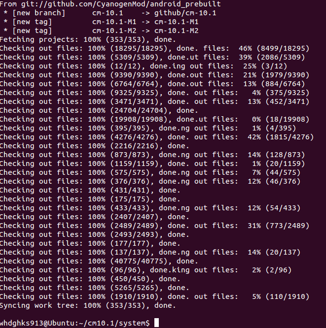
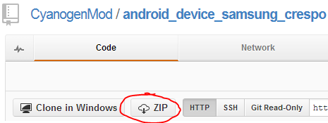

저번 빌드 환경 구축에 이어 2번째 강좌입니다

이글이 다른분들께서 읽으실지는 모르겠지만 ㅠ

아무튼 첫 1) 에서 말한것 처럼 제가 경험한 모든것을 쏟아 부은 강좌가 되도록 노력하겠습니다!

**0. 사전 필독 글들 && 관련 글들**

이 글은 기본적으로 리눅스/우분투에 대한 지식이 있어야 합니다

여기서의 지식이란 굉장한 것이 아니라 그냥 조금 가지고 놀아봤다 정도면 됩니다

기본적인 지식으로 질문하시면 대단히 힘듭니다 ;;

필독글

[2013/05/25 - [강좌/팁/커널/빌드 강좌] - 1) 안드로이드를 빌드하기 전에 빌드 환경을 구축하자](/archive/itmir/2013/220)

관련글

[2013/03/31 - [강좌/팁/커널/빌드 강좌] - 버전별 CyanogenMod의 소스를 다운받자!](/archive/itmir/2013/184)

[2013/02/03 - [강좌/팁/커널/빌드 강좌] - 나도 CM7 포팅해 보자 - 디바이스 소스와 벤더를 짜자](/archive/itmir/2013/107)

[2013/01/28 - [강좌/팁/커널/빌드 강좌] - 나도 CM7 포팅해 보자 - CWM을 포팅해보자](/archive/itmir/2013/94)

기본적인 빌드 환경이 구축되었다고 생각하고 강좌 진행하도록 하겠습니다

**1. repo init**

우리는 전 강좌에서 repo를 받았습니다

이 repo로 소스를 다운받을건대요

처음으로 repo에게 어떤 소스를 받을것 인지 알려줍시다

먼저 폴더를 생성해야 겠지요?

```bash
mkdir ~/cm-10.1
cd ~/cm-10.1
```

이제 repo에게 "이 폴더에 이 소스를 받을거야"라고 말해 봅시다

```bash
repo init -u git://github.com/CyanogenMod/android.git -b cm-10.1
```

이런씩으로 repo에게 어떤 소스를 받을건지 지정해 주시면 됩니다

뒤에 있는 cm-10.1에 버전명을 넣으면 되는데요

@GingerBread 이하

eclair

**froyo**

froyo-stable

@GingerBread

cm-7.0.0

cm-7.0.1

cm-7.0.2.1

cm-7.0.3

gb-release-7.2

**gingerbread**

gingerbread-release

@ICS

**ics**

ics-release

cm-9.0.0

cm-9.1.0

@JellyBean

**cm-10.1**

**jellybean**

jellybean-release

jellybean-stable

이정도의 목록이 가능합니다

원하시는 버전을 넣어 repo init를 해주시면 됩니다

**2. repo sync**

이제는 소스를 받아야 합니다

```bash
repo sync
```

이렇게 입력하시면 소스의 다운로드가 시작됩니다

되도록 유선으로 받으시길..

프로세스를 더 할당하여 속도를 높일수 있는대요

뒤에 -j(숫자)를 입력해 주시면 됩니다

예를 들자면

```bash
repo sync -j8
```

이런씩으로 말이죠

이제 밥을 먹고 오시던지 놀다 오시던지 나갔다 오시던지 하시면 소스 다운이 완료됩니다

1시간 안에 받을 생각을 하셨다면 바로 지워버리세요

대략 2~3시간 정도 걸립니다, 빠르면 1시간에도 받더라고요



다운이 다 될경우 위와 같은 창이 뜨게 됩니다

Done이 뜰경우 완료된것 입니다

업데이트 확인을 위해 repo sync를 다시한번 입력해주세요.

**3. 디바이스 소스 생성**

Cyanogenmod 풀소스에 들어가신다음 device폴더에 들어가시면 현재 소스에 있는 디바이스 소스가 있습니다

cm7까지만 해도 소스 다운로드시 device소스도 모두 다운이 되었는대 지금은 device소스는 받지 않는거 같습니다

소스의 크기가 너무 커지는거 같기 때문이라 생각되는군요

소스를 받는 방법은 2~3가지가 있습니다 천천히 보도록 하겠습니다

(1) CyanogenMod 공식 지원 기기

<https://github.com/cyanogenmod>

이 github 사이트에 들어가신다음 자신이 빌드하고자 하는 기기를 찾아 주소를 복사해 주세요

우분투로 넘어와서 폴더를 하나 만든다음 터미널에 아래와 같이 다운로드 해주세요

git clone (복사한 주소)

만약 버전이 다르다면 버전을 입력해 주셔야 합니다

git clone (복사한 주소) -b (버전명)

예를 들면 git clone https://github.com/CyanogenMod/android_device_samsung_crespo -b cm-10.1

이렇게 입력해 주시면 됩니다

그럼 자동으로 git이 파일을 받아와 저장합니다

만약 그냥 웹사이트에서 바로 다운로드 하려면



ZIP을 클릭해 주시면 몇초쯤뒤 다운로드가 됩니다

디바이스 소스가 모두 다운로드 되었으면 이제 vendor을 짜야 합니다

cd device/(제조사)/(기기명)로 터미널로 진입하신다음 기기를 USB로 연결하세요

그다음 adb devices로 연결을 확인하시면 됩니다

그 뒤

```bash
./extract-files.sh
`````n
을 입력하여 필요한 파일을 기기에서 pull하게 해주세요

제가 사용하는 넥서스S의 경우 구글의 sh드라이버 지원이 끊겼습니다...

레퍼런스의 지원이 끊기다니..

이경우에는 Cyanogen에서 벤더를 제공하지 않으면 커스텀 벤더를 가져와야 하는데요

TheMuppets라는 팀의 벤더를 가져와서 사용해 봅시다

device/samsung/crespo에 들어가셔서 self-extractors을 보시면 필요한 벤더 파일을 보실수 있습니다

이제 git clone으로 파일을 받아야 하는데요

git clone은 아래와 같은 구조로 이루어져 있습니다

```bash
git clone (가져올 repo주소) -b (가져올 브런치 이름)
`````n
그럼 아래 박스를 입력하여 벤터를 가져와 봅시다

```bash
git clone git://github.com/TheMuppets/proprietary\_vendor\_akm.git -b cm-10.1
git clone git://github.com/TheMuppets/proprietary\_vendor\_broadcom.git -b cm-10.1
git clone git://github.com/TheMuppets/proprietary\_vendor\_imgtec.git -b cm-10.1
git clone git://github.com/TheMuppets/proprietary\_vendor\_nxp.git -b cm-10.1
git clone git://github.com/TheMuppets/proprietary\_vendor\_samsung.git -b cm-10.1
git clone git://github.com/TheMuppets/proprietary\_vendor\_widevine.git -b cm-10.1
`````n
이제 다운받은 폴더의 이름을 변경하여 봅시다

```bash
mv proprietary\_vendor\_akm akm
mv proprietary\_vendor\_broadcom broadcom
mv proprietary\_vendor\_imgtec imgtec
mv proprietary\_vendor\_nxp nxp
mv proprietary\_vendor\_samsung samsung
mv proprietary\_vendor\_widevine widevine
`````

mv명령어는 파일을 이동할때 쓰이지만 파일명 또는 폴더명을 변경할때도 사용됩니다

(2) CyanogenMod 비공식 지원 기기 - 개발자분의 github에서 소스 다운

이 방법은 device소스가 개발자분의 github등에 있는 경우 입니다

이때는 github에서 소스를 찾아 git clone으로 다운로드 하면 끝입니다 ㅎ

예를들어 hPa님의 github에서 소스를 다운로드 해봅시다

hPa님의 github주소는 <https://github.com/985hPaKicK> 입니다

원하는 repo의 주소를 복사한뒤 위와 같이 git clone으로 다운로드 해주시면 됩니다

hPa님의 github에 있는 ef46l(베가레이서2)기기의 cm10소스를 받는다고 하면

git clone <https://github.com/985hPaKicK/android_device_pantech_ef46l> -b jellybean

이렇게 다운로드가 가능하겠군요 ㅎ

(3) 직접 디바이스 소스 생성

이 케이스가 가장 까다로운 방법입니다 -_-

그리고 가장 어렵습니다..

디바이스 소스를 만드는 방법에도 2가지 정도가 있습니다

먼저 한 방법은 이미 비슷한 기종의 소스를 빌려오는 방법입니다

이 방법으로 소스를 생성하는 방법은 일단 포팅하고자 하는 기기와 스펙이 비슷한 기기를 찾습니다

저는 이자르(?)소스로 미라크a에 맞는 cm7소스를 만들었습니다

해상도, AP, 와이파이 칩셋등이 비슷한 기기를 찾아 그 기기의 config을 빌려오면 됩니다 ㅎ

찾는 방법은 다양합니다

<https://github.com/CyanogenMod> 에서 찾을수도 있고

개발자 께서 올려두신 첨부파일로도 찾을수 있고

etc..

두번째 방법은 직접 소스를 만드는 방법입니다

Aㅏ... 이 글로 설명하기 진짜 힘들고 어려운 방법입니다

주변 비슷한 스펙중 CyanogenMod 정식 지원기기가 없고, 개발자분들도 없을때는 직접 소스를 짜셔야 합니다

어느 글에서 "이글만 보면 소스를 짤수 있습니다"라는 내용이 있다면 그건 거짓입니다 한 포스팅으로 소스 짜기는 아주 어렵다고 생각되는군요

아직 제 능력이 좋지 않아 이부분은 간단하게 설명해 드리겠습니다

안드로이드 풀소스안 device/(제조사)/(코드네임) 폴더를 생성하신 다음

BoardConfig.mk, device_(코드네임).mk등의 파일을 생성해야 합니다

```bash
build/tools/device/mkvendor.sh
`````으로 디바이스 소스의 기초를 생성할 수 있습니다

순정 boot.img가 필요합니다

```bash
build/tools/device/mkvendor.sh (제조사) (코드네임) (부트이미지경로)
`````

이렇게 입력해 주시면 기초적인 빌드에 필요한 파일, 즉 BoardConfig.mk등이 생성되어 나옵니다

그다음은 완전 노가다 입니다

cmdline등과 각종 Config설정을 BoardConfig.mk에 넣어주고 필요한 파일은 device_(코드네임).mk에 추가해 주고..

[2013/01/28 - [강좌/팁/커널/빌드 강좌] - 나도 CM7 포팅해 보자 - CWM을 포팅해보자](/archive/itmir/2013/94)

이 글과 대체적으로 비슷하다고 생각하시면 됩니다

**4. 빌드**

이제 디바이스 소스를 생성하였습니다

터미널로 이동하여 빌드를 시작해 봅시다

```bash
. build/envsetup.sh
lunch full\_(기기명)-eng 또는 lunch cm\_(기기명)-eng
brunch (기기명)
`````

이 3개의 명령어로 빌드를 시작할 수 있습니다

터미널을 새로 열었다면 꼭 . build/envsetup.sh를 실행해 줘야 합니다

lunch명령어는 어떤 기기를 빌드할 것인지 설정해 주는 명령어로 make -j4 recoveryimage같은 명령어로 빌드시 필요합니다

만약 리커버리를 빌드하려고 하는대 lunch를 하지 않고 make -j4 recoveryimage를 하게 되면 기본 디바이스, 즉 generic이 빌드됩니다;;

brunch (기기명)으로 빌드할때는 lunch를 하지 않아도 됩니다 자동으로 선택되어 집니다

여기서 eng는 롬파일 자체가 su를 얻는것이고 userdebug는 eng의 반대라 생각하시면 됩니다

빌드 명령어는 사실상 이게 끝입니다

디바이스 소스를 짜는것이 어렵고 소스의 문제가 없다면 몇시간후 zip으로 나오게 되지요 ㅎㅎ

그 오류 해결이 까다롭고 어려운 것이지...

이렇게 해서 이번 강좌 마치겠습니다~

출처

<http://blog.naver.com/akthfdyd/50159218843>

<https://github.com/CyanogenMod>

</archive/itmir/2013/94>