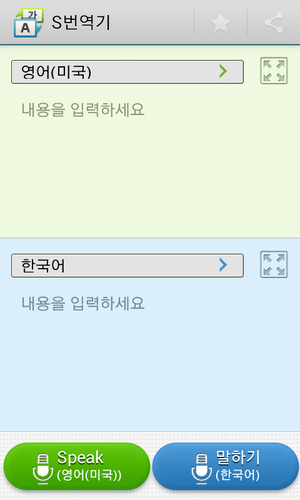
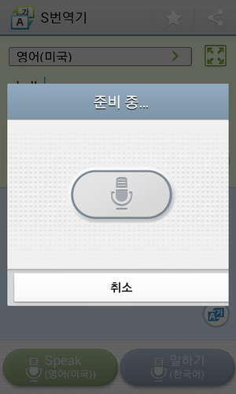
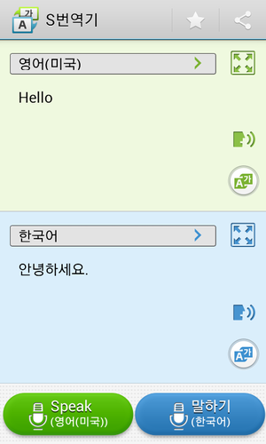
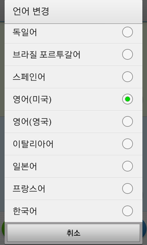
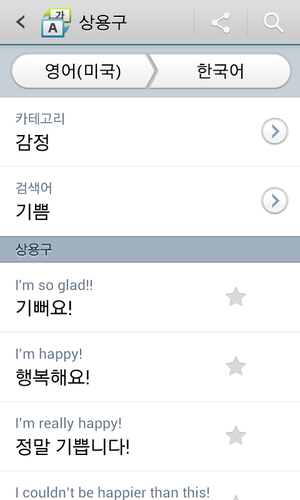
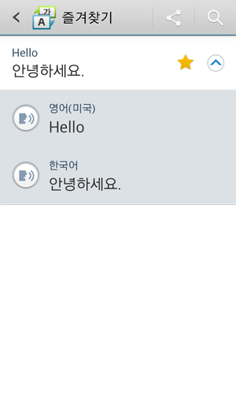

웃음투자님께서 포팅해 주신 겔럭시 S4 S번역기 입니다

이 자료는 제가 만든 것이 아니며 softdx(웃음투자)님께서 만드신 자료 입니다

<http://blog.naver.com/softdx/60192631041>

파일 저장용 글입니다

원본 글

갤럭시S4 최신 펌(젤리빈 4.2.2 ME6 버전)에서 S번역기 시스템 앱을 추출하여 타 단말기에 설치하여 사용할 수 있도록 작업하였습니다. 특히 갤럭시S2 기종에서 작동될 수 있도록 작업하였습니다.

포팅 작업 사항 :

1. 시스템 앱의 ODEX 화된걸 DEODEX 화 작업 APK 1개의 파일로 수정

2. 젤리빈 4.2 이상 설치 가능한 부분을 ICS 이상 설치 가능하도록 호환성 확대 수정

3. 시스템 참조 라이브러리 내장 및 일반 설치 가능도록 작업

4. 삼성 전용 터치위즈 라이브러리 사용 부분 모두 대체 수정하여 타기종 단말기 호환성 확대

5. 갤럭시S4 이외 타 기종 하단에 음성 인식 버튼 작동 안되는 부분 표시 및 작동 하도록 수정

6. 갤럭시S4 해상도 최적화된 부분을 갤럭시S2 해상도 최적화된 레이아웃 추가 작업 지원 확대

7. WIFI 외 연결시 메세지 출력 및 일부 도움말 표시 불필요 화면 작동 부분 제거

설치 사용 환경 :

1. 안드로이드 ICS 이상 기종

2. 삼성 계정 접속이 가능한 기종(삼성 단말기 기본 내장 그외는 삼성 계정 접속 앱 추가 설치)

3. 갤럭시S2 이상의 해상도 지원 기종

4. 인터넷 연결이 가능한 기종(삼성 번역 서버에 접속하여 결과를 가져오는 방식)

5. 삼성 TTS 기능 작동 가능한 기종(음성 읽어주기 이용시)

설치 파일

1. 삼성 계정 접속 앱 설치 - 삼성 단말기는 기본 내장이며 없는분만 samsungsvc 설치

2. S-Translator 다운로드 설치(시스템 앱이 아니므로 그냥 설치하세요)

모처럼 시간내서 작업에 들어 갔었네요. 갤럭시S2 에서 사용 결과 아주 작동 잘됩니다. 삼성 갤럭시S2 이상 기종에서는 모두 문제 없이 작동될 것으로 판단됩니다. 고해상도의 레이아웃으로 전용으로 나와서 갤럭시S2 레이아웃도 맞게 추가로 넣는 부분에서 양쪽을 모두 지원하도록 맞추는 부분에서 약간 애를 먹었네요.

노력한 사람를 생각해서 출처 정도는 밝혀 주시면 감사하겠습니다.

2013.05.27 15:30 2차 수정 파일로 교체했습니다.

그전에 받으신 분들은 업데이트하시기 바랍니다.

[S\_Translator\_CSLi\_v0.8.8\_ported\_softdx.apk

다운로드](./file/S_Translator_CSLi_v0.8.8_ported_softdx.apk)

[Samsungsvc\_v1.4.0.108.apk

다운로드](./file/Samsungsvc_v1.4.0.108.apk)