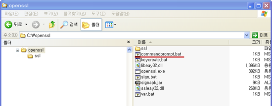
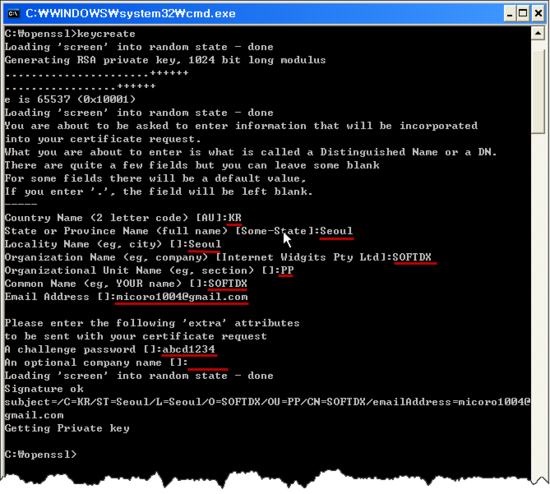
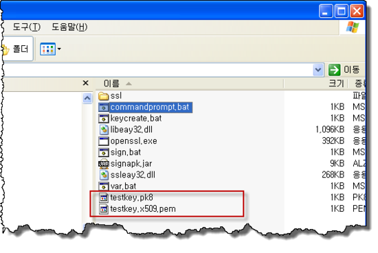

서명 파일 만드는 것을 궁굼해 하시는 분들이 있어 apk-manager 에 적용이 가능한 안드로이드 서명 파일 만드는 방법과 툴을 소개해 드리고자 합니다.

카카오톡 테마 apk 파일이나 어플을 개발시 나의 서명을 삽입하는 방법은 일단 서명 파일을 만들어야 합니다. 한번 만든 서명 파일을 계속 이용하시면 내 어플에 같은 나만의 서명이된 apk 파일을 배포 가능합니다.

apk-manager에 적용이 가능한 서명 만드는 방법에 대해서 아시는 분들이 없어서 제가 개인적으로 안드로이드 apk에 적용이 가능하도록 배치 파일로 만들어 사용하고 있는 툴을 공개합니다.

나만의 서명 파일을 만들기 위해서 apk-manager 의 other 폴더의 testkey.pk8, testkey.x509.pem 파일이 apk-manager의 12번 sign 시 적용이 되는 파일입니다. 이 2개의 파일을 생성하려면 첨부한 파일을 다운로드 받아서 C:\에 압축을 해제하면 아래와 같은 파일이 나옵니다. 아래 화면에서와 같은 폴더명과 위치를 사용하세요.

여기서 **commandprompt.bat**를 실행하시면 CMD 창이 열립니다. 제가 미리 작성해 놓은 키 생성 시키는**keycreate.bat**를 실행합니다. 그럼 아래 화면에서 처럼 나오고 서명에 삽입할 여러가지를 묻는데 묻는 질문에 적당해 적당히 답변해 넣으면 완료가 됩니다.

아래 화면에서 보시는 것처럼 아래 2개의 서명키 파일이 생성되며 이 파일을 **apk-manager 의 other 폴더의 서명 파일을 교체**하시면 끝입니다.

참고로 apk 파일의 서명을 교체하고자 한다면 sign.bat 를 이용하시면 생성된 서명을 apk 파일에 서명을 별도로 하실 수 있도록 배치 파일로 만들어 놓았습니다.

C:\openssl>sign sample.apk 라고 하시면 sample.apk 에 testkey.pk8, testkey.x509.pem 의 서명이 됩니다.

[openssl.zip](./file/openssl.zip)

꼭 C:\에 넣어주세요 ㅎㅎ 그래야 파일을 찾을수 없다는 오류가 안뜹니다 ㅇㅅㅇ

이 글은 <http://blog.naver.com/softdx/60159760190> 이 원본 출처입니다

툴을 만들어 주신 웃음투자님께 감사드립니다!!

웃음투자님 블로그에 있는 CCL을 따라 이 글을 작성하였습니다

---

## 첨부파일

- [openssl.zip](https://github.com/itmir913/archive/releases/download/itmir-attachments/openssl.zip) `853 KB`
