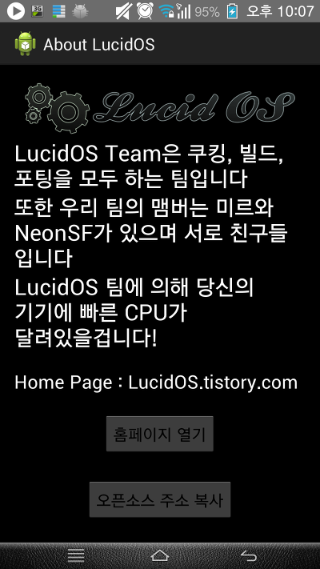
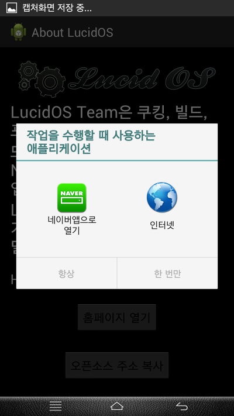
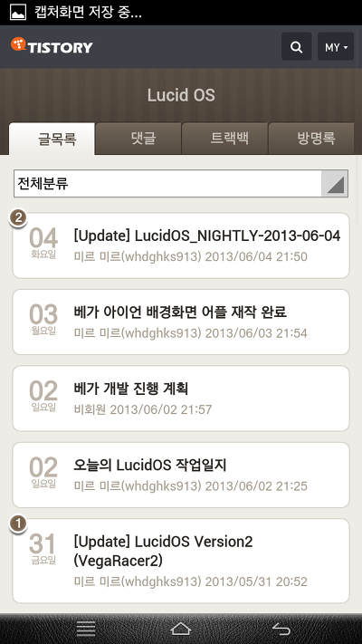
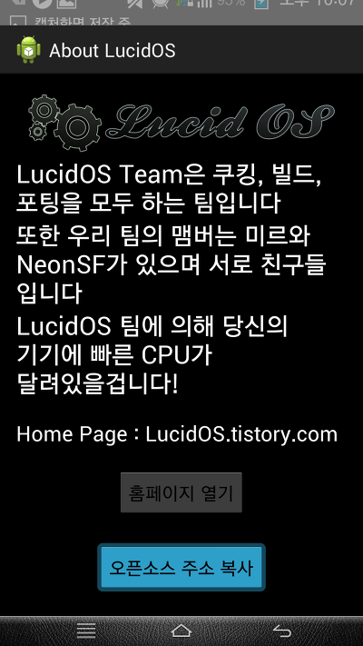
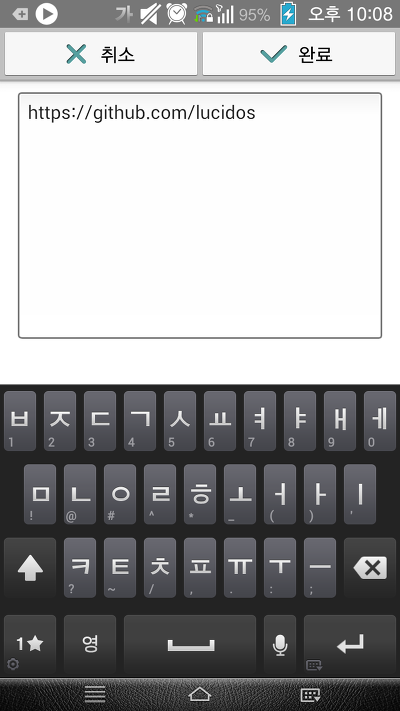

ㅇㅅㅇ! 어플 제작 은근 재밌네요 !!

중독됬어요 ㅋㅋ

이번에는 MainActivity.java파일까지 수정해서 약간 힘들었습니다...

그래도 java를 배워둔 덕에 이해까지는 쉬웠네요 ㅋㅋ

역시 java를 배워두길 잘했습니다 컴퓨터 자바랑 안드로이드 자바랑 약간 들어가는 문구만 다르지 다른건 모두 같아요 ㅋㅋ

맨 처음 화면처럼 그냥 글씨 띄워주고 홈페이지 열기를 누르면 LucidOS.tistory.com을, 아래거 누르면 클립보드에

https://github.com/LucidOS를 복사합니다 ㅋㅋㅋㅋ

이것이 단 1시간정도만에 만들어 졌다는 사실! 너무 이해하는대 시간이 오래걸린듯 합니다...

오늘 처음 어플 개발하는것 배운 초보가 만든 어플치고 너무 허접하지 않나요..??ㅎㅎ

java코드는 디벨로이드 검색해 보니 고수님께서 올려주신 소스가 있기에 그거 좀 수정해서 사용했어요 ㅎㅎ

어플과 소스 올려둡니다~

[AboutLucidOS.zip](https://github.com/itmir913/archive/releases/download/itmir-attachments/AboutLucidOS.zip)

[signed_AboutLucidOS.apk](https://github.com/itmir913/archive/releases/download/itmir-attachments/signed_AboutLucidOS.apk)

---

## 첨부파일

- [AboutLucidOS.zip](https://github.com/itmir913/archive/releases/download/itmir-attachments/AboutLucidOS.zip) `1.4 MB`
- [signed_AboutLucidOS.apk](https://github.com/itmir913/archive/releases/download/itmir-attachments/signed_AboutLucidOS.apk) `286 KB`
