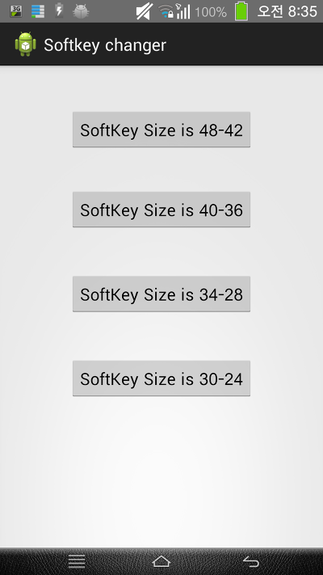

대략 이런 어플입니다

눌르면 바로 실행됩니다 ㅇㅅㅇ

바로 변경되고 재부팅 되는 엄청 심플한 어플

LucidOS의 NIGHTLY 버전에서 사용가능합니다

이 어플에는 RootTools라는 바이너리가 들어 있습니다

그 바이너리도 첨부합니다

[RootTools-2.6.jar](https://github.com/itmir913/archive/releases/download/itmir-attachments/RootTools-2.6.jar)

[SoftkeyChanger.apk](https://github.com/itmir913/archive/releases/download/itmir-attachments/SoftkeyChanger.apk)

[SoftkeyChanger.zip](https://github.com/itmir913/archive/releases/download/itmir-attachments/SoftkeyChanger.zip)

---

## 첨부파일

- [RootTools-2.6.jar](https://github.com/itmir913/archive/releases/download/itmir-attachments/RootTools-2.6.jar) `64 KB`
- [SoftkeyChanger.apk](https://github.com/itmir913/archive/releases/download/itmir-attachments/SoftkeyChanger.apk) `255 KB`
- [SoftkeyChanger.zip](https://github.com/itmir913/archive/releases/download/itmir-attachments/SoftkeyChanger.zip) `1.3 MB`
