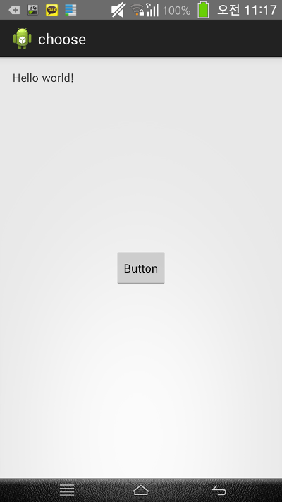

이렇게 버튼을 누르면 레이아웃을 변경합니다

Androidmanifest.xml을 건들이니 오류가 게속 났지만

"src/패키지명" 에서 마우스 오른쪽 - New -Other - android activity로 만드니 오류가 나지 않군요

어플의 소스와 apk올립니다

[choose.apk](https://github.com/itmir913/archive/releases/download/itmir-attachments/choose.apk)

[choose.zip](https://github.com/itmir913/archive/releases/download/itmir-attachments/choose.zip)

---

## 첨부파일

- [choose.apk](https://github.com/itmir913/archive/releases/download/itmir-attachments/choose.apk) `230 KB`
- [choose.zip](https://github.com/itmir913/archive/releases/download/itmir-attachments/choose.zip) `1.2 MB`
