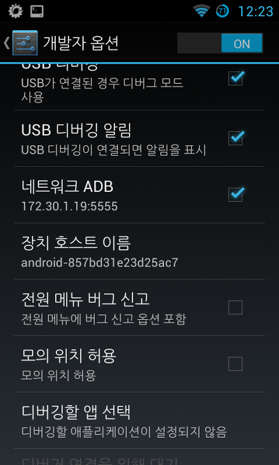

안녕하세요~

이번에는 특별한 것을 들고 왔는데요

기기에서 기기에게 adb를 실행하는 방법입니다 ㅋ

이말이 무슨뜻인즉 A라는 기기가 있고 B라는 기기가 있을때

B라는 기기의 logcat을 보거나 할때 A기기를 통해 adb접속이 가능하다는 뜻입니다 ㅎ

**A → B**

이렇게 말이죠 ㅋㅋ

같은 Wi-Fi등 같은 무선에 접속해 있어야 합니다

먼저 무선 ADB서비스를 활성화 해보겠습니다

터미널 에뮬레이터를 받으신다음 su를 입력하시고 아래를 입력해 주세요

> setprop service.adb.tcp.port 5555
>
> stop adbd
>
> start adbd

이것으로 무선 Adb를 활성화 했습니다

su권한이 필요하니 su를 준다음 시도해 주세요

그다음 다른 기기에서 접속하는 방법을 알아보겠습니다

> adb connect (아이피):5555
>
> adb devices
>
> adb shell

이제 잡힐겁니다 ㅎㅎㅎㅎㅎㅎㅎㅎ

실수로 rm -rf /system을 입력하지 않도록 주의해 주세요 ㅋㅋ
