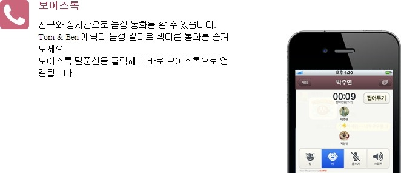
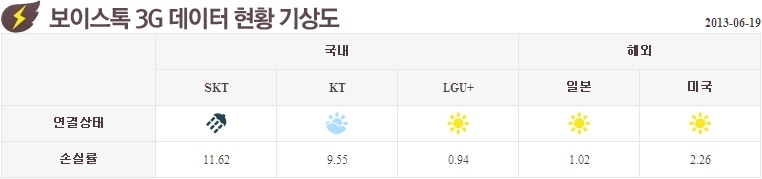
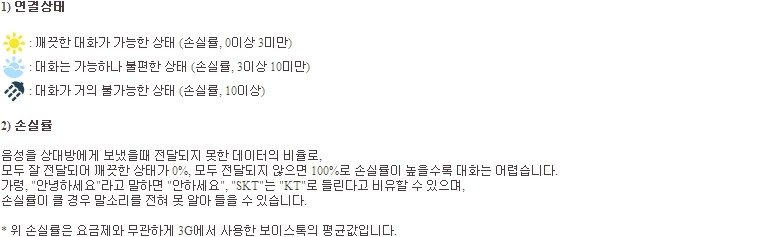

카카오톡에서 지원하는 기능중 "보이스 톡"이라는 기능이 있습니다

위 사진과 같이 무료로 통화를 할 수 있는대요

WIFI로는 상관이 없지만 3G로 하는 보이스톡은 통신사에게는 엄청난 부담 입니다

무제한 요금제를 사용하는 일부 유저들 때문이죠

*지들이 망 관리나 잘 할것이지*

카카오톡 홈페이지에서는 이런 보이스톡의 손실률을 날씨에 비유에 확인할수 있습니다

(맑음) 표시가 정상이고 (구름)과 (비)는 통신사가 약간씩 관여하는 것입니다

<http://www.kakao.com/talk/stat_voicetalk>

이 링크를 보시면 상태를 확인하실수 있습니다

아래 표는 직접 홈페이지에서 가져온 정보 입니다 [06/01~06/19]

|  | | SKT | KT | LGU+ | 일본 | 미국 |
| --- | --- | --- | --- | --- | --- | --- |
| 06월 19일 | 연결상태 | Icon_rain | Icon_cloud | Icon_sun | Icon_sun | Icon_sun |
| 손실률 | 11.62 | 9.55 | 0.94 | 1.02 | 2.26 |
| 06월 18일 | 연결상태 | Icon_rain | Icon_cloud | Icon_sun | Icon_sun | Icon_sun |
| 손실률 | 11.56 | 9.11 | 0.97 | 1.79 | 2.63 |
| 06월 17일 | 연결상태 | Icon_rain | Icon_cloud | Icon_sun | Icon_sun | Icon_cloud |
| 손실률 | 11.36 | 9.73 | 1.03 | 0.95 | 4.96 |
| 06월 16일 | 연결상태 | Icon_rain | Icon_rain | Icon_sun | Icon_sun | Icon_cloud |
| 손실률 | 12.47 | 10.01 | 0.99 | 0.96 | 3.29 |
| 06월 15일 | 연결상태 | Icon_rain | Icon_rain | Icon_sun | Icon_sun | Icon_sun |
| 손실률 | 11.74 | 10.76 | 0.94 | 1.03 | 2.93 |
| 06월 14일 | 연결상태 | Icon_rain | Icon_rain | Icon_sun | Icon_sun | Icon_cloud |
| 손실률 | 11.0 | 10.08 | 1.0 | 0.98 | 3.62 |
| 06월 13일 | 연결상태 | Icon_rain | Icon_cloud | Icon_sun | Icon_sun | Icon_cloud |
| 손실률 | 10.41 | 9.88 | 0.84 | 1.03 | 3.0 |
| 06월 12일 | 연결상태 | Icon_rain | Icon_cloud | Icon_sun | Icon_sun | Icon_cloud |
| 손실률 | 10.52 | 9.45 | 0.91 | 1.04 | 3.41 |
| 06월 11일 | 연결상태 | Icon_rain | Icon_cloud | Icon_sun | Icon_sun | Icon_sun |
| 손실률 | 10.28 | 9.31 | 0.96 | 0.94 | 2.89 |
| 06월 10일 | 연결상태 | Icon_cloud | Icon_cloud | Icon_sun | Icon_sun | Icon_cloud |
| 손실률 | 9.87 | 9.56 | 0.67 | 0.95 | 3.33 |
| 06월 09일 | 연결상태 | Icon_rain | Icon_cloud | Icon_sun | Icon_sun | Icon_sun |
| 손실률 | 10.74 | 9.59 | 0.7 | 0.97 | 2.44 |
| 06월 08일 | 연결상태 | Icon_rain | Icon_rain | Icon_sun | Icon_sun | Icon_cloud |
| 손실률 | 11.71 | 10.84 | 0.68 | 1.03 | 3.7 |
| 06월 07일 | 연결상태 | Icon_cloud | Icon_cloud | Icon_sun | Icon_sun | Icon_cloud |
| 손실률 | 9.69 | 9.72 | 0.66 | 1.07 | 3.19 |
| 06월 06일 | 연결상태 | Icon_rain | Icon_rain | Icon_sun | Icon_sun | Icon_sun |
| 손실률 | 10.31 | 10.12 | 0.64 | 0.99 | 2.74 |
| 06월 05일 | 연결상태 | Icon_cloud | Icon_cloud | Icon_sun | Icon_sun | Icon_sun |
| 손실률 | 9.13 | 9.78 | 0.55 | 0.96 | 2.74 |
| 06월 04일 | 연결상태 | Icon_cloud | Icon_cloud | Icon_sun | Icon_sun | Icon_sun |
| 손실률 | 8.91 | 9.4 | 0.64 | 0.93 | 2.46 |
| 06월 03일 | 연결상태 | Icon_cloud | Icon_cloud | Icon_sun | Icon_sun | Icon_cloud |
| 손실률 | 9.2 | 9.32 | 0.54 | 0.89 | 3.19 |
| 06월 02일 | 연결상태 | Icon_rain | Icon_rain | Icon_sun | Icon_sun | Icon_cloud |
| 손실률 | 10.32 | 10.12 | 0.65 | 0.92 | 3.05 |
| 06월 01일 | 연결상태 | Icon_rain | Icon_rain | Icon_sun | Icon_sun | Icon_sun |
| 손실률 | 10.46 | 10.52 | 0.69 | 0.98 | 2.6 |

SKT보이시나요?

맑은 날이 없습니다

모두 손실률이 10%가 넘고 있습니다

그에 비해 KT는 SKT보다는 덜 막고 있지만 그래도 막고 있습니다

보이스톡을 말이죠

하지만 U+는 어떤가요? 모두 (맑음) 입니다

손실률이 아주 적습니다 1%도 안되고 있어요

이건 무엇을 뜻하고 있을까요..?

SKT와 KT가 고의적으로 약간씩 누락시키고 있다고 생각합니다

아니라면 저런 손실률이 나올리가 없잖아요..?

10%라면 "미르의 IT정복기"라고 말한다고 하면 "미의 T복기"정도로 들리는 것인대..

U+와 달리 망에 자신이 없나봐요
