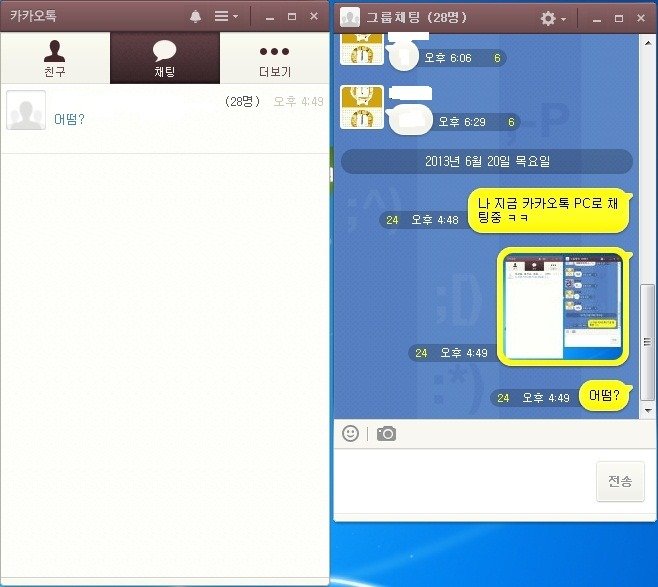
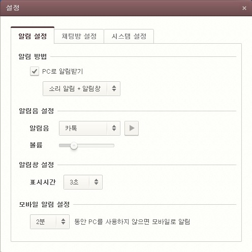
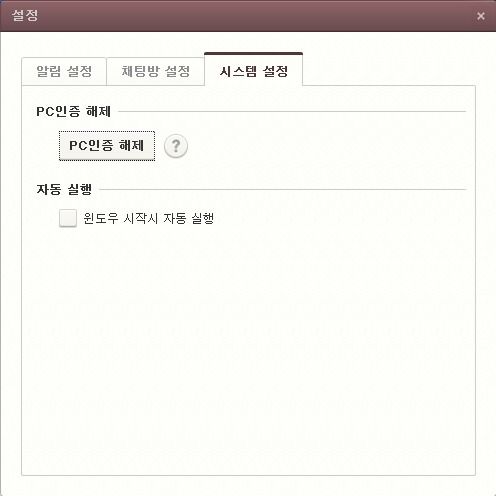
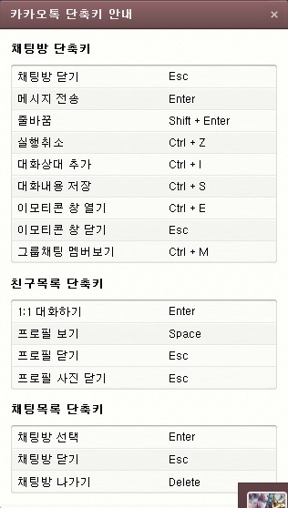
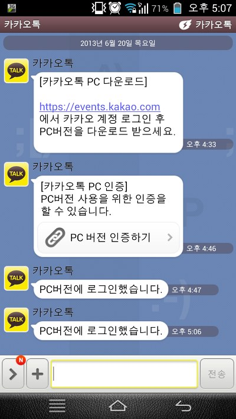

3월부터 시작된 베타 테스트를 마치고 이제 본격적으로 정식버전을 출시하려 하나 봅니다!

어디 한번 저도 사용해 봤는대요 확실히 편하더라고요. ㅎㅎ

카카오톡은 다른 서비스(마이피플, 라인등)와 다르게 PC버전이 지원되지 않아 VMWere등 가상머신으로 PC에 안드로이드를 깔아 사용했었는데요.

이제 정식버전이 나왔습니다!ㅋㅋ

한번 구경해보겠습니다.

이렇게 채팅 목록도 그대로 나타나고요~

채팅도 가능합니다.(당연하지만) 그리고 사진 올리기는 가능하네요.

아쉬운게 있다면 동영상은 업로드가 안되는듯 합니다..

친구들도 재대로 뜹니다. (일부로 모자이크 처리했습니다.)

설정도 모바일 카톡이랑 완전 같습니다.

이건 설정창 인대요 아직은 간소롭습니다.

심플하니 마음에 듭니다. ㅎㅎ

시스템 설정탭 에서는 위와 같은 설정을 건드릴수 있습니다.

윈도우 시작시 자동 실행과 PC버전 인증 취소가 있습니다.

마지막으로 단축키 키능도 지원하는데요.

음.. 저걸 다 외울 일은 (저는)없습니다;;

간단하게 카카오톡 PC버전을 살펴봤습니다.

베타 테스터 신청하셨던 모든분들에게는 메일로 날라갔고요~

아니신 분들도 모바일 - 설정 - PC버전메뉴에 들어가 예약이 가능합니다!

저는 예약 하자마자 1분뒤에 가능했네요(?)ㅋㅋㅋㅋ

이렇게 로그인하게 되면 모바일 카카오톡으로도 알림이 뜨게 됩니다. ㅎㅎ

그럼 이쯤해서 카카오톡 PC버전에 대한 설명을 마치겠습니다.

[KakaoTalk\_Setup.zip

다운로드](./file/KakaoTalk_Setup.zip)

설치 파일을 그냥 올리면 두려우니(그럼 카카오에서 이메일 인증 한 이유가 없으니) 암호를 걸어 압축한 뒤 올려두겠습니다.

일종의 자료 저장용(?)

저 파일은 2013-06-20-5:00에 받았습니다