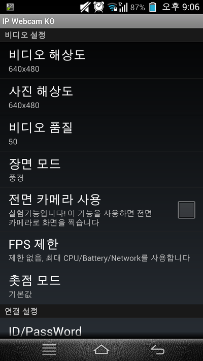
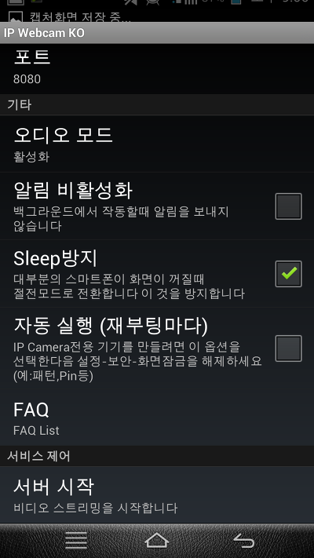
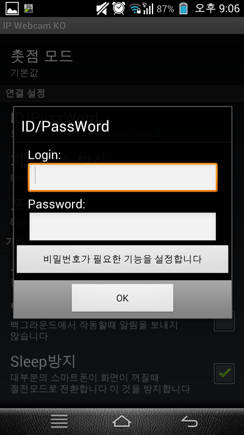
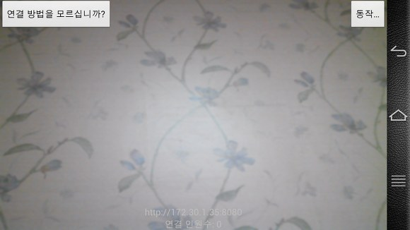
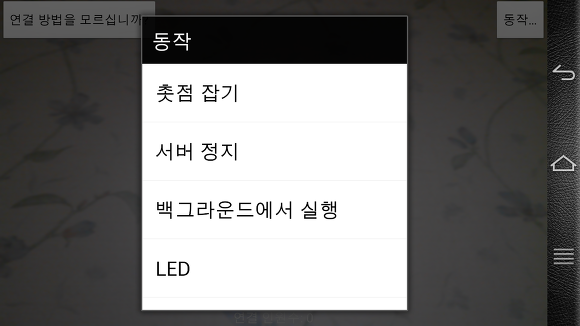
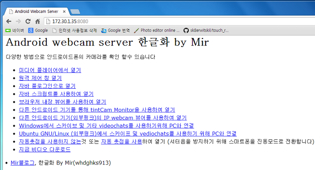
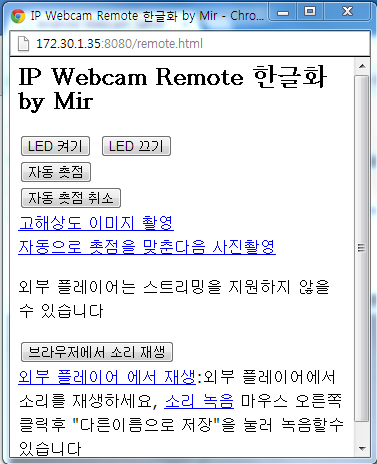
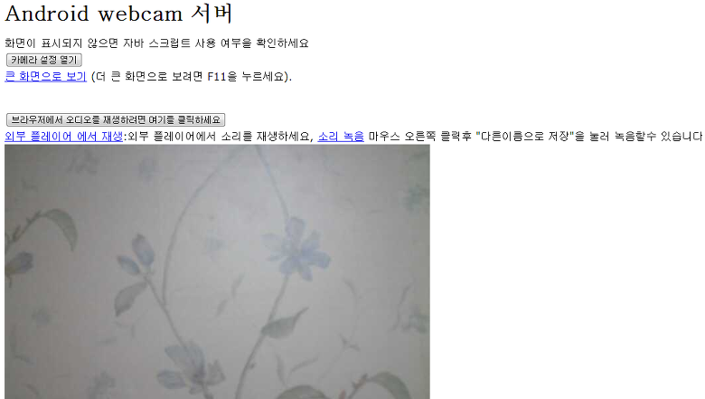

안드로이드폰으로 CCTV를 만들자!

IP Webcam을 소개합니다 ㅎㅎ

이 어플은 온라인 스트리밍으로 동영상을 보내주는 형식인대요

예를 들면 A라는 안드로이드 폰에 설치한다음 실행을 한다음 B라는 PC에서 접속을 하게되면

A에서 B로 영상을 실시간 전송하는 기능을 합니다

단! 영상의 저장은 불가능합니다 ㅎㅎ..;

이 포스팅에 첨부되어 있는 Apk파일은 한글화된 어플입니다

제가 직접 발로 뛰어서 영어를 모두 한글로 번역하였습니다

**업데이트 내역**

**-2013-07-04**

**1. 첫 번역작업**

**-2013-07-05**

**1. 발번역부분 수정(오역, 직역등등)**

**2. 많은 영어를 한글로 다시 수정**

**3. 메뉴키를 눌렀을때 Ported by Mir라는 메뉴 생성**

아래는 스샷입니다~

이렇게 초기 실행화면이 모두 한글화 되어 있습니다

대부분의 한글화가 되어 있습니다

카메라 실행 화면도 한글화 되어 있습니다

전에 만들었던 번역(개인소장)에 오역을 좀더 수정하고 많은 영어를 또 번역하였습니다

접속하게 되면 위와 같은 화면이 뜨는대요 이부분도 한글화를 하였습니다

"한글화 by Mir"라는 문구를 보시면 제가 번역한 것임을 알수 있겠죠? 무단배포등을 막아줄겁니다 아마...

팝업창을 하나 열어서 LED설정, 촛점등을 지원합니다

물론 모두 한글화 되어 있습니다

이렇게 PC에도 같은 화면이 나타납니다 ㅎ

한글화 되어 있어 쉽게 알아볼수 있습니다

이렇게 많은 부분이 한글화 되어 있습니다 ㅎ

이것은 2일동안 힘들게 번역한 것임으로 함부로 배포하지 않으셨으면 합니다 ㅎㅎ..

개인 소장 부탁드립니다~

[IP Webcam KO.apk](https://github.com/itmir913/archive/releases/download/itmir-attachments/IP Webcam KO.apk)