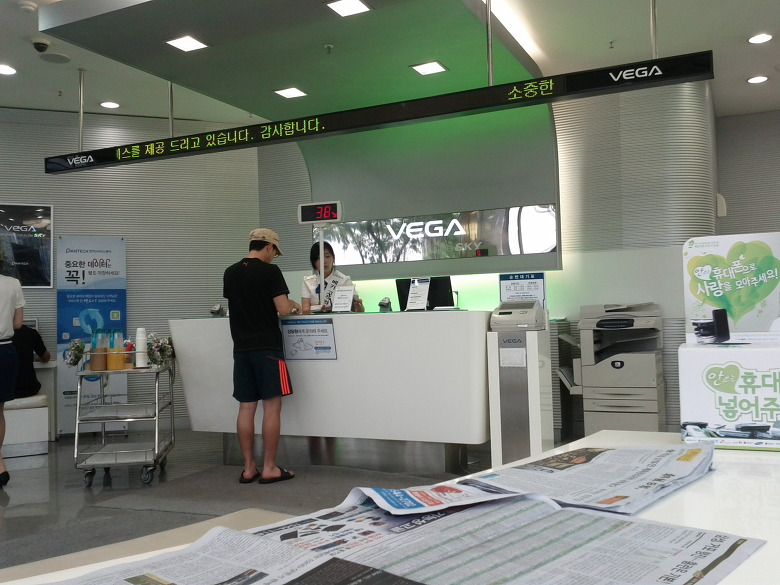
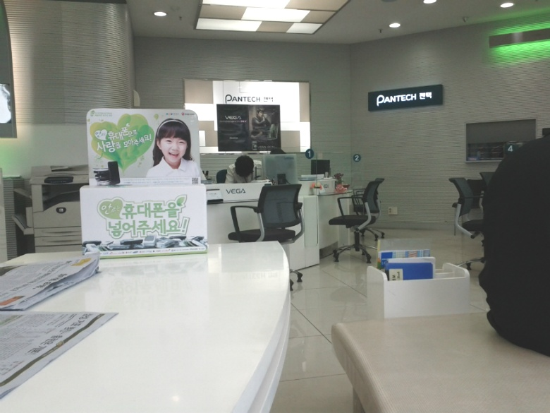
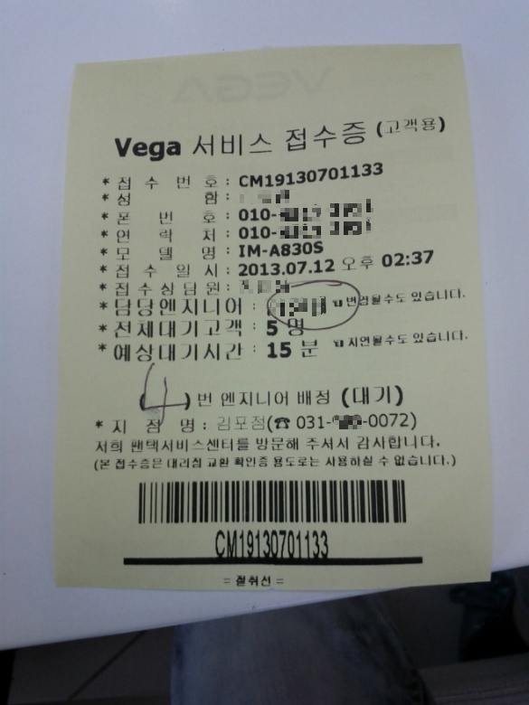
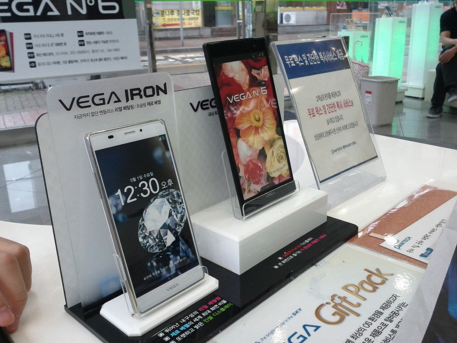
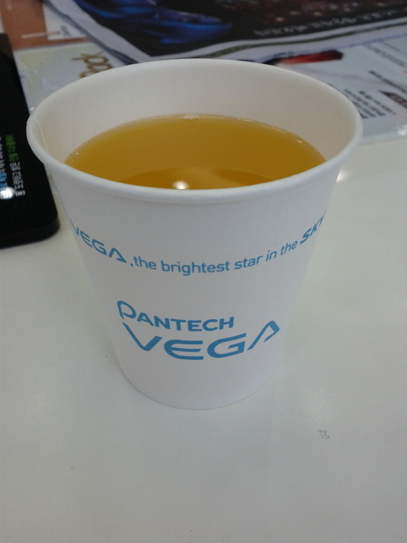
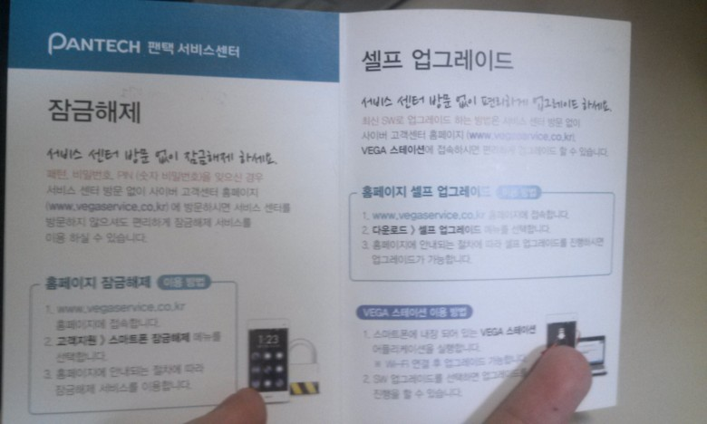

베가레이서2가 점점 스피커 소리가 작아지는 문제가 있어서 서비스 센터에 방문하여 수리받고 왔습니다 ㅎ

원래는 루팅카운터라던지 셀업을 돌리고 가야 하지만 다시 와서 꾸미는 시간이 너무 귀찮은 관계로 그냥 갔습니다. ㅇㅅㅇ..

루팅은 풀고 카운터도 지우고 갔는데, 이상하게도 커널 카운터는 남아있더군요. ㅇㅅㅇ?

그래도 부트로더 모든 카운터가 지워졌다 해도 소프트키라던지 상단바보시고 바로 알아채셨을 겁니다. ㅋㅋ

실내 인증 입니다 ㅎㅎ

이 사진은 너무 밝기가 작아 좀 올렸어요. ㅎ

그나마 좋은 사진이군요.

사진 찍는 솜씨가 없어서... 그리고 넥스의 500화소도 한몫을..

(일부 개인정보는 모자이크 처리 했습니다.)

Vega 서비스 접수증 인증입니다. ㅋㅋ

함정이 있다면 접수번호 시작이 CM이라는 거죠. CyanogenMod ㅋㅋㅋㅋㅋㅋㅋㅋㅋㅋㅋㅋㅋㅋ

전시되어 있는 베가 아이언과 베넘식..

그래서 실컨 만지고 왔습니다. ㅇㅅㅇ!

베가 아이언.. 역시 너무 좋더군요. 디자인이. ㅋㅋㅋ (물론 전시용이라 흠집은 있더라고요. ㅇㅅㅇ)

그냥 저 주지..

가만히 있었는데 주스 주셨습니다. +\_+

아주 좋아요. 서비스. ㅎㅎ

수리해주시는 기사분께서 제가 나이가 어린대도 불구하고 항상 존댓말로 답변해 주시고!

부팅화면 보시고는 루팅하셨나요?라고 물어보시는..

루팅하면 그 뭐냐 음.. 폰이 망가져서 수리비가 많이 나온다고 하시더군요. 그래도 전 하겠습니다(?)

걸렸지만(어쩔 수 없어요 셀업도 안하고 가고 카운터도 있으니 말이죠 ㅇㅅㅇ..) 유상처리나 이런건 안해주신다고 하셨습니다. ㅎㅎ

다음에 문자오면 ★★★★★ 드려야겠습니다. ㅋ

그나저나 이 스피커 문제는 기기 설계 결함이 맞나요..? 기사님 말씀으론 쓰다보니 헐거워져서 그런거라는데, 기기 결함이라고는 안하시는..

마지막 짤은 섭센에 있던 안내 책자 스샷.
