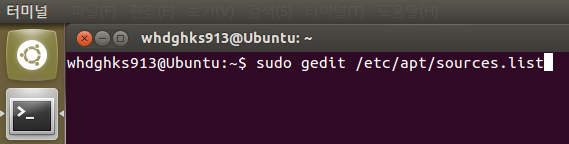
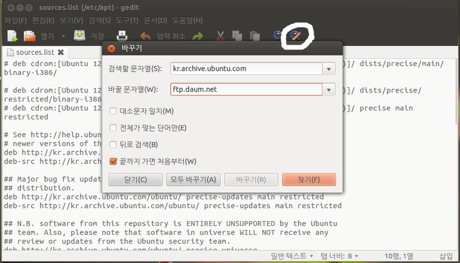
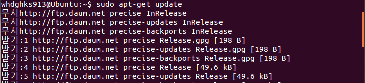
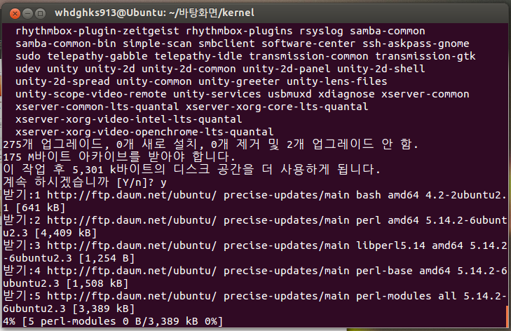

오늘 우분투를 다시 깔아서 필요한 것들을 다시 깔아주는대 ㅇㅅㅇ...

kr.archive.ubuntu.com이 포화상태인지 미쳤는지 아무튼 너무 느렸습니다;;

그래서 우분투 저장소를 빠른 다음 서버로 바꿔주니 속도가 날아다니네요. ㅋㅎㅎㅎㅎㅎㅎ

역시 제 컴이 느린게 아니었습니다. 하하하하..

그럼 이제 그 방법을 소개하려 합니다.

먼저 su권한이 필요합니다. 비번 알아두세요~

2가지 방법이 있습니다.

먼저 터미널에 아래와 같이 입력해 주세요.

sudo gedit /etc/apt/sources.list

이렇게 입력해 주세요.

그럼 자주보는 Gedit가 나타납니다.

위에 있는 돋보기+연필 아이콘을 누르면 검색해서 한번에 바꿀수 있는데요. 동그라미 된 아이콘을 누르시면 됩니다.

kr.archive.ubuntu.com를 ftp.daum.net로 바꿔주셔야 합니다.

사진과 같이 입력해 주세요 ㅎㅎ

완료하셨으면 이제 터미널로 돌아와서 아래 명령어를 입력해 주시면 끝입니다.

sudo apt-get update

이제 아래 사진처럼 뭐가 막 뜰겁니다.

그냥 보고만 있으시면 됩니다. ㅎㅎ

이제 얼마나 속도가 향상되었는지 볼까요??

필수 프로그램을 설치중입니다...

우호호호호호오한ㅇ롷ㄹ호로호롷라활

역시 국내 서버입니다. ㅋㅋ 속도가 대박이네요. ㅋㅋ

이렇게 해서 저장소를 국내 서버로 우회하여 속도향상을 꾀하는 방법이었습니다. ㅎㅎ

나머지 하나는 sed를 이용한 방법인대요.

sed -i 's/kr.archive.ubuntu.com/ftp.daum.net/g' /etc/apt/sources.list

을 사용해 주시면 됩니다 ㅎㅎ

+2013-12-02

다음 서버가 13.10용 미러를 제공하지 않아서 다른 미러 사이트를 소개해 드립니다.

**ftp.neowiz.com**

13.10에서는 이 서버를 사용해 주시면 되고요.

방법은 위와 같습니다.

10.04도 에러가 많이 뜰탠대 그때는 아래로 변경해 주세요.

**old-releases.ubuntu.com**
