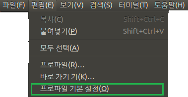
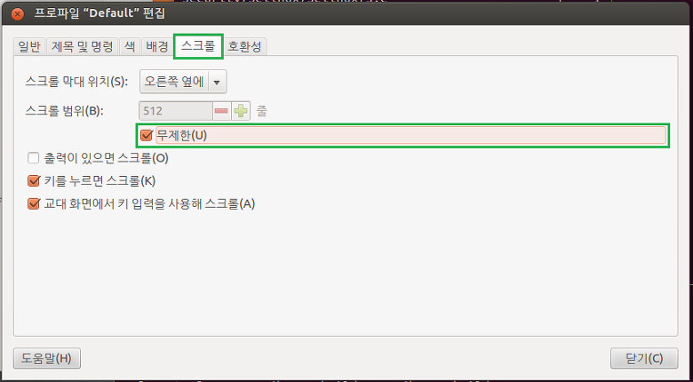

터미널에서 작업을 하다보면 중요한 로그를 놓칠때가 있습니다.

왜냐하면 최대로 터미널이 기록하는 범위가 512줄이기 때문인데요.

512줄이 모두 찬뒤에는 가장 위에 있는 것 부터 제거하기 시작합니다.

하지만 불편하죠... 그래서 이번에는 이 설정을 바꿔보도록 하겠습니다.

보기-프로파일 기본설정을 들어가 주세요.

아래 사진처럼 스크롤 탭에 들어가 스크롤 범위를 무제한으로 해주시면 됩니다.

간단한 작업이지만 은근 편리합니다. ㅎㅎ

꼭 설정해 보시길..
