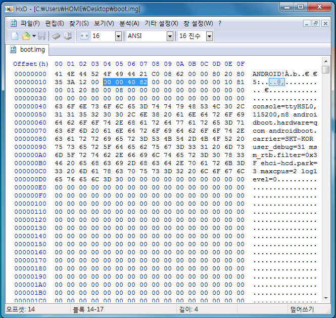
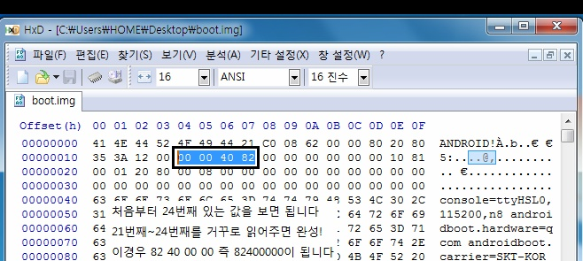

명쾌하게 정리된 자료가 없어서 포스팅 해봅니다. ㅎㅎ

ramdiskaddr이란 램디스크의 주소 값인데요.

요즘 최신 스마트폰은 이 값을 지정해 줘야만 부팅이 됩니다.

그럼 어떻게 구하는지 알아보겠습니다.

먼저 헥스 에디터가 필요합니다.

헥스 에디터 포터블 한글판입니다.

받아주세요.

그다음 ramdiskaddr을 알아낼 boot.img도 준비해 주세요.

이제 HxD로 boot.img를 열어주시면 됩니다.

자 이렇게 나오는대요 우리가 필요한 것은 처음부터 24번째 까지 값뿐입니다.

저렇게 처음(41)부터 24번째 까지 가셔서 21 22 23 24번째 값을 찾아주세요.

어떻게 해서 24번째냐, 맨 위 왼쪽에 있는 41을 1번째, 그옆 4E를 2번째, 그옆 44를 3번째... 이렇게 가다보면 나옵니다.

이 값을 뒤에서 부터 읽어 줍시다.

24번째 읽고 23번째 읽고 22번째 읽고 21번째 읽고..

예를 들면 위 사진의 경우 82 40 00 00 이렇게 읽어 주셔야 합니다.

절대로 완전 거꾸로 읽으시면 안됩니다(28040000 이렇게 말이죠 절대 아니예요.)

위 사진은 필요 없는 부분 짜른다음 사진과 글자를 넣어봤습니다.

이해가 아직도 안되신다면 덧글을...

그리고 hexdump를 이용하는 방법도 있습니다.

> hexdump -C -n 24 boot.img

이렇게 나온 값은 위 헥스 에디터와 같습니다.

그러므로 위 방법처럼 뒤에서 읽어 주시면 됩니다.

hexdump는 리눅스에서 사용하는 명령어 입니다.

윈도우에서는 원칙상 사용 불가능하나 영구땡칠님께서 빌드하신 윈도우용 buxybox.exe를 이용한다면 윈도우 cmd에서도 가능합니다.

<http://cafe.naver.com/androidhacker/168>

여기서 busybox.exe받으신다음 cmd창에서 busybox hexdump -C -n 24 boot.img 이런식으로 입력하시면 됩니다~
