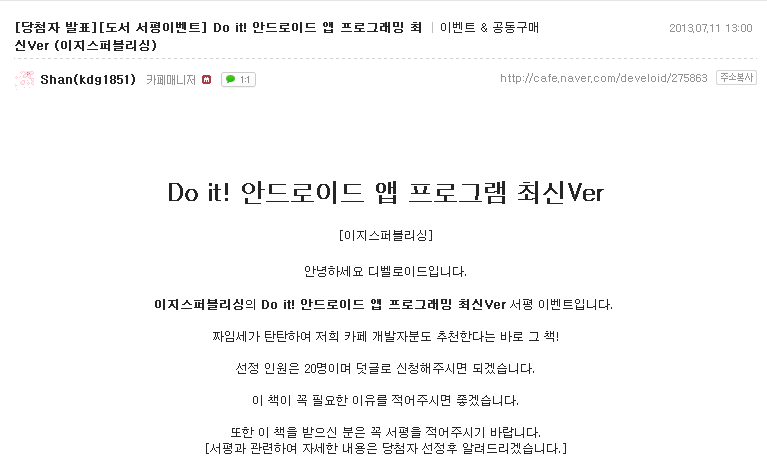
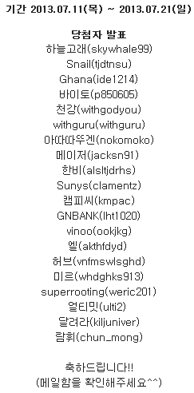
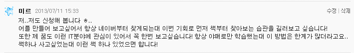
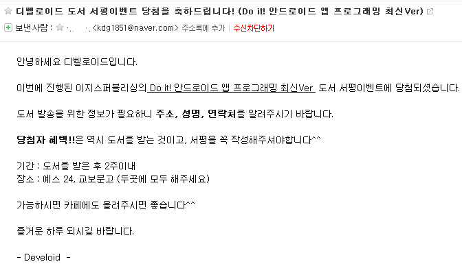
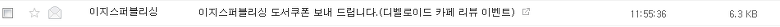
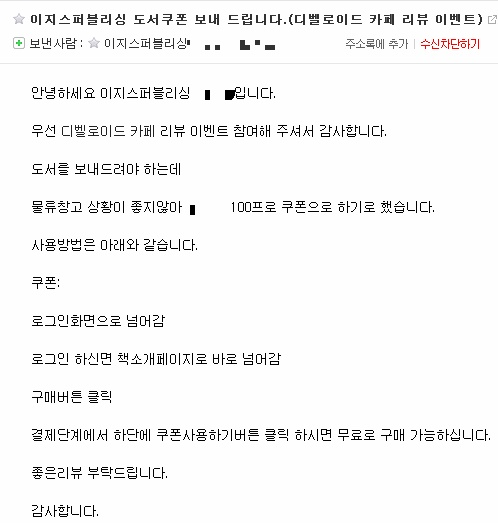
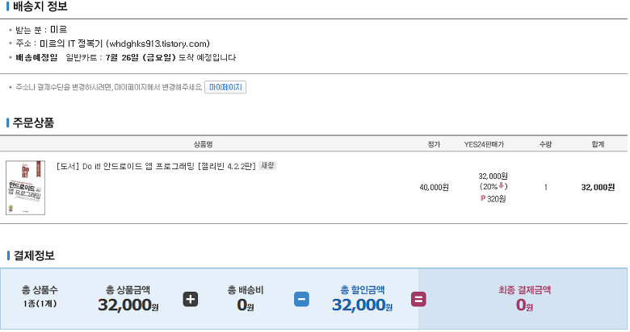

디벨로이드 카페에서 진행하는 도서 서평 이벤트에 당첨되어 이렇게 조금이나마 도움이 되고자(?) 게시판을 하나 만들었습니다

이 게시판에는 이제부터 제가 어플을 만들며 배운 모든것들을 기록하고자 합니다

비슷한 게시판이 하나 있지만 이는 제 독학 게시판이므로 따로 지우지는 않았습니다 ㅎㅎ

아래는 이벤트 관련 내용입니다

이..이런 좋은 이벤트가 어디 있겠습니다?

4만원 상당의 책을 주다니요!

이렇게..신청했습니다 ㅎㅎ

메일함을 확인해 보니

역시! 디벨로이드 카페 감사드립니다!

꼭 서평 작성하고 유용하게 사용하도록 하겠습니다

이제부터 알차고 군더더기 없는 유용한 뻘글(?) 써보도록 하겠습니다

+ 2013-07-25 추가

음..? 메일이 왔네요??

그렇군요... 100% 무료쿠폰이라니!

받는분 : 미르

주소 : 미르의 IT 정복기 (itmir.tistory.com)

이렇게 입력하였습니다(?)

내일쯤 오는군요 ㅋㅋㅋ 기대됩니다

최종 결재 금액은 **0원!!**
