안녕하세요!

먼저 이 책을 주신 디벨로이드 카페에게 감사드립니다~

[디벨로이드 도서 서평 이벤트](http://cafe.naver.com/develoid/275863)에 당첨되어 오늘 Do it 안드로이드 앱 프로그래밍 이라는 책을 받아보았습니다!

Yes24와 교보문구에 서평을 작성해야 한다고 하셨는대 구체적으로 어디에 들어가서 어떤 형식으로 작성해야 하는지 몰라 일단 블로그와 카페에만 작성합니다

추후 방법을 찾아 YES24와 교보문구에 서평을 꼭 작성할 생각 입니다

지금부터, 안드로이드 앱 개발자라면 누구든지 가지고 싶어하는 책, "Do it 안드로이드 앱 프로그래밍 최신 개정판" 개봉기를 시작합니다~

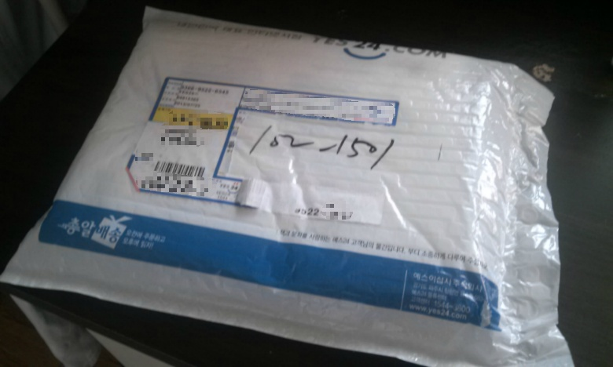

팩에 담겨져 온 책!

뽁뽁이 안에 있어서 안전하게 집까지 왔습니다 ㅎㅎ

(중요 개인정보는 모자이크 처리 하였으나 호수는 모자이크 하기엔 사진이 너무 이상해 져서 그냥 둡니다 ㅎㅎ..)

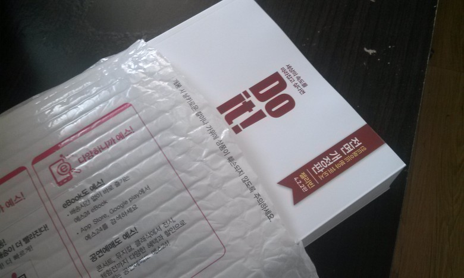

책을 살짝만 꺼내 봤습니다

고급스러운 모습을 뽐내고 있는 책의 모습이 보이네요 ㅎㅎ

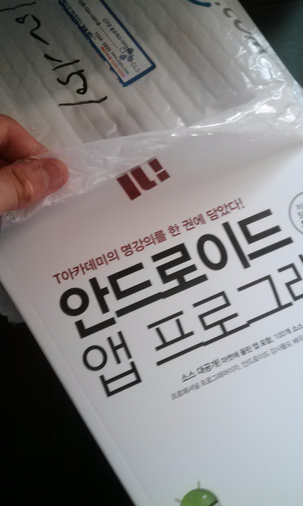

비닐팩에 담겨 있어 안전하게 저희 집까지 도착하였습니다~

상자에 담겨 있는것도 좋지만 그럴경우 뽁뽁이(?)가 따로 필요하게 되어 이런 포장 방식이 저는 마음에 드는군요 ㅎ

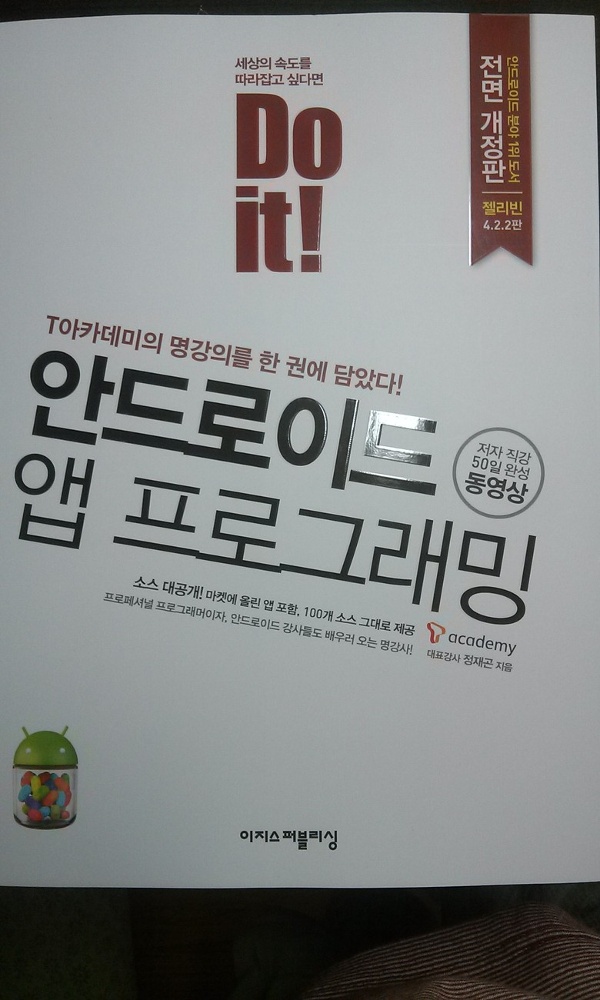

(가장 잘나온 정면 샷)

처음 화면에 그림이라던지 뭔가 가득 차 있으면 복잡해 보이기 십상이나 이 책의 메인은 제목과 할수 있다 (DO IT)이라는 문구가 있어 강렬하게 제 시선을 사로잡습니다!

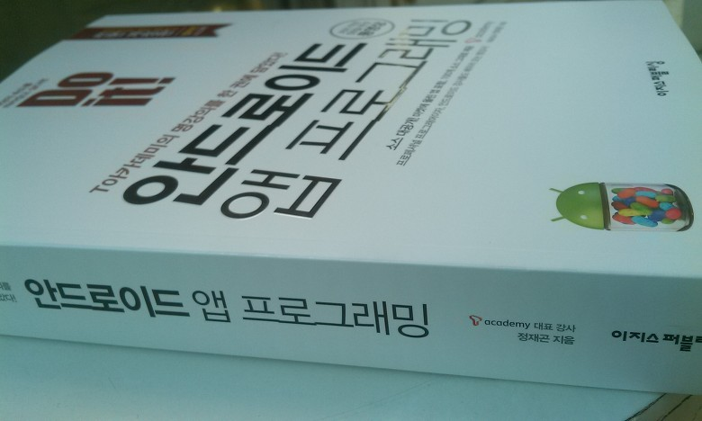

우측에서 본 스샷

(저는 왜인지 몰라도 저 오른쪽에 있는 젤리콩이 마음에 드는군요(???))

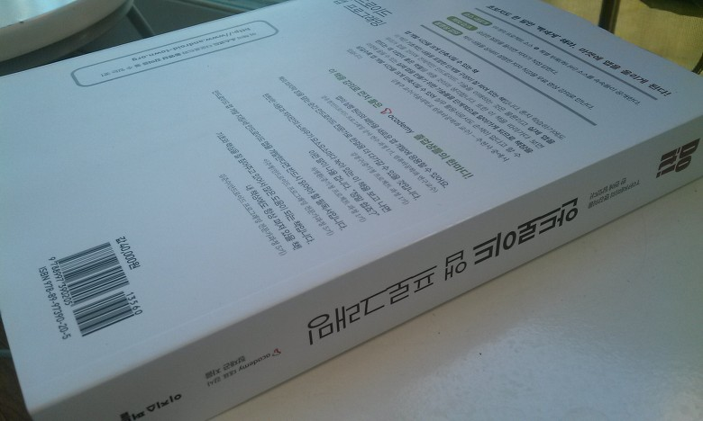

사람마다 다르겠지만 저는 심플하면서도 간결한 것을 좋아합니다 ㅋ

그래서 인지 몰라도 뒷모습도 간결한 모습이라 요점을 정확하게 알수 있는 구성이 마음에 드는군요

역시 전부터 갖고 싶었던 책이라 모든것이 마음에 듭니다!

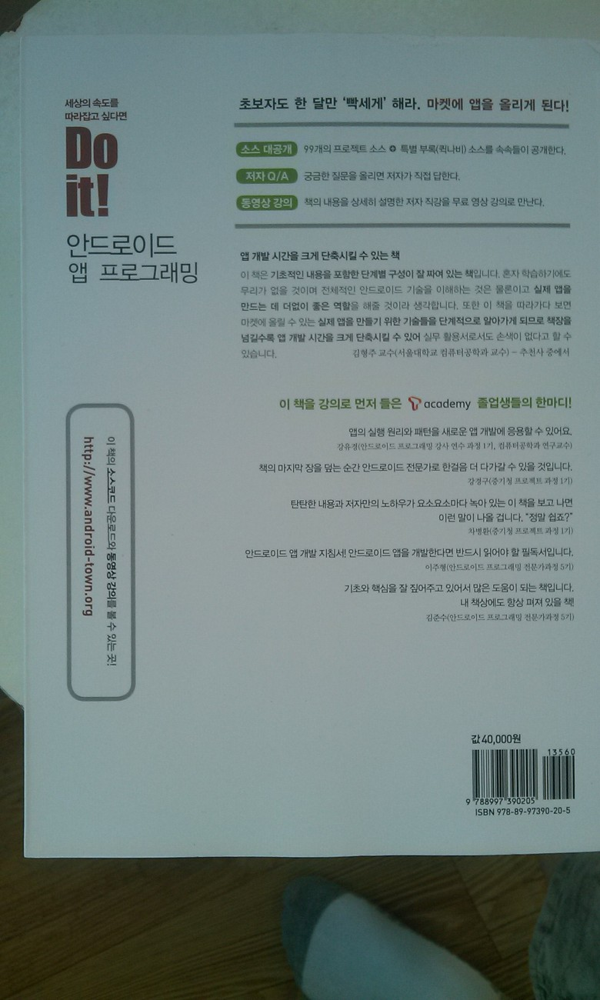

가장 인상적인 문구가 "앱 개발 시간을 크게 단축시킬수 있는 책"인대요

약간 어플을 만들어 보았지만 정말로 엄청나게 고생하며 만들었습니다

하나의 기능을 구현하기 위해 엄청나게 돌아다녔는대요

이제는 그럴 필요가 없게 되었네요 ㅎㅎ

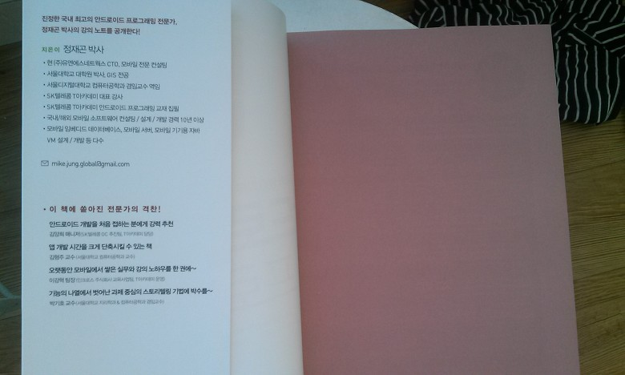

첫장을 뙇 넘기면 저자 정재곤 박사님의 간략한 프로필이 나옵니다

이제 박사님과 함께 동영상 강의를 시청하며 어플을 만들 날이 다가오고 있어요 ㅋ

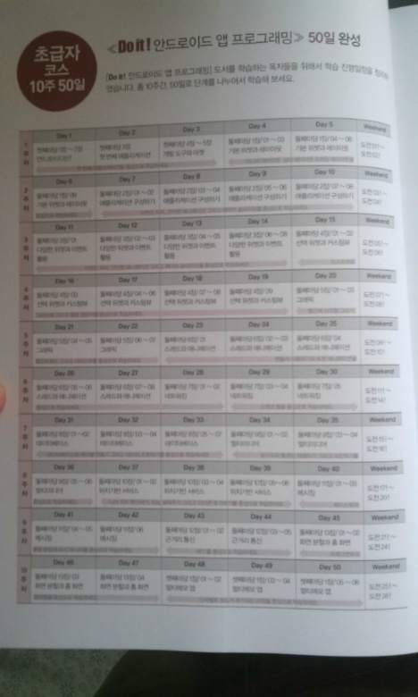

두번째 장을 넘기면 일정표가 나옵니다

초급자용 50일 완성표와 아래에는 중급자용 25일 코스가 존재합니다

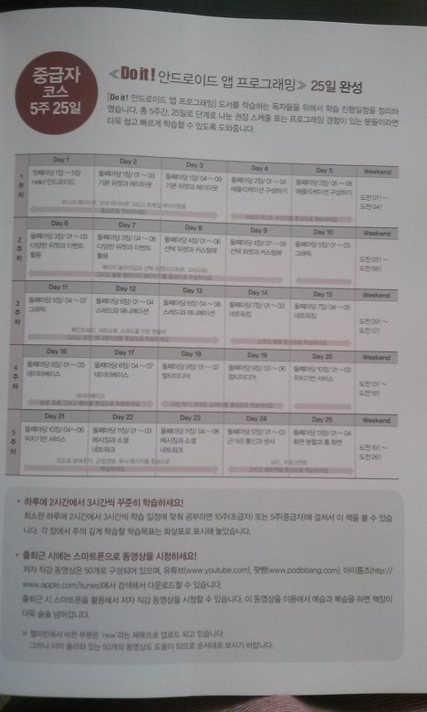

스케쥴 표를 참고하면서 하루하루 꾸준하게 배운다면 분명 실력이 늘겁니다~

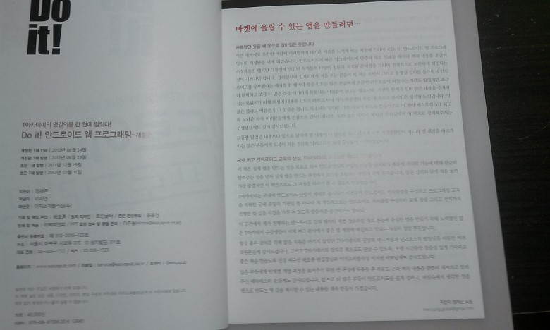

으아 초점이 이상하게 잡혔네요;; 하지만 그래도 알아볼수는 있습니다! (아무리 해도 이것보다 더 잘 안나오더군요;;)

저자 설명과, 책의 추천서, 졸업생들의 한마디, 개발자분들의 한마디가 자리잡고 있습니다

현직 개발자들의 한마디를 보면 "구글링 했던 내용이 시원하게 잘 나와있어..." ㅋㅋㅋㅋㅋㅋㅋㅋㅋㅋ

정말 이 말에 공감할 날이 온건가요?ㅋㅋ

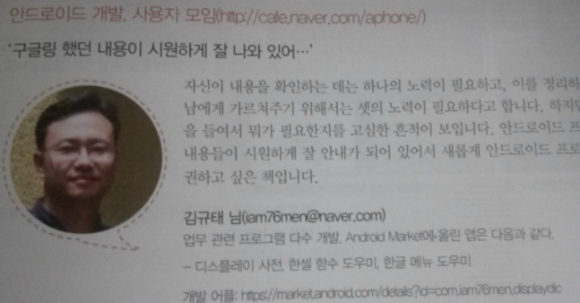

너무 공감될 내용일것 같아 한컷 올립니다~ㅋㅋ

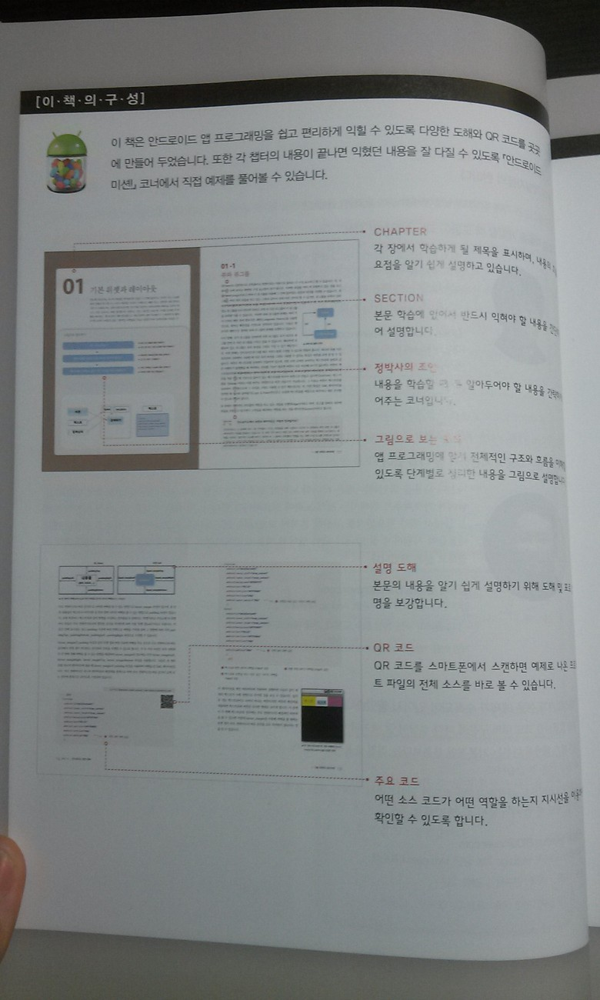

그 다음장에 보면 책의 구성이 나와 있습니다

뭐 차차 하다보면 많이 익숙해 질겁니다 ㅎㅎ

체계적으로 구성되어 있다는대 기대를...!

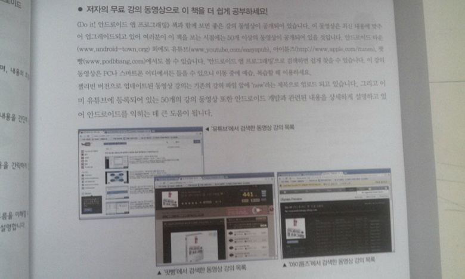

그 옆에는 동영상 강의에 대한 내용이 있습니다

유뷰트와 아이튠즈등에서 강의를 찾아 볼수 있답니다~

링크 걸어드릴께요~ <http://www.youtube.com/easyspub>

"new"라고 되어 있는 강의가 개정판 강의 입니다

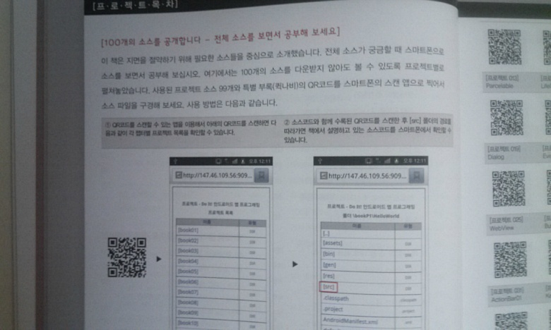

첫 단원의 바로 앞, 설명차트의 마지막에는 OR코드 관련 내용이 설명되어 있습니다

모든 책의 예제 소스가 OR코드로 받을수 있는대요

요즘은 모두 이렇게 소스를 제공한다는대 이 책도 OR코드를 이용하게 되어 잘 사용하지 않는 카메라를 사용해야 할 날이 많아지겠습니다 ㅋㅋ

이렇게 해서 Do it 안드로이드 앱 프로그래밍 개정판의 개봉기를 마칠까 하는대요

짧은 시간동안 봤지만 확실히 책의 내용이 초보자를 기준으로 설명하는 느낌이 들었습니다

강의를 들으면 더욱 이해가 잘 될거라 생각됩니다

이제부터 며칠동안 공부하며 서평을 작성할까 합니다 ㅎㅎ

그럼, 긴 글 읽어 주셔서 감사드립니다!

-사진 정보

촬영기기 : SK 베가레이서2

보정 : 일부 사진 선명도, 밝기 조정 / 첫 사진의 개인정보 모자이크 처리
