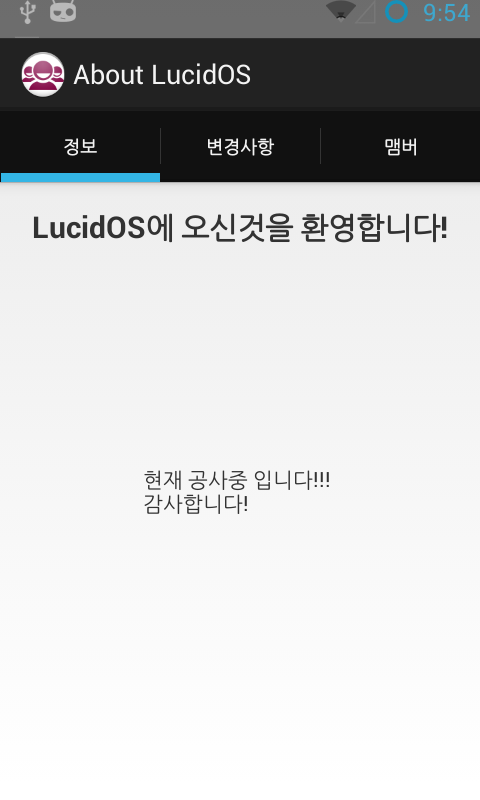
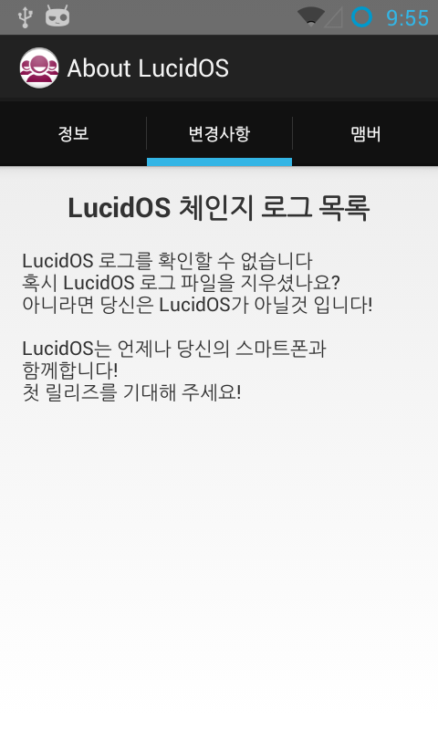
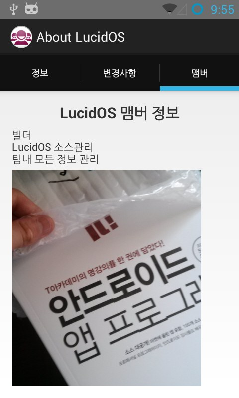
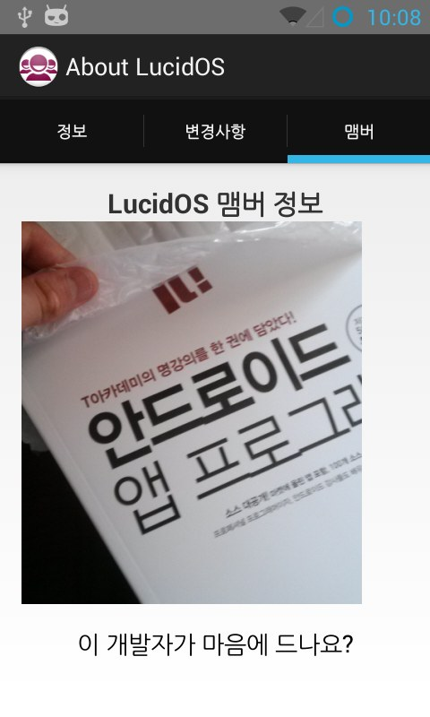
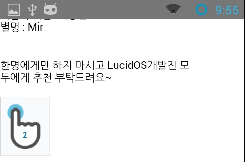

으아 엄청 힘드네요 ㅎㅎ;;

처음 구현하는 기능이 많아 조금 시간이 걸렸습니다

그래도 구현은 성공했네요 ㅎㅎ

처음은 Splash입니다

잠깐 약 2초정도? 표시되는데요

지금은 뭐 딱히 넣을것도 없고 개발의 순수함을 나타내기 위해서(?) 하얀색으로 칠했습니다(?)

처음에 몇초정도 나오는 화면이죠 ㅎㅎ

드림나래 오픈소스 ♥♥♥♥♥

그다음은 메인화면 인대요

전까진 그냥 Blank액티비티였지만 오늘은 Fixed Tab + Scroll(?)을 사용하였습니다

한 4번째 시도인가요? 겨후 성공했습니다 ㅠㅠ

그냥 네이버 예제를 바로 사용해 버리니 저 "정보", "변경사항", "맴버" 탭이 없어지더군요(?)

그래서 좀 삽질좁 했습니다 ㅠㅠ

양옆으로 스크롤해서 사용이 가능합니다

이걸 구현하기 위해 엄청 뒤졌네요...; 구글링이랑 네이버, 책을....으아아아

변경사항 탭을 클릭하거나 또는 옆으로 스와이프 하면 나타납니다

/system/etc/changelog.txt파일이 있으면 그 파일의 내용을, 없다면 위 내용을 표시해 줍니다

아ㅡㅡ 이것도 처음 구현하는거라 정말 힘들었습니다 ㅠㅠ 나중에 포스팅 해야 겠어요

java.io였나... 이걸 사용하더군요ㅎ

이건 맴버 정보 란인대요 팀원 설명이 기록되어 있습니다

여기서 제 잉여력이 돋보이는 구간이 있는대요ㅋㅋㅋㅋㅋㅋㅋㅋㅋ

위 스샷을 보시면 "이 개발자가 마음에 드나요?"라는 글자가 있는대요

사실 글자가 아니라 버튼입니다 ㅋㅋ

이걸 클릭하면

이런 사이트가 뜹니다 ㅋㅋㅋㅋㅋㅋㅋㅋㅋㅋ

저 버튼 어디서 보신적 있지 않으신가요?

티스토리나 뭐 이런곳에 "손가락 눌러주세요" 하는건데요 ㅋㅋㅋ

그걸 적용했습니다 ㅋㅋㅋㅋㅋ

으아 이것도 구현하는게 처음이라 힘들었네요 휴ㅋㅋㅋㅋㅋ

아무튼 이렇게 잉여력을 발휘한 어플을 만들어 봤습니다

그나마 만든 어플중 가장 잘만든거 같네요 ㅋㅋㅋㅋㅋㅋㅋ
