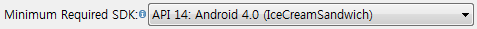
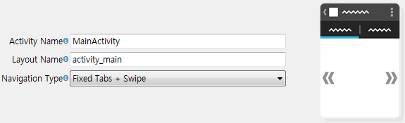
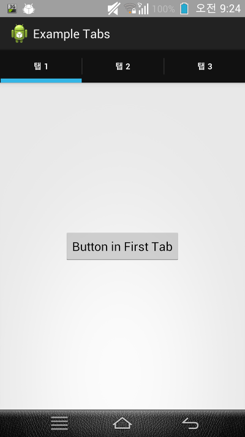
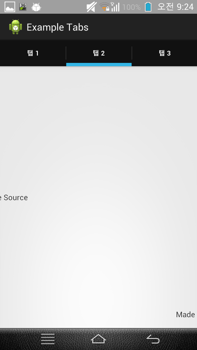
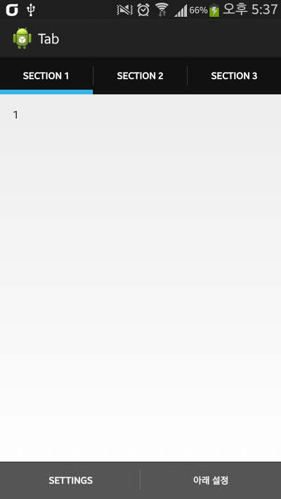

> 이 글은 2016-10-17 이후 수정될 예정입니다.

맨 처음 어플을 만들게 되면서 가장 먼저 생각한 것은 바로 [탭, Tabs]이었습니다.

무엇보다도 양옆으로 스크롤 하면서 사용할 수 있는 Fixed Tab + Scroll이 가장 마음에 들었는데요!

제가 네이버를 찾아보며 가장 설명이 잘되어 있는 곳은 <http://blog.naver.com/liar1938/30171663892> 이라 생각됩니다.

그러나 모든 것은 직접 써봐야 더 능통해 지므로 서평이 끝난 지금, 지금부터 어플 강좌를 하나씩 시작하겠습니다.

이 강좌를 통해 알수 있는것들

Fragment

Fixed Tabs + Scroll

Fragment에서 id값 찾기

먼저 프로젝트를 만들어 주세요.

Min API 11이상부터 Fixed Tabs + Swipe라는 네비게이션 타입을 지원하는 것으로 알고 있습니다.

적절하게 잡아주시고,

이렇게 Navigation Type를 "Fixed Tabs + Swipe"로 결정해 주세요. ㅎㅎ

프로젝트 생성이 끝났다면, 이제 MainActivity에 들어가 봅시다.

src/(패키지 네임)/MainActivity.java파일입니다.

제 경험상,

res/layout/activity\_main.xml

res/layout/fragment\_main\_dummy.xml

이 두개의 파일은 건들일 필요가 없더군요.

기본적으로 아래와 같은 내용이 있을겁니다. MainActivity을 눌러 펼쳐주세요.

MainActivity

package com.tistory.whdghks913.exampletabs;

import 생략

public class MainActivity extends **FragmentActivity** implements

ActionBar.TabListener {

/\*\*

 \* The {@link android.support.v4.view.PagerAdapter} that will provide

 \* fragments for each of the sections. We use a

 \* {@link android.support.v4.app.FragmentPagerAdapter} derivative, which

 \* will keep every loaded fragment in memory. If this becomes too memory

 \* intensive, it may be best to switch to a

 \* {@link android.support.v4.app.FragmentStatePagerAdapter}.

 \*/

SectionsPagerAdapter mSectionsPagerAdapter;

/\*\*

 \* The {@link ViewPager} that will host the section contents.

 \*/

ViewPager mViewPager;

@Override

protected void onCreate(Bundle savedInstanceState) {

super.onCreate(savedInstanceState);

setContentView(R.layout.activity\_main);

// Set up the action bar.

final ActionBar actionBar = getActionBar();

actionBar.setNavigationMode(ActionBar.NAVIGATION\_MODE\_TABS);

// Create the adapter that will return a fragment for each of the three

// primary sections of the app.

mSectionsPagerAdapter = new SectionsPagerAdapter(

getApplicationContext(), getSupportFragmentManager());

// Set up the ViewPager with the sections adapter.

mViewPager = (ViewPager) findViewById(R.id.pager);

mViewPager.setAdapter(mSectionsPagerAdapter);

// When swiping between different sections, select the corresponding

// tab. We can also use ActionBar.Tab#select() to do this if we have

// a reference to the Tab.

mViewPager

.setOnPageChangeListener(new ViewPager.SimpleOnPageChangeListener() {

@Override

public void onPageSelected(int position) {

actionBar.setSelectedNavigationItem(position);

}

});

// For each of the sections in the app, add a tab to the action bar.

for (int i = 0; i < mSectionsPagerAdapter.getCount(); i++) {

// Create a tab with text corresponding to the page title defined by

// the adapter. Also specify this Activity object, which implements

// the TabListener interface, as the callback (listener) for when

// this tab is selected.

actionBar.addTab(actionBar.newTab()

.setText(mSectionsPagerAdapter.getPageTitle(i))

.setTabListener(this));

}

}

@Override

public boolean onCreateOptionsMenu(Menu menu) {

// Inflate the menu; this adds items to the action bar if it is present.

getMenuInflater().inflate(R.menu.main, menu);

return true;

}

@Override

public void onTabSelected(ActionBar.Tab tab,

FragmentTransaction fragmentTransaction) {

// When the given tab is selected, switch to the corresponding page in

// the ViewPager.

mViewPager.setCurrentItem(tab.getPosition());

}

@Override

public void onTabUnselected(ActionBar.Tab tab,

FragmentTransaction fragmentTransaction) {

}

@Override

public void onTabReselected(ActionBar.Tab tab,

FragmentTransaction fragmentTransaction) {

}

/\*\*

 \* A {@link FragmentPagerAdapter} that returns a fragment corresponding to

 \* one of the sections/tabs/pages.

 \*/

public class SectionsPagerAdapter extends FragmentPagerAdapter {

Context mContext;

public SectionsPagerAdapter(Context context, FragmentManager fm) {

super(fm);

mContext = context;

}

@Override

public Fragment getItem(int position) {

// getItem is called to instantiate the fragment for the given page.

// Return a DummySectionFragment (defined as a static inner class

// below) with the page number as its lone argument.

Fragment fragment = new DummySectionFragment();

Bundle args = new Bundle();

args.putInt(DummySectionFragment.ARG\_SECTION\_NUMBER, position + 1);

fragment.setArguments(args);

return fragment;

}

@Override

public int getCount() {

// Show 3 total pages.

return 3;

}

@Override

public CharSequence getPageTitle(int position) {

Locale l = Locale.getDefault();

switch (position) {

case 0:

return getString(R.string.title\_section1).toUpperCase(l);

case 1:

return getString(R.string.title\_section2).toUpperCase(l);

case 2:

return getString(R.string.title\_section3).toUpperCase(l);

}

return null;

}

}

/\*\*

\* A dummy fragment representing a section of the app, but that simply

\* displays dummy text.

 \*/

public static class DummySectionFragment extends Fragment {

/\*\*

\* The fragment argument representing the section number for this

 \* fragment.

 \*/

public static final String ARG\_SECTION\_NUMBER = "section\_number";

public DummySectionFragment() {

}

@Override

public View onCreateView(LayoutInflater inflater, ViewGroup container,

Bundle savedInstanceState) {

View rootView = inflater.inflate(R.layout.fragment\_main\_dummy,

container, false);

TextView dummyTextView = (TextView) rootView

.findViewById(R.id.section\_label);

dummyTextView.setText(Integer.toString(getArguments().getInt(

ARG\_SECTION\_NUMBER)));

return rootView;

}

}

}

이 소스가 이 예제 어플에서 가장 중요한 소스입니다.

먼저, 처음 빨간색으로 칠해져 있는 메소드 public Fragment getItem(int position)의 경우 아래와 같이 변경이 필요합니다.

@Override

public Fragment getItem(int position) {

// getItem is called to instantiate the fragment for the given page.

// Return a DummySectionFragment (defined as a static inner class

// below) with the page number as its lone argument.

switch(position) {

case 0:

return new **첫번째탭에들어갈내용이담긴액티비티이름**(mContext);

case 1:

return new **두번째탭에들어갈내용이담긴액티비티이름**(mContext);

case 2:

return new **세번째탭에들어갈내용이담긴액티비티이름**(mContext);

}

return null;

}

그런대 여기서도 수정이 필요한데요, "첫번째탭에들어갈내용이담긴액티비티이름"... 길긴하지만 일단 가봅시다.

이 부분도 수정이 필요합니다.

그런대 지금은 필요가 없으니 일단 넘어가겠습니다.

분홍색으로 칠해진 것은 추가가 필요합니다. ㅎㅎ

그다음 초록색으로 칠해져 있는 return 3; 은 탭의 갯수를 반환합니다.

이미 눈치채신 분들은 아시겠지만 탭의 갯수를 줄이려면 이 값을 줄인 다음 switch-case문도 줄여주면 되겠지요??

DummySectionFragment로 탭을 구현할 수도 있지만, onCreateView() 메소드는 inflater 객체를 사용하여 뷰를

반환하여 화면에 뿌려주므로, getItem() 메소드로 탭 화면을 지정할 때에 비해 코드가 길어지므로 지워버립니다.

마지막 파란색 부분은 탭의 이름입니다.

return getString(**R.string.title\_section1**).toUpperCase(l);

굵고 밑줄친 부분이 탭의 이름이 되는대요 이부분은 어떻게 이루어져 있냐,

**R**(R.java파일을 참조합니다)**.string**(R파일중 string부분을 참조합니다, 즉 values/string.xml을 참조합니다)

**.title\_section1**(title\_section1이란 이름의 값을 반환합니다)

이렇게 생각하시면됩니다. 저도 이렇게 생각했고요.

(이글이 올려지는 당시가 강좌가 하나도 올라와 있지 않지만, 시간이 지나 강좌를 많이 쓴 다음 차례가 되면 순서를 바꿀텐데

그때쯤이면 더 쉽게 이해가 되실겁니다. 지금은 이해하지 않아도 됩니다.)

그럼 탭의 이름을 수정하기 위해서는 values/string.xml을 수정해야겠죠?

이 부분은 너무 쉬우니 따로 말씀드리지는 않겠습니다.

밑줄이 그어 있는 onCreateOptionsMenu 메소드는 메뉴키를 누르면 뜨는 내용을 정의하는겁니다. 필요없으니 삭제합니다.

이제 MainActivity는 끝났습니다.

이어서 각 탭에 들어갈 내용물들을 만들어 봅시다.

만들고 있던 프로젝트에 마우스 오른쪽을 누른다음 New-other-Android Activity를 눌러주세요.

아무렇게나 BlankActivity를 만들어 주신다음 소스를 확인해 봅시다.

package com.tistory.whdghks913.exampletabs;

import android.os.Bundle;

import android.app.Activity;

import android.view.Menu;

public class Tabs1 extends Activity {

@Override

protected void onCreate(Bundle savedInstanceState) {

super.onCreate(savedInstanceState);

setContentView(R.layout.activity\_tabs1);

}

@Override

public boolean onCreateOptionsMenu(Menu menu) {

// Inflate the menu; this adds items to the action bar if it is present.

getMenuInflater().inflate(R.menu.tabs1, menu);

return true;

}

}

너무 간단합니다. ㅎㅎ...;

각 탭에 나타날 화면과 관련된 모든 자바 소스를 이곳에 기록해야 합니다.

자 아래와 같이 그냥 수정해 주세요.

package com.tistory.whdghks913.exampletabs;

import android.annotation.SuppressLint;

import android.content.Context;

import android.os.Bundle;

import android.support.v4.app.Fragment;

import android.view.LayoutInflater;

import android.view.View;

import android.view.ViewGroup;

**@SuppressLint("ValidFragment")**

public class Tabs1 extends **Fragment** {

**Context mContext;**

**public Tabs1(Context context) {**

**mContext = context;**

**}**

**@Override**

**public View onCreateView(LayoutInflater inflater,**

**ViewGroup container, Bundle savedInstanceState) {**

**View view = inflater.inflate(R.layout.activity\_tabs1****, null);**

**return view;**

**}**

}

위 원본 소스의 취소선은 삭제된 부분, 아래 소스의 굵은 부분은 추가, 수정된 부분입니다.

밑줄 친 부분은 다들 아시는 것처럼 레이아웃을 결정하는 xml에 관한 구문입니다.

MainActivity는 FragmentActivity를 상속하지만 탭에 들어갈 내용들은 Fragment을 상속(extends)해야 합니다.

혹시 Fragment에 대해 더 알고 싶으시다면

<http://developer.android.com/guide/components/fragments.html>

<http://developer.android.com/reference/android/support/v4/app/FragmentActivity.html>

이제 이런 소스와 같이 나머지 탭에 들어갈 내용물들도 하나 씩 구성해 주시면 됩니다.

모든 탭의 구성이 끝났다면 아까 MainActivity에서 건너뛰었던 부분으로 돌아가 이름을 지정해야하는데요.

switch(position) {

case 0:

return new 첫번째탭에들어갈내용이담긴액티비티이름(mContext);

case 1:

return new 두번째탭에들어갈내용이담긴액티비티이름(mContext);

case 2:

return new 세번째탭에들어갈내용이담긴액티비티이름(mContext);

}

위 세 개의 문구를 만드신 Activity의 이름으로 변경해 주시면 됩니다.

이제 빌드 해보시고 작동 시켜 보시면 각 탭과 연결된 xml에 기록된 내용물들이 탭 아래에 나타나는 것을 볼 수 있습니다.

자 그런데 문제가 발생했습니다.

우리가 탭을 구현하기 위해 쓴것은 Fragment, 그런대 Fragment에서는 findViewById가 잘 작동하지 않습니다.

Button button1;

button1 = (Button) **view.**findViewById(R.id.button1);

이렇게 구현하시면 쉽게 작동됩니다. ㅎㅎ

위치는 View view = inflater.inflate(R.layout.activity\_tab1, null);와 return view;사이에 넣어주세요.

실행 스샷

옆으로 스크롤하면 나타납니다.

메뉴 아이탬을 아래로 이동하는것은 가능합니다.

일명 루익처럼 말이죠.

이렇게 아래로 이동하는것은 가능하며, API 14 (4.0)이상에서 사용가능합니다.

<activity .. **android:uiOptions="splitActionBarWhenNarrow"** ..></activity>

이 빨간 문구를 AndroidManifest.xml의 <activity> 부분에 넣어주세요.

API 14보다 낮을경우, 이 구문은 무시됩니다.

예제소스

[ExampleTabs.zip

다운로드](./file/ExampleTabs.zip)

---

## 첨부파일

- [ExampleTabs.zip](https://github.com/itmir913/archive/releases/download/itmir-attachments/ExampleTabs.zip) `523 KB`
