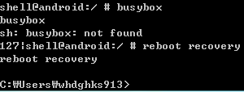
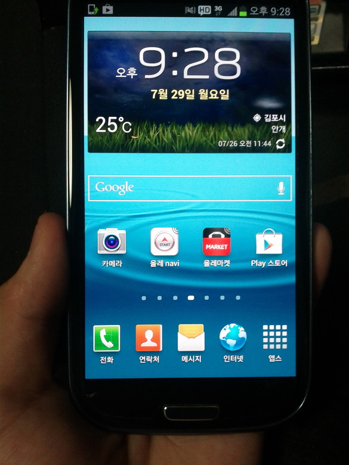
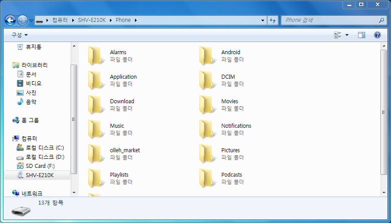
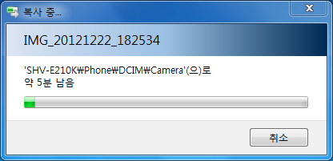
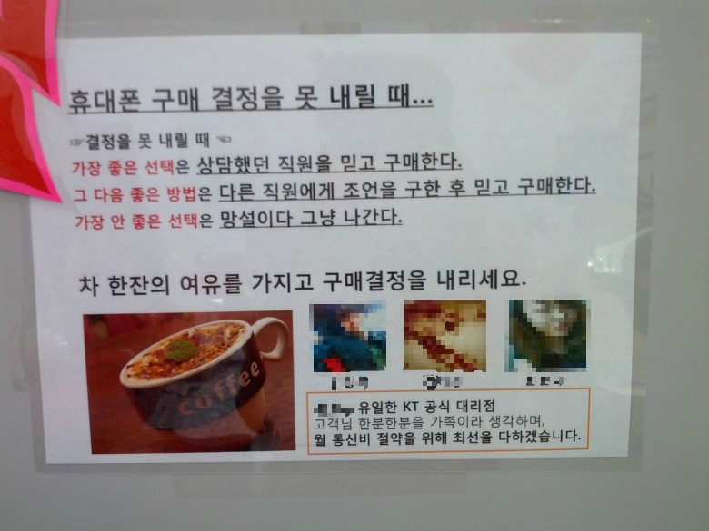

허허... 결국에는 베레2가 제품에서 떠났군요. 허허..

마지막 su권한이었습니다 ㅎㅎ..

일단 shell에서 su를 받으면 rm으로 su를 지워도 권한은 일정시간 유지되더군요..허허

허탈한 마음이네요..

베레2를 모두 초기화하고 셀업해서 완전 순정으로 변경한뒤 동생에게 넘겼습니다 허허

그래도 제겐 겔삼티이가!!

3g받을줄 알았는대 알고보니 티이였네요 ㅎㅎ

ㅎㅎ

ㅎㅎ

ㅎㅎ...

베레2를 동생에게 넘기는데 고런처에 카톡머신으로 쓸걸 생각하니 불쌍해 지는군요 베레2가..(?)

그래도 뭐 예정됬던일 넘겨야 겠습니다 ㅎㅎ 겔삼티이를 얻엇으니 ㅎㅎ

한가지 아쉬움이 있다면 만들던 커널을 완성하지 못하고 떠나보낸게 아쉽네요 ㅎㅎ..

prima\_wlan.ko를 빌드시킬수있다면 바로 완성이 가능한대 말이죠...

베레2에서 겔삼티이로 갔지만 활동은 그전과 비슷하게 할겁니다 ㅎㅎ

그리고 심심하면 베레2 뺏어서 만들죠(???)

마지막짤은 겔삼 유심으로 바꿀때 게이티 공식 대리점에서 본 호갱 양성글(?)

