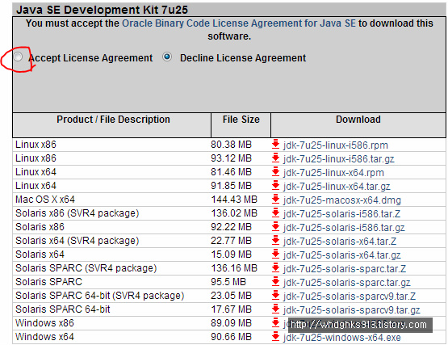
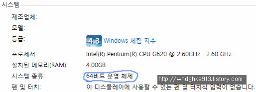
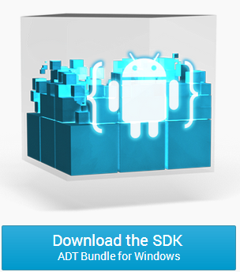
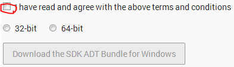
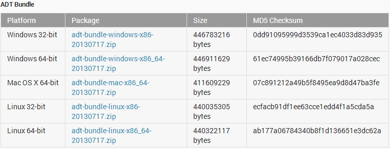
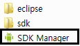
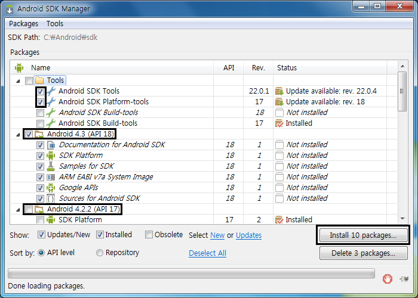
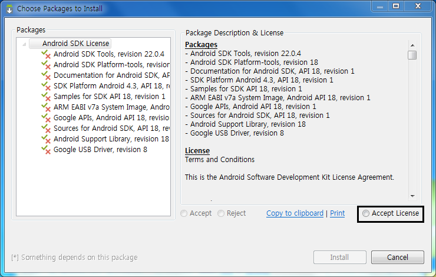

> 구글에서 이클립스 ADT의 지원을 중단한 뒤로 안드로이드 스튜디오를 이용하셔야 합니다.
>
> 이 글에서 ADT를 설치하는 부분 대신 안드로이드 스튜디오를 설치하시면 됩니다.
>
> #이 붙은 강좌는 이클립스를 기준으로 작성하였지만, 중요한 코드와 핵심 내용은 같습니다.

안녕하세요~ 처음뵙겠습니다. 미르라고 합니다. ㅎㅎ

이 게시글부터 제가 어플을 만들며 배운 지식을 나누기 위해 작성할 예정인데요.

많은 강좌가 있지만 밀리지 않기 위해 자세하게 포스팅 해보도록 하겠습니다!

만약 오타, 잘못된 부분이 있다면 따끔한 지적 부탁드립니다~

최대한 앱 프로그래밍에 대해 모르시는 분이 봐도 쉽게 이해할 수 있도록,

한편 한편 자세하고 읽기 쉽게 작성해 보도록 하겠습니다~

*강좌의 또다른 목적은 Snails님의 독점을 막기위해(?)*

## 1. 어플 개발 환경을 구축하자!

일단 어플을 만들기 위한 개발 환경을 구축해야 합니다.

어플을 만들기 위해서 필요한것은? 자바와 이클립스, SDK입니다. ㅎㅎ

### 1-1 자바를 깔자

일단 자바를 깔아볼까요?

자바 다운로드 사이트 <http://www.oracle.com/technetwork/java/javase/downloads/jdk7-downloads-1880260.html>

으로 이동하셔서 자바를 깔아주세요.

라이센스에 동의한다는 체크를 해주시면 아래와 같이 글자가 변경됩니다.

아래에서 각 OS에 맞게 깔아주시면 됩니다. ㅎㅎ

[미르의 팁]

-OS버전을 어떻게 알수 있나요?

Windows의 경우 컴퓨터 - 속성을 들어가시면 몇 비트인지 알수 있습니다.

리눅스의 경우 System - About Ubuntu에 들어가서 확인하거나 uname -a으로 확인 (i686 = 32bit, x86/64 = 64bit)

만약 페이지를 찾지 못했다는 오류가 발생할경우 <http://www.oracle.com>에서 찾아주시면 됩니다.

### 1-2 이클립스와 SDK

자바를 깔으셨다면 이제 이클립스와 SDK를 설치해야 합니다.

이 두가지는 따로따로 설치할수 있으나 불편합니다 따로 설정해야 하고...

그러므로 이 포스팅에서는 한번에 통합되어 있는 파일을 받아보도록 하겠습니다.

<http://developer.android.com/sdk/index.html>

구글 안드로이드 개발자 사이트의 sdk항목입니다.

들어가신다음 ADT Bundle을 받아주세요.

[미르의 팁]

-ADT란 Android Developer Tools의 약자입니다

ADT Bundle을 받는 이유는

Eclipse + ADT plugin (이클립스와 ADT 플러그인이 합처져 있습니다)

Android SDK Tools (SDK가 통합되어 있습니다)

Android Platform-tools (Platform-tools이 내장되어 있습니다)

The latest Android platform (최신버전의 SDK가 탑재되었습니다)

The latest Android system image for the emulator 최신버전의 SDK가 탑재되었습니다)

이 4가지의 이유로 ADT 번들을 받는답니다~

+2015-02-03 내용 추가

안드로이드 스튜디오가 ADT를 밀어내고 공식 IDE가 되었습니다

그래서 이제 안드로이드 공식 홈페이지에서 이클립스를 받을수 없습니다

이클립스의 다운로드는 중단되었지만 사용은 가능합니다

미잘서버에 ADT를 올려두었으니 필요하신 분께서는 다운로드 해주세요

<http://fs.mzl.kr/_etc/ADT/>

32비트 : adt-bundle-windows-x86-20140702.zip

64비트 : adt-bundle-windows-x86\_64-20140702.zip

공식 홈페이지에서 이클립스 다운 중단됨

윈도우 환경이라면 이런 버튼을 눌러주세요.

약관에 동의합니다 체크하신다음,

운영체제의 비트를 선택해주세요 그럼 아래 버튼이 활성화됩니다.

[미르의 팁]

-만약 다른 운영체제라면?

이 글자를 클릭하시면 아래와 같이 나타납니다

각 OS에 맞는 ADT를 선택해서 다운로드 하시면 됩니다~

다운로드하신다음 아무데다 압축 풀으시면 끝입니다. ㅎㅎ

### 1-3 SDK

압축푼 폴더에 들어간다음 SDK Manager.exe를 실행해주세요.

도스창이 하나 뜬다음 아래와 같은 창이 뜹니다.

만들 어플이 지원할 안드로이드 버전(API)를 선택한다음 설치해주세요.

만약 어플이 진저브레드와 ICS JB에서 돌아가게 하려면 GB, ICS, JB를 다운로드 해주셔야 합니다.

[미르의 팁]

-모든 API를 받아야 하나요?

그럴 필요는 없습니다.

자신에게 필요한, 또는 어플에게 필요한 API만 받으셔도 됩니다.

저는 젤리빈에서 작동하는 어플을 만들 예정이므로 API 17과 16을 받았습니다.

저는 이미 설치해서 이렇게 뜨지만 창은 같습니다.

Accept Licence를 체크해 주신다음 Install을 눌러주세요.

자, 이제 SDK도 다운로드가 끝났습니다!

이제 당신의 PC에서도 어플을 개발할 수 있습니다!

뭔 개발환경 구축이 이렇게 빨리 끝나냐고요?

ADT Bundle의 힘입니다. 하하...

다음 강좌에서는 이클립스를 실행해 보고 기본적인 인터페이스에 대해 알아보겠습니다.
