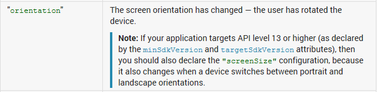

이 글을 작성하기에 큰 도움을 주신 네타냥(liar1938)님께 감사드립니다!

저번 강좌

[2013/07/29 - [미르의 개발 이야기/어플 개발 강좌] - 안드로이드 탭을 구현해 보자, Fragment](/archive/itmir/2013/283)

의 문제점을 보면 화면을 회전할경우 어플리케이션이 강제종료된다는 점이었습니다

이번에 네타냥님의 도움으로 이 문제를 해결하게 되어 한번 글을 올려볼까 하는대요 ㅎ

제 글실력이 부족하여 못알아 들으신경우 <http://blog.naver.com/liar1938/30173022348>으로 가시면 더욱 자세하게 아실수 있으실겁니다 ㅎㅎ

으아아아아아 컴이 렉걸렸어요 ;;

왜 문제가 발생하느냐...

기기의 화면을 전환할때는 onDestroy()와 onCreate()가 호출되면서 바뀐 화면이 화면에 나타납니다

그런대 이때 모든 Activity의 필드, 변수가 초기화 되는대요

화면이 다시 만들어 지면서 강제종료가 발생하는 겁니다

그럼 해결해 봅시다

AndroidManifest.xml에서 모든 Activity부분에

android:configChanges="keyboardHidden|orientation|"

또는

android:configChanges="keyboardHidden|orientation|screenSize"

을 추가해 주세요

만약 안드로이드 3.2 허니콤(APU 13)이상이라면

android:configChanges="keyboardHidden|orientation|screenSize"

을 추가해 주셔야만 합니다

관련 API입니다 (출처: <http://developer.android.com/guide/topics/manifest/activity-element.html>, http://blog.naver.com/liar1938/30173022348)

직역하자면 target API 버전이 13이상이라면 android:configChanges에 screenSize도 추가해 주라네요..

아오... 제 머리가 안돌아가서 글 인용하겠습니다...

> 'android:configChanges' 속성은 화면전환시 자동으로 onDstroy()와 onCreate()를 호출하지 않고 onConfigurationChanged()  메소드 호출하여 내가 원하는 내용으로 환경 설정을 하겠다고 안드로이드에게 알려줍니다. 네, 이렇게되면 Activity를 재생성하지 않아도 되는거죠. ^^ 화면회전이 생길 때, 안드로이드 시스템이 아니라 액티비티 내부에서 직접 이벤트를 관리하게 됩니다.
>
> 그런데 orientation 환경 변화는 이해가 가는데 keyboardHidden 값은 왜 주는 걸까요?
>
> keyboardHidden이란 키보드가 보여지거나 숨겨지는 변경사항인데, 키보드 히든 구성을
>
> 주는 것은 기존에 물리적 키보드가 장착되어 있는 모바일 기기와의 호환성 때문
>
> 입니다. 특정 기기의 경우 키보드를 열면 자동으로 화면이 회전된다고 하더라구요ㅎ
>
> 한가지 주의해야 할 것은 android:configChanges 속성이 각 액티비티 마다
>
> 하나씩 들어가야 한다는 것입니다. 물런 액티비티가 하나라면 한번만 사용해도 됩니다.
>
> 매니페스트 파일에 속성을 추가했다면 이제 자바 코드내에서 onConfigurationChanged()
>
> 메소드를 작성해야합니다. 이 메소드가 화면 회전시 onCreate() 메소드 대신 호출되게 되는거죠.

그럼 이제 MainActivity에 아래 메소드를 추가해 줍시다

public void onConfigurationChanged(Configuration newConfig) {

        super.onConfigurationChanged(newConfig);

        (이곳에 작업 내용을 적습니다, 생략 가능)

}

만약 화면 전환시 알림을 뜨게 하고 싶다면

if (newConfig.orientation == Configuration.ORIENTATION\_LANDSCAPE)

{

// 기기가 가로로 회전할때 할 작업

} else if (newConfig.orientation == Configuration.ORIENTATION\_PORTRAIT)

{

// 기기가 세로로 회전할때 할 작업

}

이런식으로 작성해 주시면 됩니다

확인결과 잘 작동하는군요 ㅎㅎ