저번 강좌 3개를 모두 정독하셨다면, 여러분의 컴퓨터에는 이클립스와 SDK가 모두 설치되어 있을것이며,

또한 어플의 기본 구조도 대충은 아실겁니다.

이제부터는 본격적으로 어플을 만들기 시작하며, 예제소스가 첨부되어 있는 강좌가 많을것 입니다. ㅎㅎ

하나하나 차근차근 해봅시다!!

## 어떻게 화면이 표시될까?

### 4-1 어플 생성

저번 강좌가 필요한 부분이 있으니 꼭 정독해 주신다음 읽어 주시기 바랍니다.

File - New - Android Application Project를 눌러 새로운 어플을 만들어 봅시다.

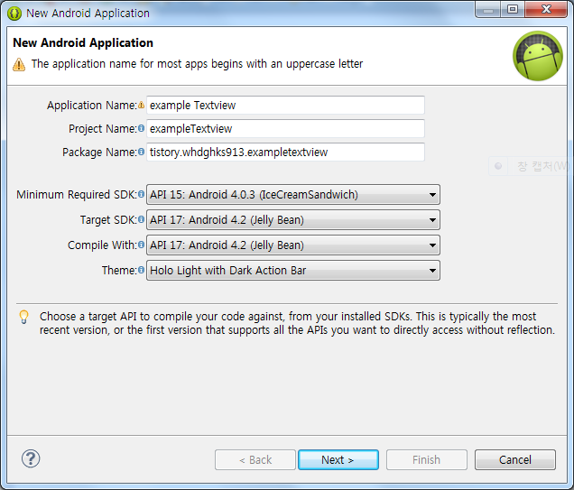

이렇게 생성해주시면 되고 ㅎㅎ.. 나머지는 모두 기본 설정 그대로 두시면 됩니다.

### 4-2 어떻게 화면에 표시되는가?

프로젝트가 생성되고 아래와 같은 화면이 뜨게 됩니다.

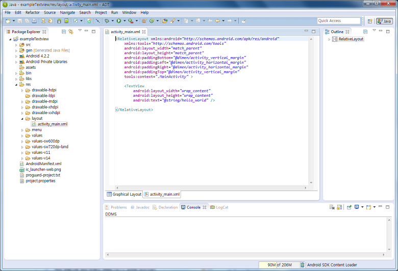

Package Explorer의 src/(패키지 네임)/MainActivity.java를 더블클릭하여 열어주세요.

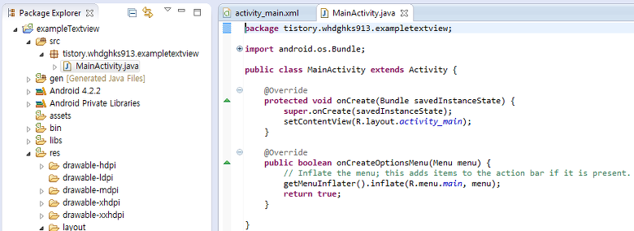

열렸습니다!

코드를 한번 확인해 볼까요?

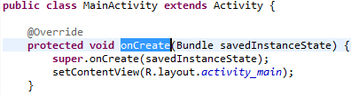

위 사진에서 public class MainActivity부분을 클래스라고 합니다.

그 아래에 있는 @Override는 아직 잘 몰라도 됩니다. ㅎㅎ..

protected void onCreate부분을 보십시오.

여기서 onCreate를 메소드의 이름이라 칭하는데요.

onCreate메소드는 기기 화면에 표시되는 것을 정의하는 메소드 입니다.

[미르의 팁]

-메소드가 무엇인가요?

다른 언어에서는 "함수"라고도 합니다.

자바에서는 이 함수를 "메소드"라고 칭하며, 이에대한 자세한 내용은 자바를 배워야 합니다.

[2013/02/20 - [미르의 개발 이야기/Java 배움터] - 첫번째 java프로그램을 만들어 보자](/archive/itmir/2013/148)

이글부터 읽어보시면 자세한 내용이 담겨 있습니다.

그런대 onCreate메소드의 코드가 무척 단조롭죠?

2줄입니다.

그런대 이 두줄로 기기의 화면에 HelloWorld가 표시되게 합니다 ㅎㅎ...

```
super.onCreate(savedInstanceState);
setContentView(R.layout.activity_main);
```

이 코드중 위에 있는 코드는 super이라는 키워드를 사용하고 있는데 상속받은 부모 클래스가 가지는 동일한 이름의 onCreate 함수를 호출하는 코드로 화면에 표시해주는 코드와는 의미가 멃니다.

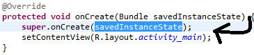

그렇다는건 setContentView(R.layout.activity\_main);이 화면에 표시하는 코드라는 건데요!

R.layout.activity\_main을 봅시다. ㅎㅎ

저번 시간에 R.java에 대해 언급한 적이 있었습니다.

R.java파일은 이런형식으로 조회가 가능한데요.

이경우

R(R.java파일을 참조한다).layout(layout에 있는 파일을 참조한다, res/layout)

.activity\_main(activity\_main이라는 파일을 참조한다)

라는 의미입니다.

그럼 res/layout/activity\_main을 확인해 볼까요?

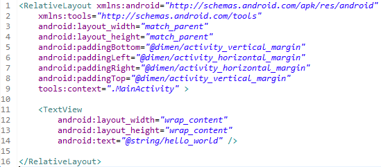

자! 여기에는 TextView라는것이 있어요! 이게 화면에 표시해 주는건가봐요. ㅋㅋㅋㅎㅎ

그런대 여기에도 hello World! 라는건 없습니다...

다만 android:text="@string/hello\_world"라는것만 있군요.

@string은 res/values/string.xml에서 값을 참조한다는 뜻입니다.

그럼 확인해 봐야겠지요??

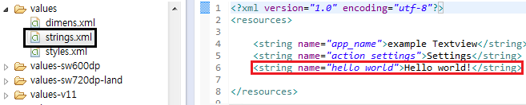

찾았습니다!

Hello world!라는 문구가 있군요!

아하, 아까본 android:text="@string/hello\_world"는 values/string.xml에서 hello\_world라는 이름을 가진 스트링을 찾아 표시한다는 뜻이었습니다.

그럼 한번 정리를 해볼까요?

1. 안드로이드는 AndroidManifest.xml에 나와있는 Activity를 실행합니다.

2. MainActivity.java파일은 setContentView(R.layout.activity\_main);코드로 res/layout/activity\_main.xml을 호출합니다. (1번 위, 3번)

3. activity\_main.xml파일에서는 android:text="@string/hello\_world"구문으로 res/values/string.xml의 값을 참조 합니다. (1번 아래, 4번)

4. hello\_world로 설정된 값을 activity\_main에 준다음, 완성된 화면을 MainActivity.java에 보내줍니다. (2번)

5. 마지막으로 기기에 화면을 띄웁니다.

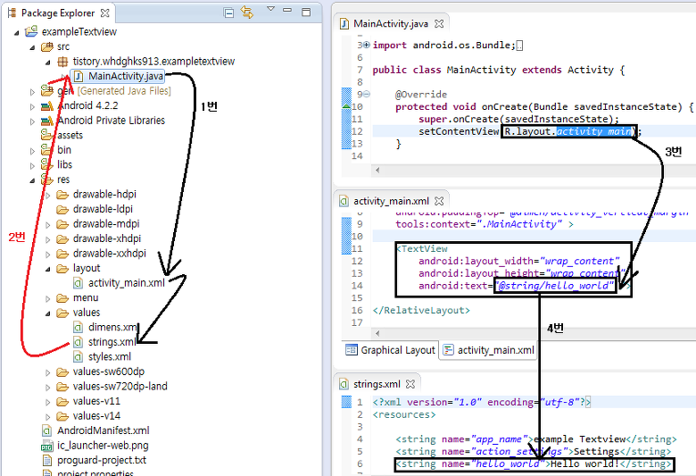

이런 형태로 움직인다는 것을 이해하시면 오늘 강좌의 목표를 달성하신겁니다. ㅎㅎ

[안나오면 섭섭한 미르의 팁]

-이클립스에서 소스의 줄번호를 나타내는 방법이 뭔가요?

Window - Preferences를 들어가 주세요.

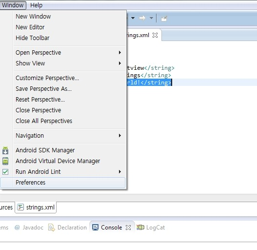

General - Editors - Test Editors에 들어간다음

Show line numbers를 체크해 주세요

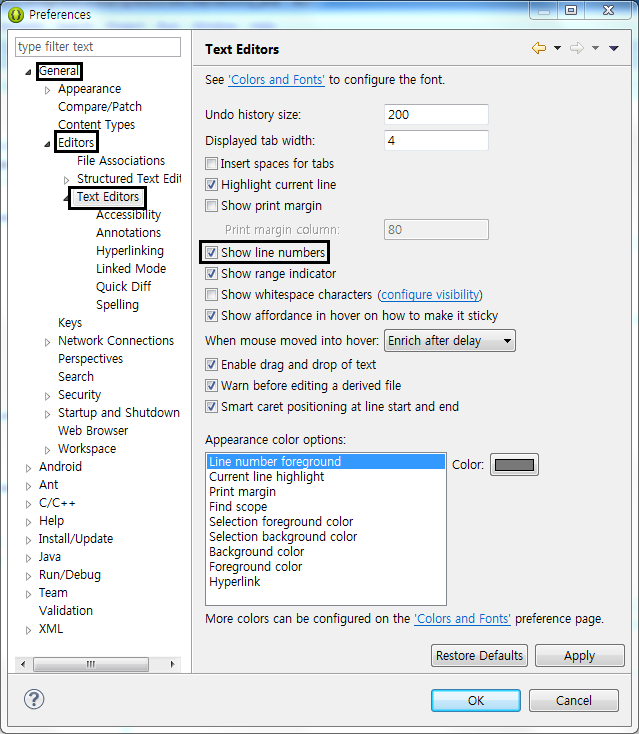

OK 누르면 완료됩니다

그럼 이제 어플에 추가하고 바꿔볼까요?

-<string name="hello\_world">Hello world!</string>

+<string name="hello\_world">미르의 안드로이드 정복기!</string>

-는 제거, +는 추가란 뜻으로 git써보신적 있으시다면 바로 아실겁니다. ㅎㅎ

원래는 values-ko폴더를 만들어서 넣지만 지금은 그냥 넣어보겠습니다.

참고로 values폴더는 en(영어), 모든 언어의 기준 string을 기록하며.

values-(나라 코드)는 만약 시스탬이 (나라코드)일경우 이 언어를 사용하라~ 라는 뜻입니다.

이제 activity\_main.xml으로 돌아와서 아래에 있는 Graphical Layout(그래픽 레이아웃)을 눌러주세요.

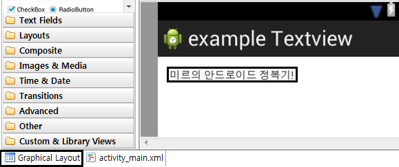

정상적으로 변경되었습니다. ㅎㅎ

이로써 values/string.xml을 수정하면 표시되는 글자를 변경할 수 있다라는 사실을 배웠습니다.

이렇게 해서 4번째 강좌가 끝났습니다ㅎ..

설명을 쉽게 한다 해도 어려운 부분이 꼭 있습니다.

만약 어렵게 느껴지신다면 더 해보세요.

Do it!

하다보면 익숙해 져서 눈감고 해도 편할겁니다. ㅎㅎ