네... 오늘은 제목답게 Textview만 죽도록 할겁니다 ㅎㅎㅎㅎㅎㅎㅎㅎㅎ

각오 단단히 하(지 않으셔도 되지만 하)시고 따라와 주세요~

## 5. TextView를 정복하자

### 5-1 프로젝트 생성

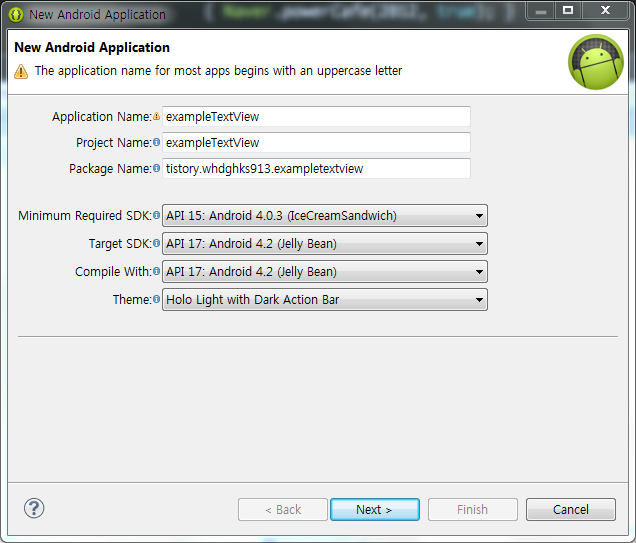

자 ㅎㅎ 저번 강좌에 프로젝트 만들기부분은 아주 자세하게 나와 있습니다 ㅎㅎ

저런 예쁜 모양으로 만들어 주시면 되요 ㅎㅎ

(다음 강좌부터 이 스샷을 생략합니다 특이 사항이 있다면 강좌에 표시할 것이고 없다면 기본설정(BlankActivity)그대로 가시면 됩니다)

### 5-2 XML코드의 모든것

만들어 졌습니다!

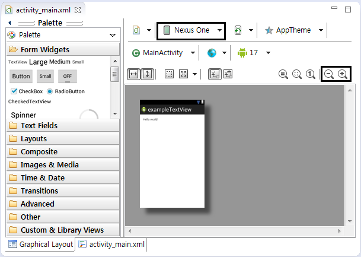

이부분을 자세히 봐주세요

이때 Nexus One부분은 눌러 다른 기기로 바꿔주시고.. (안타깝게도 아직 이부분을 고정하는 방법은 저도 잘 모릅니다)

돋보기 눌러주시면 크게 키울수 있습니다

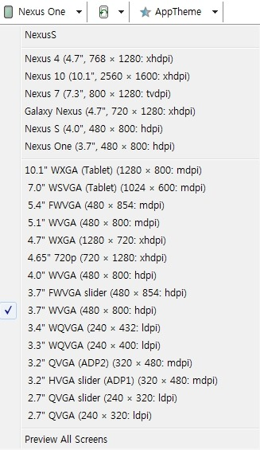

저는 레퍼런스인 겔럭시 넥서스로 선택했습니다 ㅎㅎ

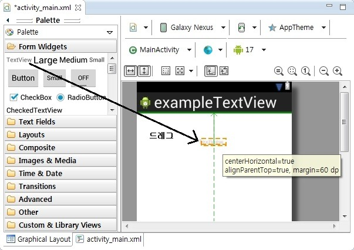

저 화면에서 Ctrl + A를 눌러 처음에 있던 hello world를 지워주세요

아니면 아래에 있는 activity\_main.xml을 눌러 하나 있는 textview를 지워주시면 됩니ㅏㄷ

그다음 옆에 있는 위젯 창고(?)에서 TextView를 드래그 해주세요

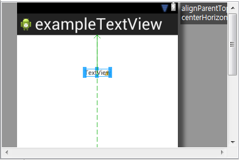

정 가운데 배치 했습니다 ㅎㅎ

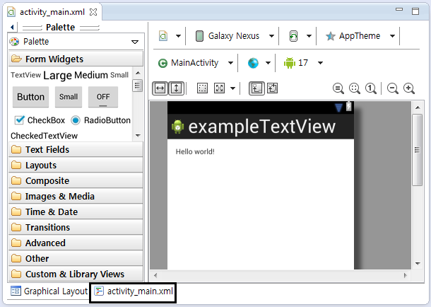

소스코드를 보겠습니다

activity\_main.xml을 눌러주세요

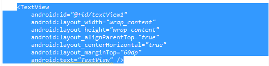

자, 이게 우리가 이번 시간에 마스터할 TextView의 기본 소스입니다

[미르의 팁]

-android:layout\_alignParentTop="true"

android:layout\_centerHorizontal="true"

android:layout\_margin="60dp" 이건 몬가요?

아래 정리해 두었습니다

layout\_alignParentTop - 부모의 상단 가장자리에 위젯 배치

layout\_alignParentBottom - 부모의 하단 가장자리에 위젯 배치

layout\_alignParentLeft - 부모의 왼쪽 가장자리에 위젯 배치

layout\_alignParentRight - 부모의 오른쪽 가장자리에 위젯 배치

layout\_centerHorizontal - 부모의 가로방향 중앙에 위젯을 배치

layout\_centerVertical - 부모의 세로방향 중앙에 위젯을 배치

layout\_centerInParent - 부모의 정중앙에 위젯을 배치

layout\_above - 특정 위젯의 위에 해당 위젯을 배치

layout\_below - 특정 위젯의 아래에 해당 위젯을 배치

layout\_toLeftOf - 특정 위젯의 왼쪽에 해당 위젯을 배치

layout\_toRightOf - 특정위젯을 오른쪽에 해당 위젯을 배치

layout\_alignTop - 특정 위젯과 상단이 일치하도록 위젯을 배치

layout\_alignBottom - 특정 위젯과 하단이 일치하도록 위젯을 배치

layout\_alignLeft - 특정위젯과 왼쪽이 일치하도록 위젯을 배치

layout\_alignRight - 특정 위젯과 오른쪽이 일치하도록 위젯을 배치

여기서 부모란?, Textview를 감싸고 있는 또하나의 View를 뜻합니다

<RelativeLayout>가 감싸고 있으면 이게 부모가 되는거 같습니다

모두 알고 계실 필요는 없으나 이런것들도 있구나 정도만 알아주세요 ㅎㅎ

layout\_margin은 "값"만큼 띄어서 배치하겠다는 뜻입니다

하나하나 Textview의 속성에 대해 알아보겠습니다

android:text

다들 아시다 싶이 Textview에 표시될 글자를 뜻합니다

두가지로 들어갈수 있죠

하나는 @string/의 형식으로, 하나는 그냥 표시하고픈 글자를 넣어주면 됩니다

원래 string은 2가지 이상에서 같은 글자가 필요할때 쓰거나, 멀티 랭기지를 할때 쓰이는 경우가 많습니다

[미르의 팁]

-@string/을 안썼더니 소스의 줄 옆에 이상한게 생겼어요

그건 Android Lint라고 합니다

[I18N] Hardcoded string "내용", should use @string resource

린트 경고 인데요 되도록이면 @string을 이용하여 작성하라 라는 뜻으로

무시하셔도 됩니다

android:textColor

딱보면 알겠죠? 글자 색을 지정하는 겁니다

값은 #AARRGGBB의 형식을 주로 사용하는데요

AA는 투명도, RR은 빨강색, GG는 초록색, BB는 파랑색을 의미합니다

AA의 경우 불투명일때 FF, 반투명일때 88, 완투명일때 00을 사용합니다

상단바 투명화 하면서 자주 썼죠????ㅋㅋㅋ

[미르의 팁]

RRGGBB의 값은 어떻게 구하나요?

일단 그림판을 열어 색편집을 누르세요

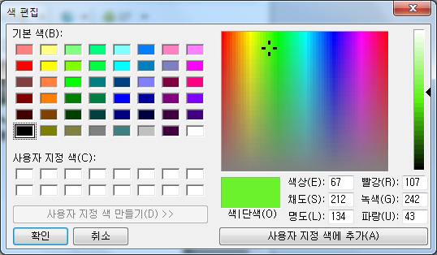

원하는 색을 고른다음 저기 있는 빨강, 녹색, 파랑의 숫자를 기록해 두세요

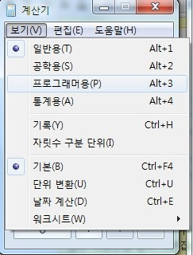

다른걸 써도 되는데 여기서는 윈도우 계산기로 하겠습니다

보기 - 프로그래머용을 들어간다음 좌측 메뉴를 Dex로 설정하세요

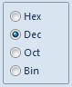

이제 빨강의 숫자를 입력하세요

그다음 Hex를 누르면 그 숫자의 헥스 값이 나옵니다 기록해 두시고...

초록, 파랑도 이렇게 해줍니다

이제 조합하시면 RRGGBB의 값이 나옵니다

저 사진의 숫자의 RRGGBB는 6BF22B이네요

android:textSize

말그대로 글자 크기입니다

단위로는 dip, dp, sp, px등이 있는데요

사진으로 봅시다

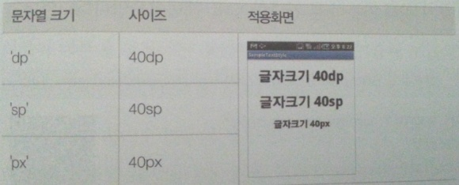

(그림 출처 : Do it 안드로이드 앱 정복기)

이렇구나 이해하시고 외우지 말고 넘어가세요

android:typeFace

글자 폰트를 지정합니다

대표적으로

normal

sans

serif

monospace

등이 있습니다만 별로 쓸일은 없더군요

android:textStyle

글자의 특징입니다

뭐 예를들면 **굵은글씨**, *기울어짐*등등..

기본을 제외한 세개만 들어갈수 있습니다

normal

**bold**

*italic*

***bold|italic***

뭐 이런 느낌입니다. ㅎㅎ

[미르의 팁]

bold와 italic사이에 들어간 |은 뭔가요?

우리 집합 배울때 {x|x는 ...}이러잖아요 그때의 |일겁니다 ㅎㅎ

키보드의 \있죠? Shift키와 \키를 동시에 누르면 |이 나옵니다

|은 동시에 적용한다는 뜻입니다

여려개의 속성을 동시에 적용할때 |을 씁니다

android:singleLine

싱글라인 이네요ㅎ

싱글은 하나, 1이란 뜻이고 라인은 줄(번호)라는 뜻이죠?

싱글라인은 줄이 하나다, 즉 글자가 길어졌을때도 한줄로 표시한다 라는 뜻입니다

기본값은 false이며 이를 true로 변경하게 되면 ...으로 나타나게 됩니다

여담인대 런처의 어플이름에 이 값이 설정되어 있는건지 ... 이거 불편하지 않나요?

그럼 한번 테스트 해보겠습니다

지금까지 배운걸 모두 넣어보죠

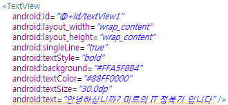

소스는 다음과 같습니다

아래에 있는 Graphical Layout을 눌러보세요

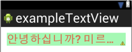

이렇게 나타납니다 ㅎㅎ

만약 singleLine이 없다면?

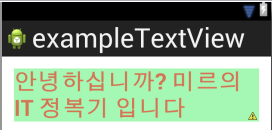

이렇게 ...으로 안나타나고 모두 나오지요 ㅎㅎ

안드로이드 기기에 올려서 확인해 보겠습니다

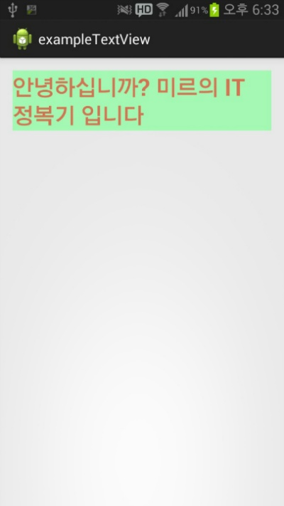

정상적으로 나오군요!

이렇게 어플을 만들때는 꼭 기기에 올려 동작을 확인해 봐야 합니다

이렇게 해서 xml상의 코드를 살펴보았습니다

다음에는 자바 코드와 관련된 textview를 살펴보고, 버튼을 약간 배운다음 버튼을 누르면 Textview의 내용이 바뀌는 어플을 만들어 보겠습니다

이 글에 추가될것으로 추가될때 까지는 가져가지 마세요 ㅎㅎㅎ

[exampleTextView.zip](https://github.com/itmir913/archive/releases/download/itmir-attachments/exampleTextView.zip)

(xml만 수정한 예제소스)

### 5-3 JAVA코드의 모든것

이번에는 java소스에서 건들여 보겠습니다

MainActivity를 볼까요?

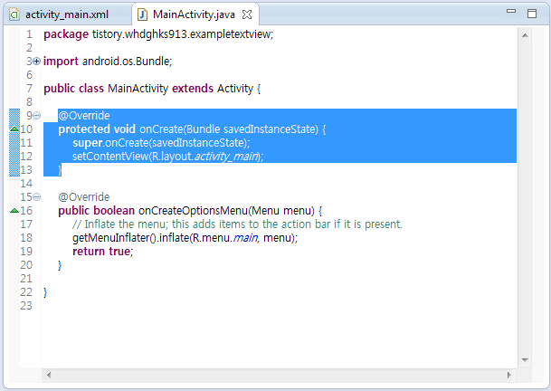

자, 저게 가장 중요한 소스라고 했습니다

잠시 xml으로 돌아와서 button을 추가해 봅시다

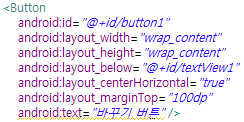

버튼은 아직 배우지 않았지만 이번시간에는 일단 추가해 보겠습니다

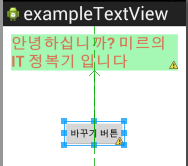

추가완료!

다시 java소스로 넘어옵시다

이제 버튼을 누르면 글자와 TextView의 속성이 변경되게 할건데요

public class MainActivity extends Activity { 밑에 Button Btn\_change;을 추가해 주세요

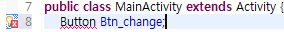

어? Button에 빨간 줄이 그어 있어요...

이건 import가 되지 않았다는 뜻입니다

이클립스에서는 Ctrl + Shift + O키를 눌러 자동으로 import 할수 있습니다

키를 눌러 import해주시면 됩니다

import전

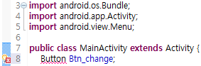

import 후

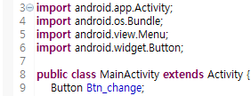

보시면 import android.widget.Button;이 추가되었고 Button에 있던 빨간줄 에러도 없어졌습니다

이렇게 import를 해줘야 오류가 안나고 컴파일이 이루어 지게 됩니다

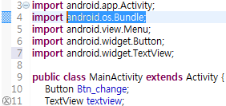

마찬가지로 TextView textview;도 추가후 import 해주세요

이제 버튼과 TextView를 자바 코드상에서 조작할수 있도록 xml과 java를 연결해야만 합니다

protected void onCreate(Bundle savedInstanceState) { 메소드 안에 넣어주시면 되는데요

여기서 주의할점이 있습니다

setContentView(R.layout.activity\_main); 이 코드 위에는 넣으시면 안되며 아래에 넣어주셔야 합니다

[미르의 팁]

-왜 위에 넣으면 안되나요?

setContentView메소드는 화면에 나타낼 뷰를 지정하는 역할을 하는데요 이때 xml 레이아웃을 메모리상에 객체화 합니다

즉 화면에 나타낼 뷰를 지정하고, xml 레이아웃의 내용을 메모리 상에 객체화 합니다

그런대 이 메소드 위에 코드를 넣게 되면 메모리 상에 객체화 되지 않은 정보를 참조하려 하기 때문에 강제종료 오류가 발생합니다

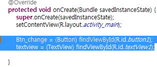

그럼

Btn\_change = (Button) findViewById(R.id.button1);

textview = (TextView) findViewById(R.id.textView1);

을 적당한 공백을 두고 추가 하시면 됩니다

이제 버튼을 사용자가 클릭했을때의 작업을 구현해야 합니다

아직 버튼을 배우지 않아 모르지만 버튼을 클릭했을때의 기능 구현은 대표적으로 2가지(setOnClickListener을 이용, 메소드 이용)가 있는데요

다음 시간에 구체적으로 살펴볼 예정이므로 오늘은 그냥 넘어가 봅시다

(사실 여기서 쓰려다가 버튼에 넣는게 나을거 같아 보류해 둡니다 ㅎㅎ)

onCreate메소드에

Btn\_change.setOnClickListener(listener);

을, onCreate메소드가 끝나고 빈 공간에

Button.OnClickListener listener = new Button.OnClickListener()

{

 public void onClick(View v)//버튼을 클릭 하면 ...

 {

    switch(v.getId()){

    case R.id.button1:

    textview.setText("미르의 It정복기 예제 소스"); // 또는 R.string.(이름)

    textview.setTextSize(50);

    textview.setTextColor(Color.GREEN); // 또는 RGB(255, 255, 255)

    break;

    }

 }

     };

을 추가해 주신다음 import해주세요

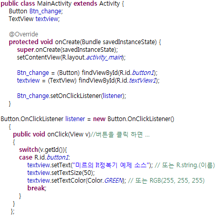

완성된 소스는 위 사진과 같습니다

다음 강좌에서 자세하게 배울것 이지만 간단하게 짚고 넘어가겠습니다

Button.OnClickListener란, 버튼이 눌렸을때 실행되며 그안에 onClick이라는 메소드가 존재합니다

여기서 if ~else if를 통한 방법 또는 switch ~ case를 통한 방법등을 통해 어떤 버튼이 눌렸는지 ID값을 확인한다음

어떤 명령을 할것인지 지정해 주는겁니다

이 포스팅에서는 자세히 다루지 않고 Button편에서 다루겠습니다

우리가 주의깊게 봐야할건

textview.setText("미르의 It정복기 예제 소스");

textview.setTextSize(50);

textview.setTextColor(Color.GREEN);

입니다

setText안에 어떤 글자를 넣느냐에 따라 달라지죠 ㅎㅎ

만약 string을 통해 넣고 싶다면

setText(R.string.(이름));으로 넣어주시면 됩니다

그다음 setTextSize는 아시다싶이 글자크기, 그 아래 setTextColor은 글자 색입니다

그럼 완성된 코드가 어떻게 돌아가는지 확인해 보겠습니다

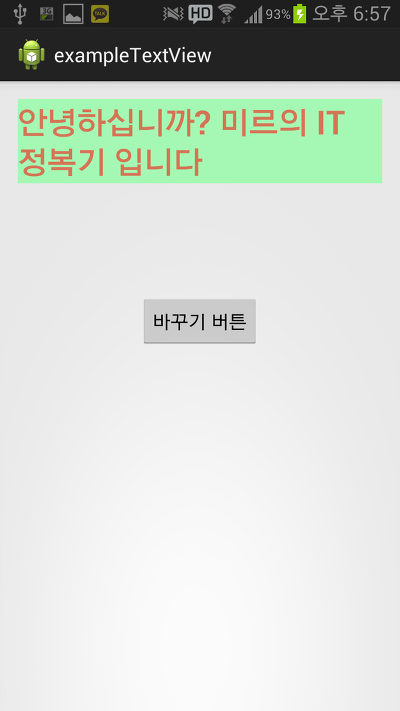

여기서 버튼을 누르게 되면

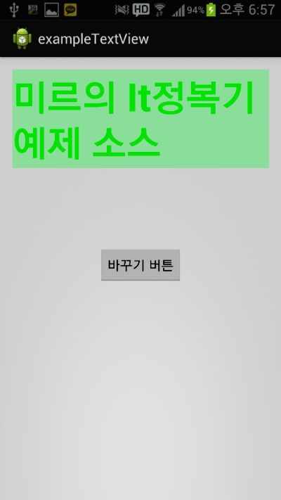

이렇게 글자색, 내용, 크기가 바뀌게 됩니다

[미르의 팁]

-자바코드에서 다룰수 있는 TextView의 속성이 3가지 뿐인가요?

아닙니다

이클립스에는 Ctrl + Space(스페이스바) 키를 눌러 지금 입력중인 내용의 미리보기 또는 바로 입력이 가능합니다

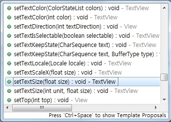

이 글에서는 대표적인 속성을 살펴본것으로 자바에서 사용가능한 TextView의 속성이 3개뿐이다 라는 오해는 하지 말아주시길 바랍니다

이렇게 해서 TextView의 모든것을 살펴보았습니다 ㅎㅎ

기본적인 TextView의 사용법을 마스터 하신다면 무궁무진한 활용이 가능합니다 ㅎㅎ

자바코드를 수정한 예제소스

[exampleTextView\_java\_code.zip](https://github.com/itmir913/archive/releases/download/itmir-attachments/exampleTextView_java_code.zip)

---

## 첨부파일

- [exampleTextView.zip](https://github.com/itmir913/archive/releases/download/itmir-attachments/exampleTextView.zip) `515 KB`
- [exampleTextView_java_code.zip](https://github.com/itmir913/archive/releases/download/itmir-attachments/exampleTextView_java_code.zip) `523 KB`
