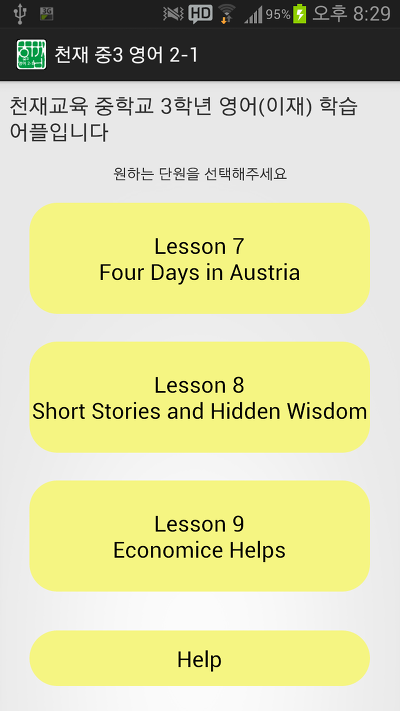
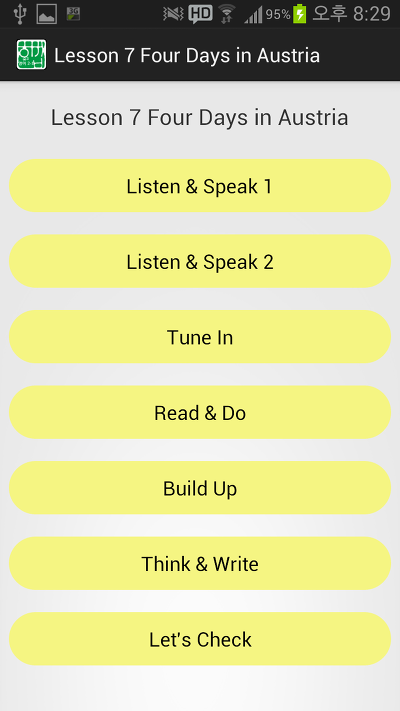
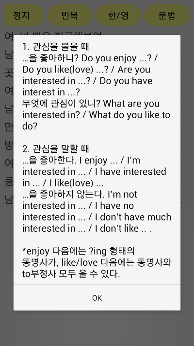
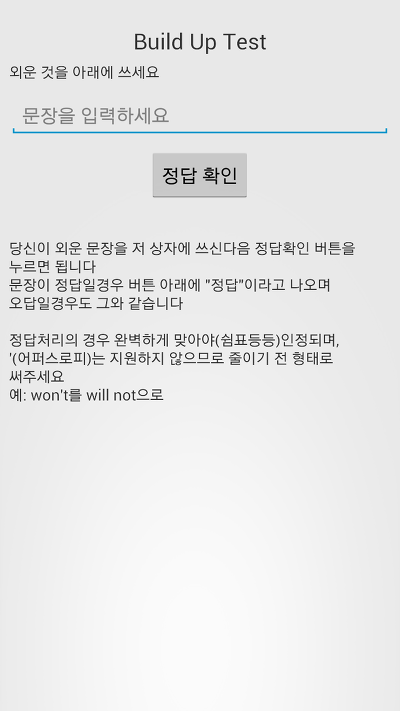
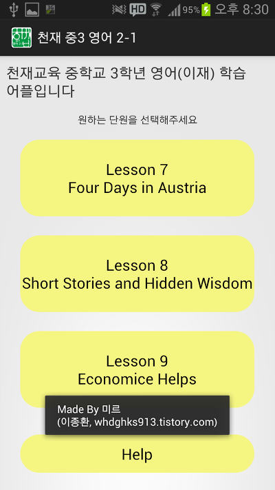

방학전 기말고사 전부터 계획을 가지고 있었고,

기말고사 틈틈히 제작하기 시작해서

지금까지 아래와 같은 성과를 이루었습니다. ㅎㅎ

현재 7과 반영이 끝난 상태이며 이제 7과 다듬기등의 작업이 이루어지지 않는다면 8과 작업을 시작하게 됩니다.

모든 단원이 접속 가능합니다. ㅎㅎ

이렇게 듣기자료가 있는경우 재생, 정지, 반복버튼이 존재합니다.

재생을 누르면 아래 사진처럼 일시정지로 글자가 바뀝니다.

버튼을 좌우로 스크롤하면 또다른 버튼이 나오는데요.

문법을 누르게 되면 팝업창으로 문법에 관련된 설명을 해주며,

한/영버튼을 누르면 영어가 한글로 바뀌며 또 누르면 다시 영어로 변경됩니다.

Build Up은 문법을 테스트 하는 파트이며 Think & Write파트도 쓰기가 많으므로 이런 부분에 있어서 Test를 구현했습니다.

저 "문장을 입력하세요"부분에 외운 문장을 그대로 입력한다음 정답 확인을 누르게 되면 정답일경우 아래에 정답, 오답일경우 오답이라 나타나는대요 여기에 제 이스터 에그가 숨겨져 있습니다.

아무것도 입력하지 않은 상태에서 정답 확인을 게속 누르거나 오답을 게속 입력하면 재밌습니다. ㅎㅎ

아래 사진은 Let's Check의 사진으로 이 파트는 A, B, C, D 네개가 있으므로 바꾸기 버튼을 이용하여 이 ABCD를 변경할 수 있습니다.

물론 바꾸기 상태에서 한/영이나 재생등을 눌르면 바뀐것으로 읽어주고 한/영이 바뀌지요. ㅎㅎ

마지막으로 제작자 표시입니다 ㅎㅎ
