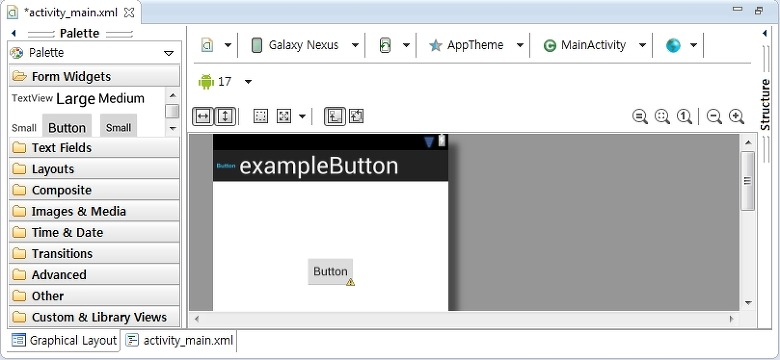
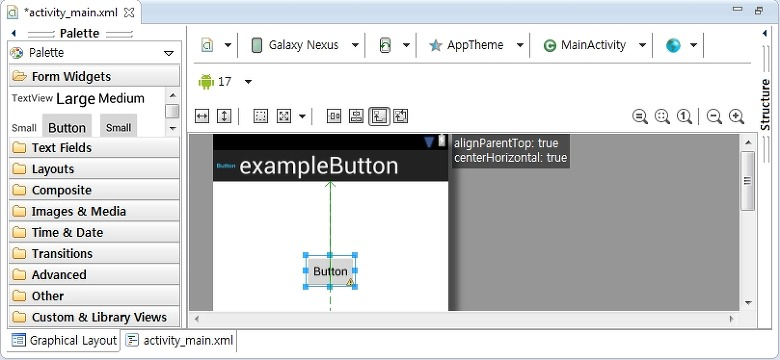
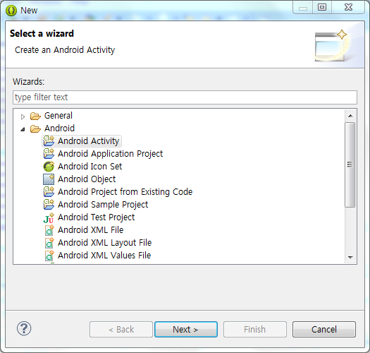
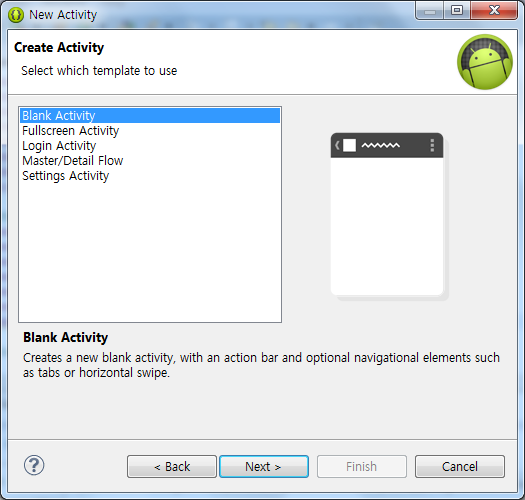
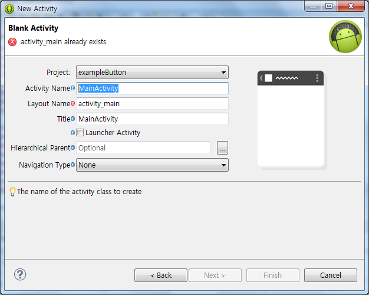
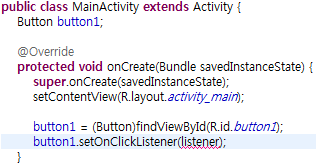
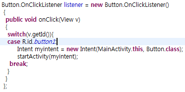
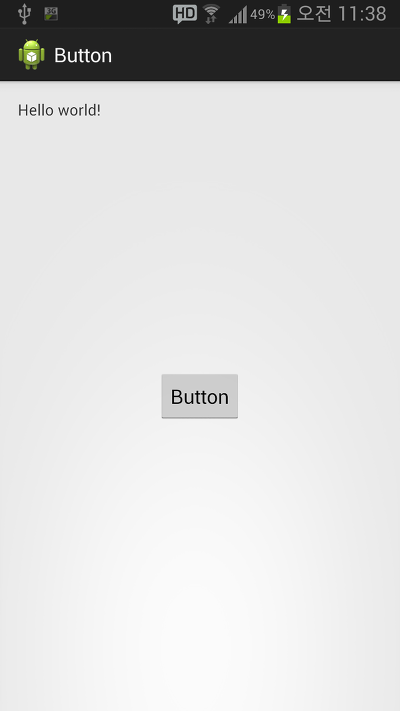

자, 이번시간에 배울 내용은 버튼입니다

약간 복잡한 내용도 있고 하니 잘 따라 오시길 바랍니다

버튼에는 일반 버튼, 이미지 버튼이 있는데요 일반 버튼을 마스터 하면 이미지 버튼도 되므로

이미지 버튼은 생략합니다

잠깐 강의의 흐름을 보면 버튼을 마스터 한다음에는 EditView의 기초(응용은 좀 뒤에), 이미지 띄우기를 할 예정입니다

아마 이미지까지 나가게 되면 볼폼 없어도 나만의 앱 하나는 만드실수 있으실 겁니다 ㅎㅎ

## 6. 버튼(Button)을 만들어 보자

### 6-1 버튼 생성

저번 강좌에서 말한대로 프로젝트 생성은 건너 뜁니다

이름 : Button

액티비티 : BlankActivity로 만들어 주시면 됩니다

전 강좌에서 버튼 만드는방법을 잠시나마 배웠습니다





이렇게 드래그 해서 버튼 하나 만들어 주세요

```xml
<Button
    android:id="@+id/button1"
    android:layout_width="wrap_content"
    android:layout_height="wrap_content"
    android:layout_alignParentTop="true"
    android:layout_centerHorizontal="true"
    android:layout_marginTop="98dp"
    android:text="Button" />
```

버튼의 소스입니다

지금까지 제 강좌를 모두 보셨다면 이 소스가 이해가 되실탠데요

id값부여

넓이, 높이

위부터 정렬

가운데 정렬

위에서 98dp만큼 떨어져 있다

라는 뜻이죠

자, 이렇게 하면 xml상에서의 버튼이 끝났습니다 (?)

왜냐... 버튼의 속성은 텍스트뷰의 속성과 많이 같습니다

그러므로 텍스트뷰를 알게되면 버튼의 속성은 비슷하니 그냥 따라올수 있는거죠

android:background

뭐 이런 속성은 버튼뿐만 아니라 모든 위젯(TexiView, Button, EditView등등)에서 사용가능하니 총정리 할때쯤 나오고 언급할 필요도 사실 없지요 ㅎㅎ

사실상 버튼은 xml이 아니라 java에서많이 사용합니다

그러므로 이번에는 자바에서 다뤄보도록 하겠습니다

버튼을 누르면 새로운 창이 나타나도록 구현해 볼건데요

이를 위해서는 새로운 액티비티를 만들어야 합니다

New - Other - Android Activity를 눌러 액티비티 하나 만듭시다



이렇게 선택해 주시면 됩니다

[미르의 팁]

-New - Other - Android Activity로만 액티비티를 만들수 있나요?

아닙니다

자바 파일을 복사해서 만들수 있습니다

만 AndroidManifest.xml에 자동등록이 되는 이 방법으로 만드는게 편합니다



Blank Activity를 눌러주시고 다음을 눌러줍시다



자, 이건 액티비티 이름을 설정하는 건데요

이미 MainActivity는 있으니

이름을 **ButtonActivity.java (각주: +2014-03-02 수정 : 자바에서 상속 관련때문에 Button과 같은 이름의 java파일을 만들수 없습니다
예) Service.java, Button.java등의 파일을 만드시면 원하는 동작을 만드실수가 없어요)**으로 해주세요

정상적으로 액티비티가 만들어 졌습니다~ ㅎㅎ

이제 버튼을 누르면 저 화면으로 이동하게 해봅시다

MainActivity에 들어가 봅시다

버튼을 눌렀을때 어떤 작업을 할껀지를 정해야 합니다

이때 사용하는 방법은 2가지가 있습니다

메소드를 이용한 방법과 listener을 이용한 방법인데요

여기서는 listener을 이용할것이므로 메소드에 관한 내용은 짧게 짚고 넘어갑시다(별로 추천하고 싶지 않은 방법인지라..)

```java
public void (메소드 이름) (View v) {
    Intent myintent = new Intent(this, (이동할 액티비티 이름).class);
    startActivity(myintent);
}
```

자바코드의 아무데나(그렇다고 onCreate같은대 넣으시면 안되요) 위 메소드를 넣어줍시다

(메소드 이름)란에는 원하는것을 입력하시면 됩니다

```xml
android:onClick="(메소드 이름)"
```

xm으로 돌아와서 Button에 위 코드를 넣어줍시다

그럼 버튼을 클릭할경우 (메소드 이름)이라는 메소드를 실행한다 라는 뜻입니다

이 강좌에서는 listener을 이용할겁니다. xml의 onClick을 이용하는 예제는 다른 위젯을 배울 때 살펴보겠습니다.

참고로, 저는 onClick을 더 선호합니다.



이렇게 추가해 주세요

```java
public class MainActivity extends Activity {
Button button1;
@Override
protected void onCreate(Bundle savedInstanceState) {
super.onCreate(savedInstanceState);
setContentView(R.layout.activity_main);
button1 = (Button)findViewById(R.id.button1);
button1.setOnClickListener(listener);
}
```

추가후, Import하는거 잊지 마시길

그다음 빨간색 '}'아래에 아래 소스를 추가합시다

```java
Button.OnClickListener listener = new Button.OnClickListener()
{
    public void onClick(View v)
    {
        switch(v.getId()){
            //case문이 들어갑니다
        }
    }
};
```

그다음 또 import해주시고요 ㅎ..

switch-case문으로 어떤 버튼이 눌려졌는지 판단후 작업을 할겁니다

```java
case R.id.button1:
    Intent myintent = new Intent(this, (이동할 액티비티 이름).class);
    startActivity(myintent);
    break;
```

이런 형태로 구현해 주세요

완성된 소스를 봅시다



여기서 Intent myintent = new Intent(this, Button.class);을 보시면 this앞에 MainActivity.이 있는데요

만약 그냥 this라고 했을때 오류가 뜬다면 액티비티 이름을 붙혀주시면 오류가 해결됩니다

완성된 소스를 보면

```java
public class MainActivity extends Activity {
Button button1;
@Override
protected void onCreate(Bundle savedInstanceState) {
super.onCreate(savedInstanceState);
setContentView(R.layout.activity_main);
button1 = (Button) findViewById(R.id.button1);
button1.setOnClickListener(listener);
}
Button.OnClickListener listener = new Button.OnClickListener()
{
public void onClick(View v)
{
switch(v.getId()){
case R.id.button1:
Intent myintent = new Intent(MainActivity.this, ButtonActivity.class);
startActivity(myintent);
break;
}
}
};
```

입니다 (굵은 글씨 추가)

만약 버튼을 2개이상 추가하려면 밑줄친 부분이 반복되겠죠??



버튼을 누르면


또다른 액티비티가 실행됩니다

이렇게 해서 버튼에 대해서도 알아봤습니다

버튼의 글자도 button1.setText();를 이용하여 변경이 가능합니다

응용은 당신의 몫!

[Button.zip](https://github.com/itmir913/archive/releases/download/itmir-attachments/Button.zip)

---

## 첨부파일

- [Button.zip](https://github.com/itmir913/archive/releases/download/itmir-attachments/Button.zip) `527 KB`
