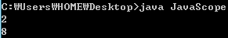

정말 오랜만의 java강좌네요. ㅎㅎㅎ

책으로는 공부했지만 강좌를 올릴 여건이 안되서. ㅎㅎ;;

으아 책 진도는 지금 메소드 다 끝났는데 ㅎㅎ;;

아무튼 빨리 시작하겠습니다.

스코프란? 영역이라는 뜻입니다.

자바에서 말하는 스코프란 변수에 대한 접근과 변수가 존재할 수 있는 영역을 의미합니다.

자바에서 중괄호 { }로 한 영역이 생성된다면 그 영역에 관한 스코프를 형성하게 됩니다.

예를 들면 메소드를 이루고 있는 것이 { }죠? 각각 다른 메소드에서 같은 이름의 변수 선언이 가능합니다.

만약 스코프가 없다면 이런 일은 불가능 하지요.

예제로 확인해 봅시다.

```java
class JavaScope
{
  public static void main(String[] args)
  {
    // Scope에 대해 알아봅시다
    int number=1;
    int ITblog=1;

    System.out.println(number+ITblog);

    add();
  }

  public static void add()
  {
    int number=3;
    int ITblog=5;
    System.out.println(number+ITblog);
  }
  
}
```

[JavaScope.java

다운로드](./file/JavaScope.java)

만약 변수의 스코프가 없다면, 이 소스는 불가능합니다.

]같은 이름의 변수가 다른 메소드에서 각각 형성되었기 때문입니다.

그런데 실행결과를 한번 봅시다.



정상적입니다. ㅎㅎ;;

이것은 변수의 스코프가 없다면 불가능한 일입니다.

이렇게 간단하게 살펴본 스코프는 몇 가지 특징을 가지고 있습니다.

하나는 선언된 영역, 즉 {}나 ()를 벗어나면 소멸되어 버립니다.

만약 자동으로 소멸되지 않는다면 프로그램 실행에 문제가 발생할 수도 있고 메모리 낭비도 심하겠죠?

이런 변수를 지역변수(local variable)이라 합니다.

변수의 중요한 특징이니 꼭 알아두시고, 우리는 중괄호를 벗어나면 소멸될 변수를 다른 메소드에서 참조하는 일이 없도록 소스를 만들어야겠습니다.

---

## 첨부파일

- [JavaScope.java](./files/JavaScope.java)
