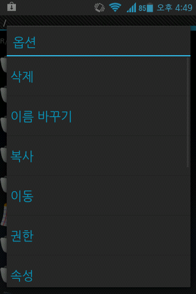
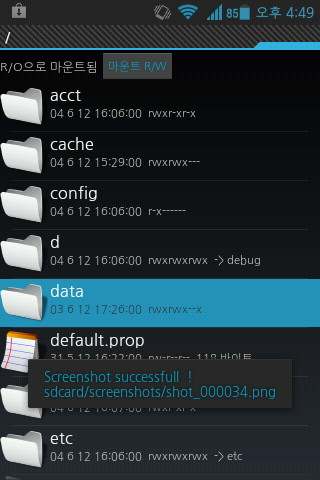
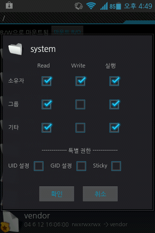
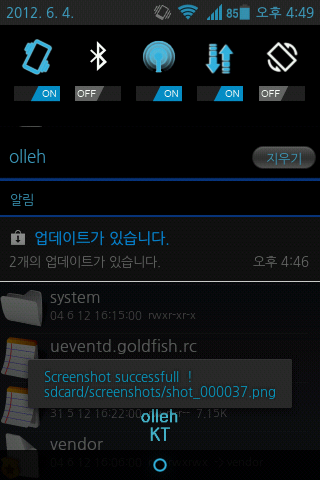
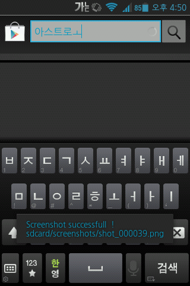
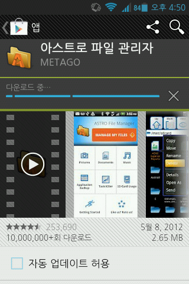

SDA와 테마카페, 이 블로그에서 배포됩니다.

다운 링크는 두곳 카페에서도 제공되며 롬 암호는 블로그에서 요청하시기 바랍니다.

--------------------------------------

안녕하세요 ㅋ

원래는 카페에서 배포했는데

이제 블로그에서 암호와 함께 배포합니다. ㅎㅎ

이곳에서 배포하는 이유가 바로 몇몇 눈팅분들 때문이니 이해해 주세요...

이제 베타정도는 아니라 생각되어서 정식버전으로 넘어왔습니다.

그.러.나 제가 커널도 작업하고 싶으나 주말에 아빠께서 우분투가 있는 안방 컴퓨터를 쓰시는 바람에...

평일에도 이제 수행평가와 시험때문에 시간이 잘 나지 않습니다. ㄷㄷ

그래서 죄송하지만 커널은 잠정 연기를 하겠습니다.

지나가던 신님의 커널을 애용해 주세요 ㅎㅎ

이번버전의 특징입니다.

------------------------------------

필요없는 기본어플 제거  
gps.conf최적화  
기본글꼴 나눔고딕체 변경  
xloud적용  
기본 벨소리 무음화  
빌프 주석 제거  
아드레노200 Lib패치(그래픽향상) 한글설명  
슈퍼유저 최신판(3.0.3.2, 12/5/15당시 최신)(마켓 오류때문에 최신판 못넣었어요 ㅠ)  
sky홈, 안드로이드 기본 키패드 삭제  
init.d지원

종료 트윅  
볼륨 30단계 세분화 (sky 세팅에서 설정하지 마시고 벨소리는 그냥, 알람은 알람 벨소리 설정에서, 미디어도 미디어 들어가서 조정해주세요)  
스크롤 패치  
CRT효과(전체애니=꺼질때,켜질때 부분애니=꺼질때 애니끔=CRT효과 없음)  
패턴 모양 ICS화  
패턴선 가늘게  
모던홀드 어플수정(SNS매니저=카카오톡)  
직접재작 boot.img 적용  
카시안님의 테마 적용  
돌핀 브라우저, 퀵픽, 녹음기 추가 (등)

------------------------------------------

이번에 카시안님께서 만드신 테마를 집어 넣게 되었습니다. ㅎㅎ

카시안님께는 허락을 받아둔 상태이고요!

원본 테마는

<http://cafe.naver.com/matdc/3199>

이곳에 가시면 있는 테마가 적용되어 있습니다.

(사실 테마를 넣으면서 볼륨 세분화, CRT, 패턴선, 모던홀드어플수정등 프윅폴더 관련 패치가 사라질까 조마조마 했는대요 카시안님과 저가 마음이 맞았는지 모던홀드 어플 수정만 제외하고 다 하신거 같아요 ㅎㅎ)

모던홀드 어플수정은 카메라만 고장(?)이 난거 같아요 ;;

다음에 고치겠습니다 ㅎㅎ

테마부분은 제가 만든게 아니므로 카시안님께 질문해드리길 바랍니다.

아 그리고 카시안님의 테마중 설정오류는 제가 수정한번 하면서 해결되었습니다

원본 테마 게시글

========================

배타버전의 마지막 뻘인

BETA 4 입니다.

========================

패치사항

[+] ICS Layout Setting

[+] SkyHome Theme

[+] Sky New Camera

[+] Framework-res image change

[+] Framework-res xml change

========================

다음 패치 예정사항

ICS 다이얼 추가

SK 지원

( 제 사정으로 SK 는 다음버전에 패치 안될수도 있습니다 )

=====================

흐물흐물 베타4 를 마지막으로 해서 다음버전부터는 정식버전이 됩니다.

정식버전 예정 날자는 7 월 중순 ~ 말 정도 될꺼같네요.

비록 허접한 테마라도 사용해주시는분들께 감사의 인사를 드립니다 ( \_ \_ ) 꾸벅 ~

=====================

제 테마를 수정하시거나 추가해서 배포하고 싶다는 분들이 계신데..

정확한 출처와 제작자만 표시 해준다면 상관없습니다 .

매너적으로 카페링크 넣어주면 감사하겠지요 ? + \_ +

====================

제 테마랑 같이 사용해보세요 !

ICS KAKAO TALK : [바로가기](http://www.matcl.com/?m=bbs&bid=appDB&uid=109758)

ICS 부트 애니메이션 : [바로가기](http://cafe.naver.com/matdc/1445)

Holo Launcher : [바로가기](http://hololauncher.com/download.aspx?t=BETA)

======================

스크린샷

ㅇㅅㅇ...

아무튼(?) 이번에는 Time오버로 인해 많은 작업이 이루어지지 않은 것 같습니다...

다음에는 더 좋은 성능으로 찾아 뵙겠습니다. ㅎㅎ
