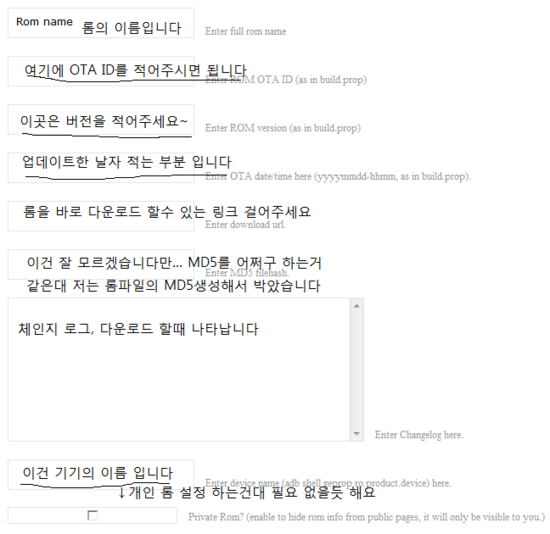

OTA란 over the air의 약자로 한마디로 그냥 폰 에서 바로 롬을 받는 것입니다

cm9등을 써보셨다면 확실히 아실수 있을탠데요

Wifi등으로 롬을 다운로드 할수 있습니다

이걸 어떻게 구현할까요? 바로 <https://otaupdatecenter.pro/> 이 사이트에서 설정 하시면 됩니다 ㅎㅎ

(지금은 무료인데 나중에 유료로 바뀔지는 의문)

그냥 가면 절 너무 원망 헐까봐요 ㅋㅋ

무서...워서 적고 갑니다 ㅎㅎ

좌측에 Register 클릭 하셔서 User Name, Password, E-mail을 입력하시면 됩니다

그다음 입력하신 E-mail으로 로그인해서 메일을 확인해 보시면 활성화 링크가 있는데 들어가시면 활성화 되고 사용할수 있습니다 (스팸 메일도 확인해 보세요)

login을 하게 되면 Add Rom이 생기는대 여기서 롬을 생성(?)하면 됩니다

이렇게 입력하시면 되는대요

여기서 검은 밑줄(ㅋㅋㅋㅋㅋㅋ)있는 부분은 Build.prop에서 가져와야 하는 부분입니다

빌드프롭 아무데나

otaupdater.otaid=OTA의 ID알아서 입력

otaupdater.otatime=업데이트 날자 입력  
otaupdater.otaver=버전 입력

추가해 주세요~

이렇게 추가한거랑 홈페이지에 입력한거랑 같아야 합니다~

그럼 대충 끝납니다

<http://static.vetruvet.com/downloads/ota/OTAUpdater-1.0.5.apk>

파일 받아 시스탬/app에 넣어주세요

그리고 실행하면 끝~~~~

안되도 저는 몰라요 ㄷㄷ(무책임한 1人.....;;)

OTA를 사용해서 자동으로 리커버리에 진입한다음 설치되게 하려면 사인이 필요합니다

제가 만든 Zip signer을 이용해 주세요

[2013/01/27 - [강좌/팁/공통/기타 강좌] - Zip Signer - Signed by Signapk](http://itmir.tistory.com/39)

[2013/01/27 - [강좌/팁/공통/기타 강좌] - 파일 MD5 체크 프로그램 / MD5 확인방법](http://itmir.tistory.com/40)

PS. OTA업데이터에서 자동으로 리커버리 진입후 설치하는건 사인이 필요합니다~

전 사인해서 성공 했습니다

아로마 인스톨러도 사인만 하게 된다면 가능합니다!
